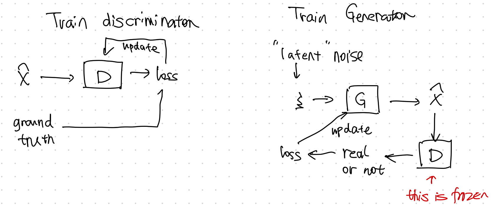

## GAN

GAN is a **generative neural sampler**[^Nowozin2016]. To train the sampler, the task of GAN is designed to generate features $X$ from a latent space $\xi$ and class labels $Y$,

$$\xi, Y \to X.$$

Many different formulations of GANs are proposed. As an introduction to this topic, we will discuss vanilla GAN in this section[^Goodfellow2014].


### Theory

#### The Minimax Game Loss

The minimax game is a game to "minimizing the possible loss for a worst case"[^minimax_wiki]. In GAN, the game is to train the generator $G$ to fool the discriminator $D$ while minimizing the discrimination error of $D$.

Goodfellow prosed a loss[^Goodfellow2014]

$$
\begin{equation}
\underset{G}{\operatorname{min}}\underset{D}{\operatorname{max}} V(D, G) = \mathbb E_{x\sim p_{data}} \left[ \log D(x) \right] + \mathbb E_{z\sim p_z} \left[ \log( 1- D(G(z)) ) \right].
\end{equation}
$$


#### Divergence

Goodfellow et al proved that the global minimum of such a setup is reached only and if only $p_{G} = p_\text{data}$. GAN is comparing the generated distribution to the data distribution, using the Jensen-Shannon divergence[^Goodfellow2014],

$$
\operatorname{D}_{\text{JS}}(p_\text{data}\Vert p_{G}) = \frac{1}{2}\left[ \operatorname{D}_\text{KL} \left( p_\text{data} \bigg\Vert \frac{p_\text{data} + p_G}{2} \right) + \operatorname{D}_\text{KL} \left( p_{G} \bigg\Vert \frac{p_\text{data} + p_G}{2} \right) \right].
$$

!!! warning "Off by a Constant"

    The value function of GAN for fixed $G$ is slightly different from JS divergence[^Goodfellow2014],

    $$
    \underset{G}{\operatorname{max}}V(G,D) = 2 \operatorname{D}_\text{JS}( p_\text{data} \Vert p_G ) - \log 4.
    $$


#### Alternating Training

GAN training requires two stages,

- train discriminator $D$, and
- train generator $G$.





### Code

We built a simple GAN using MNIST dataset.


=== "Result"

    The generated images looks quite close to hand writings.

    


=== "Code"

    ```python
    import matplotlib.pyplot as plt
    import torch
    from pathlib import Path
    import torchvision
    import torchvision.transforms as transforms
    from loguru import logger
    from torch import nn
    import click


    logger.debug(f"Setting device ...")
    device = ""
    if torch.cuda.is_available():
        device = torch.device("cuda")
    else:
        device = torch.device("cpu")
    logger.info(f"Device in use: {device}")


    def plot_images(image_samples, target):
        """Plot a grid of images and save to a file."""

        if not Path(target).parent.exists():
            Path(target).parent.mkdir(parents=True)

        # real_samples, mnist_labels = next(iter(train_loader))
        for i in range(16):
            ax = plt.subplot(4, 4, i + 1)
            plt.imshow(image_samples[i].reshape(28, 28), cmap="gray_r")
            plt.xticks([])
            plt.yticks([])
        plt.savefig(target)


    def get_data_loaders(batch_size=32, data_dir="data/mnist", download=True, plot_samples=True):
        """Get MNIST data and built a dataloader for the dataset"""

        transform = transforms.Compose(
            [transforms.ToTensor(), transforms.Normalize((0.5,), (0.5,))]
        )

        train_set = torchvision.datasets.MNIST(
            root=data_dir, train=True, download=download, transform=transform
        )

        train_loader = torch.utils.data.DataLoader(
            train_set, batch_size=batch_size, shuffle=True
        )

        if plot_samples:
            real_samples, mnist_labels = next(iter(train_loader))
            plot_images(real_samples, target="assets/real_images/real_image_samples.png")

        return train_loader


    class Discriminator(nn.Module):
        """The discrimnator should take data that has the dimension of the image and spit out a probability"""
        def __init__(self):
            super().__init__()
            self.model = nn.Sequential(
                nn.Linear(784, 1024),
                nn.ReLU(),
                nn.Dropout(0.3),
                nn.Linear(1024, 512),
                nn.ReLU(),
                nn.Dropout(0.3),
                nn.Linear(512, 256),
                nn.ReLU(),
                nn.Dropout(0.3),
                nn.Linear(256, 1),
                nn.Sigmoid(),
            )

        def forward(self, x):
            x = x.view(x.size(0), 784)
            output = self.model(x)
            return output


    class Generator(nn.Module):
        """The generator should take in some noise data (a latent space data) and spit out an image.
        We use the input noise as a trick to make the generator more general
        """
        def __init__(self):
            super().__init__()
            self.model = nn.Sequential(
                # nn.Linear(10, 100),
                # nn.ReLU(),
                nn.Linear(100, 256),
                nn.ReLU(),
                nn.Linear(256, 512),
                nn.ReLU(),
                nn.Linear(512, 1024),
                nn.ReLU(),
                nn.Linear(1024, 784),
                nn.Tanh(),
            )

        def forward(self, x):
            output = self.model(x)
            output = output.view(x.size(0), 1, 28, 28)
            return output


    @click.command()
    @click.option("--epochs", default=50, help="Number of epochs for the training")
    @click.option("--learning_rate", "-lr", default=0.0001, help="Learning rate for the optimizer")
    @click.option("--batch_size", default=32, help="Batch size")
    @click.option("--data_dir", default="data/mnist", help="Directory for storing the dataset")
    @click.option("--download_mnist", "-d", default=True, type=bool, help="Whether to download MNIST data")
    @click.option("--random_seed", "-rs", default=42, type=int, help="Random seed for the random generators")
    def main(epochs, learning_rate, batch_size, data_dir, download_mnist, random_seed):

        latent_space_dim = 100

        torch.manual_seed(random_seed)

        # check the dtypes
        logger.debug(
            f"torch tensor dtype: {torch.tensor([1.2, 3]).dtype}"
        )
        # torch.set_default_dtype(torch.float64)
        # logger.debug(
        #     f"set torch tensor dtype to 64: {torch.tensor([1.2, 3]).dtype}"
        # )

        train_loader = get_data_loaders(
            batch_size=batch_size,
            data_dir=data_dir,
            download=download_mnist
        )
        logger.debug(f"Training data is ready")

        discriminator = Discriminator().to(device=device)
        generator = Generator().to(device=device)

        loss_function = nn.BCELoss()

        optimizer_discriminator = torch.optim.Adam(
            discriminator.parameters(), lr=learning_rate
        )
        optimizer_generator = torch.optim.Adam(generator.parameters(), lr=learning_rate)

        for epoch in range(epochs):
            for n, (real_samples, mnist_labels) in enumerate(train_loader):
                # We prepare some data for training the discriminator
                # Here we will prepare both the generated data and the real data
                real_samples = real_samples.to(device=device)
                real_samples_labels = torch.ones((batch_size, 1)).to(device=device)
                latent_space_samples = torch.randn((batch_size, latent_space_dim)).to(device=device)
                # logger.debug(f"Latent space samples: {latent_space_samples}")
                generated_samples = generator(latent_space_samples)
                # logger.debug(f"Generated samples:{generated_samples}")
                generated_samples_labels = torch.zeros((batch_size, 1)).to(device=device)
                all_samples = torch.cat((real_samples, generated_samples))
                all_samples_labels = torch.cat((real_samples_labels, generated_samples_labels))

                # Training the discriminator
                # The discrinimator is trained using the samples we generated above, i.e.
                # the generated samples and the real images
                discriminator.zero_grad()
                output_discriminator = discriminator(all_samples)
                loss_discriminator = loss_function(output_discriminator, all_samples_labels)
                loss_discriminator.backward()
                optimizer_discriminator.step()

                # Generate some noise data for training the generator
                #
                latent_space_samples_generator = torch.randn((batch_size, latent_space_dim)).to(device=device)

                # Training the generator using the training optimizer
                generator.zero_grad()
                generated_samples_generator = generator(latent_space_samples_generator)
                output_discriminator_generated = discriminator(generated_samples_generator)
                loss_generator = loss_function(
                    output_discriminator_generated, real_samples_labels
                )
                loss_generator.backward()
                optimizer_generator.step()

                # Show loss
                if n == batch_size - 1:
                    print(f"Epoch: {epoch} Loss D.: {loss_discriminator}")
                    print(f"Epoch: {epoch} Loss G.: {loss_generator}")

            logger.debug(f"Plotting for epoch: {epoch} ...")
            latent_space_samples_epoch = torch.randn(batch_size, latent_space_dim).to(device=device)
            generated_samples_epoch = generator(latent_space_samples_epoch)
            generated_samples_epoch = generated_samples_epoch.cpu().detach()
            plot_images(generated_samples_epoch, target=f"assets/generated_images/generated_image_samples_{epoch}.png")
            logger.debug(f"Saved plots for epoch: {epoch}")

        latent_space_samples = torch.randn(batch_size, latent_space_dim).to(device=device)
        generated_samples = generator(latent_space_samples)

        logger.debug(f"Plot generated images...")
        generated_samples = generated_samples.cpu().detach()
        plot_images(generated_samples, target="assets/generated_images/generated_image_samples.png")


    if __name__ == "__main__":
        main()
    ```


[^Nowozin2016]: Nowozin S, Cseke B, Tomioka R. f-GAN: Training Generative Neural Samplers using Variational Divergence Minimization. arXiv [stat.ML]. 2016. Available: http://arxiv.org/abs/1606.00709

[^minimax_wiki]: Contributors to Wikimedia projects. Minimax. In: Wikipedia [Internet]. 5 Aug 2021 [cited 6 Sep 2021]. Available: https://en.wikipedia.org/wiki/Minimax


[^Goodfellow2014]: Goodfellow IJ, Pouget-Abadie J, Mirza M, Xu B, Warde-Farley D, Ozair S, et al. Generative Adversarial Networks. arXiv [stat.ML]. 2014. Available: http://arxiv.org/abs/1406.2661

[^Liu2020]: Liu X, Zhang F, Hou Z, Wang Z, Mian L, Zhang J, et al. Self-supervised Learning: Generative or Contrastive. arXiv [cs.LG]. 2020. Available: http://arxiv.org/abs/2006.08218

[^Arjovsky2017]: Arjovsky M, Chintala S, Bottou L. Wasserstein GAN. arXiv [stat.ML]. 2017. Available: http://arxiv.org/abs/1701.07875
