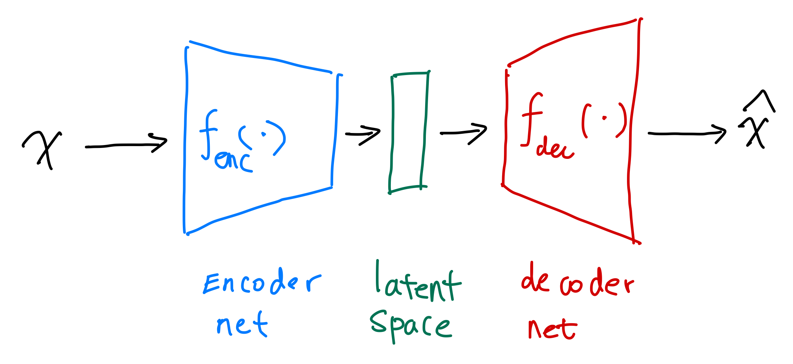

# Autoencoders

Autoencoders (AE) are machines that encodes inputs into a compact latent space.

??? tip "Notation: dot ($\cdot$)"

    We use a single vertically centered dot, i.e., $\cdot$, to indicate that the function or machine can take in arguments.

A simple autoencoder can be achieved using two neural nets, e.g.,

$$
\begin{align}
{\color{green}h} &= {\color{blue}g}{\color{blue}(}{\color{blue}b} + {\color{blue}w} x{\color{blue})} \\
\hat x &= {\color{red}\sigma}{\color{red}(c} + {\color{red}v} {\color{green}h}{\color{red})},
\end{align}
$$

where in this simple example,

- ${\color{blue}g(b + w \cdot )}$ is the encoder, and
- ${\color{red}\sigma(c + v \cdot )}$ is the decoder.

For binary labels, we can use a simple cross entropy as the loss.
