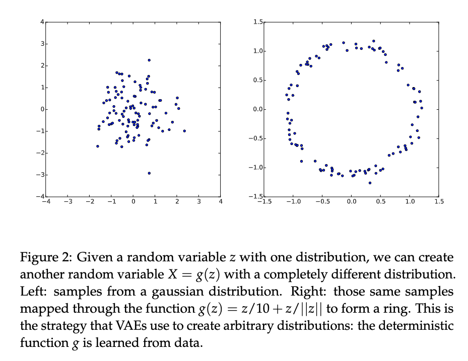

# Variational AutoEncoder

Variational AutoEncoder (VAE) is very different from [AE](ae.md). In VAE, we introduce a variational distribution $q$ to help us work out the weighted integral after introducing the latent space variable $z$,

$$
\begin{align}
\ln p_\theta(x) &= \int \left(\ln p_\theta (x\mid z) \right)p(z) \,\mathrm d z \\
&=  \int \left(\ln\frac{q_{\phi}(z\mid x)}{q_{\phi}(z\mid x)} p_\theta (x\mid z) \right) p(z) \, \mathrm d z
\end{align}
$$

In the above derivation,

- ${}_\theta$ is the model for inference, and
- ${}_\phi$ is the model for variational approximation.

??? tip "Tricks"
    - $p_\theta(x\mid z)$ is usually Gaussian distribution of $x$ but with mean parameterized by the latent variable $z$ and the model parameters $\theta$.
    - The latent space variable $p(z)$ is usually assumed to be a normal distribution.
    - The marginalization of the latent variable increase the expressive power.
    - Instead of modeling a complex likelihood $p(x\mid z)$ directly, we only need to model parameters of Gaussian distributions, e.g., a function $f(z, \theta)$ for the mean of the Gaussian distribution.

> From simple distribution in latent space to a more complex distribution. [Doersch2016]

The demo looks great. However, sampling from latent space becomes more difficult as the dimension of the latent space increase. We need a more efficient way to sample from the latent space. We use the variational method which uses a model that samples $z$ based on $x$ to sample $z$, i.e., introduce a function $q(z\mid x)$ to help us with sampling.

$$
\begin{align}
\ln p_\theta(x) &= \int \left(\ln p_\theta (x\mid z) \right)p(z) \,\mathrm d z \\
&=  \int \left(\ln\frac{q_{\phi}(z\mid x)}{q_{\phi}(z\mid x)} p_\theta (x\mid z) \right) p(z) \, \mathrm d z \\
&= \int dz q(z\mid x) \ln \frac{p(x,z)}{q(z\mid x)} + \int dz q(z\mid x) \ln \frac{q(z\mid x)}{p(z\mid x)}  \\
&= - \left[ D_{\mathrm{KL}} ( q_{\phi}(z\mid x) \mathrel{\Vert} p(z)  )  -  \mathbb E_q ( \ln p_\theta (x\mid z) ) \right] + D_{\mathrm{KL}}( q(z\mid x)\parallel p(z\mid x) ) \\
& \geq - \left[ D_{\mathrm{KL}} ( q_{\phi}(z\mid x) \mathrel{\Vert} p(z)  )  -  \mathbb E_q ( \ln p_\theta (x\mid z) ) \right] \\
&\equiv - F(x) \\
&\equiv \mathcal L .
\end{align}
$$

In the derivation, we used $\int dz q(z\mid x) = 1$.

The term $F(x)$ is the free energy, while the negative of it, $-F(x)=\mathcal L$, is the so-called [Evidence Lower Bound (ELBO)](../appendices/elbo.md),

$$
\mathcal L = - D_{\mathrm{KL}} ( q_{\phi}(z\mid x) \mathrel{\Vert} p(z)  )  +  \mathbb E_q ( \ln p_\theta (x\mid z) ).
$$

We also dropped the term $D_{\mathrm{KL}}( q(z\mid x)\parallel p(z\mid x) )$ which is always nonnegative. The reason is that we can not maximize this KL divergence as we do not know $p(z\mid x)$. But the KL divergence is always non-negative. So if we find a $q$ that can maximize $\mathcal L$, then we are also miminizing the KL divergence (with a function $q(z\mid x)$ that is close to $p(z\mid x)$) and maximizing the loglikelihood loss. Now we only need to find a way to maximize $\mathcal L$.

??? tip "More about this ELBO"

    We do not know $p(x,z)$ either but we can rewrite $\mathcal L$,

    \begin{align}
    \mathcal L(q) =& \int dz q(z\mid x) \ln\frac{p(x,z)}{q(z\mid x)} \\\\
    =& \int dz q(z\mid x)\ln \frac{p(x\mid z)p(z)}{q(z\mid x)} \\\\
    = & \int dz q(z\mid x) \ln p(x\mid z) + \int dz q(z\mid x) \ln \frac{p(z)}{q(z\mid x)} \\\\
    = & \int dz q(z\mid x) \ln p(x\mid z) - \operatorname{KL} \left( q(z\mid x) \parallel p(z) \right)
    \end{align}

    Our loss function becomes

    $$- \mathcal L(q) = - \mathbb E_{q} \ln {\color{red}p(x\mid z)} + \operatorname{KL} \left( {\color{blue}q(z\mid x) }\parallel p(z) \right),$$

    where ${\color{blue}q(z\mid x) }$ is our encoder which encodes data $x$ to the latent data $z$, and ${\color{red}p(x\mid z)}$ is our decoder. The second term ensures our encoder is similar to our priors.

## Using Neural networks

We model the parameters of the Gaussian distribution $p_\theta(x\mid z)$, e.g., $f(z, \theta)$, using a neural network.

In reality, we choose a gaussian form of the variational functional with the mean and variance depends on the data $x$ and the latent variable $z$

$$
q(z\mid x) = \mathcal N ( \mu(x,z), \Sigma (x,z) ).
$$

We have

$$
\begin{align}
&\ln p_\theta(x\mid z) \\
=& \ln \mathscr N( x\mid f(z, \theta), \sigma^2 I )\\
=& \ln \left( \frac{1}{\sqrt{2\pi \sigma^2}} \exp{\left( -\frac{(x -f(z,\theta)^2)}{\sigma^2} \right)} \right) \\
=& -(x - f(z, \theta))^2 + \mathrm{Const.}
\end{align}
$$

??? info "Why don't we simply draw  $q$  from  $p(z)$?"
    If we are sort of minimizing the KL divergence $\operatorname{KL} \left( {\color{blue}q(z\mid x) }\parallel p(z) \right)$ too, why don't we simply draw $q$ from $p(z)$? First of all, we also have to take care of the first term. Secondly, we need a latent space that connects to the actual data for reconstruction.

## Structure

Doersch wrote a very nice tutorial on VAE[^Doersch2016]. We can find the detailed structures of VAE.

Another key component of VAE is the **reparametrization trick**. The variational approximation $q_\phi$ is usually a Gaussian distribution. Once we get the parameters for the Gaussian distribution, we will have to sample from the Gaussian distribution based on the parameters. However, this sampling process prohibits us from propagating errors. The reparametrization trick solves this problem.

## Loss Explanation

> VAE Loss Explained [^Doersch2016]

[^Doersch2016]: Doersch C. Tutorial on Variational Autoencoders. arXiv [stat.ML]. 2016. Available: http://arxiv.org/abs/1606.05908
