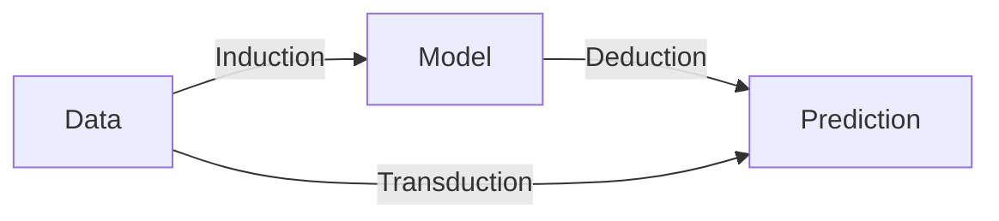
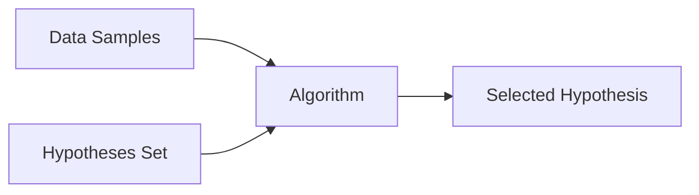

# Learning from Data

Learning from data is a practice of extracting compressed knowledge about the world from data. There are many frameworks of learning. For example, the induction, deduction, and transduction schema shows different possible paths to produce predictions.

There are two different approaches to making predictions based on some given data.

1. Perform induction to find a good model from the data, this is called induction. Once we have a model, we can use it to make predictions, this is called deduction.
2. Directly make predictions from the data, this is called transduction.

!!! info "*The Nature of Statistical Learning Theory*"

    Vapnik's seminal book *The Nature of Statistical Learning Theory* is a very good read for the fundamentals of learning theories[@Vapnik2010-xf].

    Vapnik also discussed some of the key ideas in a book chapter *Estimation of Dependences Based on Empirical Data*[@Vapnik2006-pn].

In the context of machine learning, Abu-Mostafa, Magdon-Ismail, and Lin summarized the machine learning problem using the following chart [@Abu-Mostafa2012-rk]. Ultimately, we need to find an approximation $g$ of the true map $f$ from features $\mathcal X$ to targets $\mathcal Y$ on a specific probability distribution of features $P$. This process is done by using an algorithm to select a hypothesis that works.

Based on this framework, a machine learning process usually consists of three core components[@Domingos2012-wn].

1. Representation: Encoded data and the problem representation.
2. Evaluation: An objective function to be evaluated that guides the model.
3. Optimization: An algorithm to optimize the model so it learns what we want it to do.

We will reuse this framework again and again in the following sections of this chapter.
