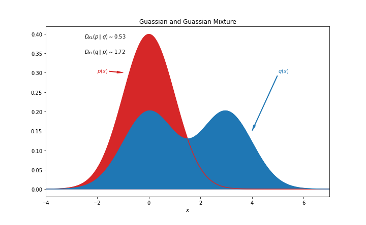

# KL Divergence

The Kullback–Leibler (KL) divergence is defined as

$$
\begin{align}
\operatorname{D}_\mathrm{KL}(p \parallel q ) =& \mathbb E_{p} \left[\log\left(\frac{p}{q}\right) \right] \\
=& \int_{-\infty}^\infty p \log\left(\frac{p}{q}\right)\, dx .
\end{align}
$$

Suppose $p$ is a Gaussian distribution and $q$ is a bimodal Gaussian mixture, the KL divergence $\operatorname{D}_\mathrm{KL}(p \parallel q )$ and $\operatorname{D}_\mathrm{KL}(q \parallel p )$ are different as KL divergence is not necessarily symmetric. Thus the KL divergence is not a proper distance definition.

KL divergence is a special case of [f-divergence](f-divergence.md).

