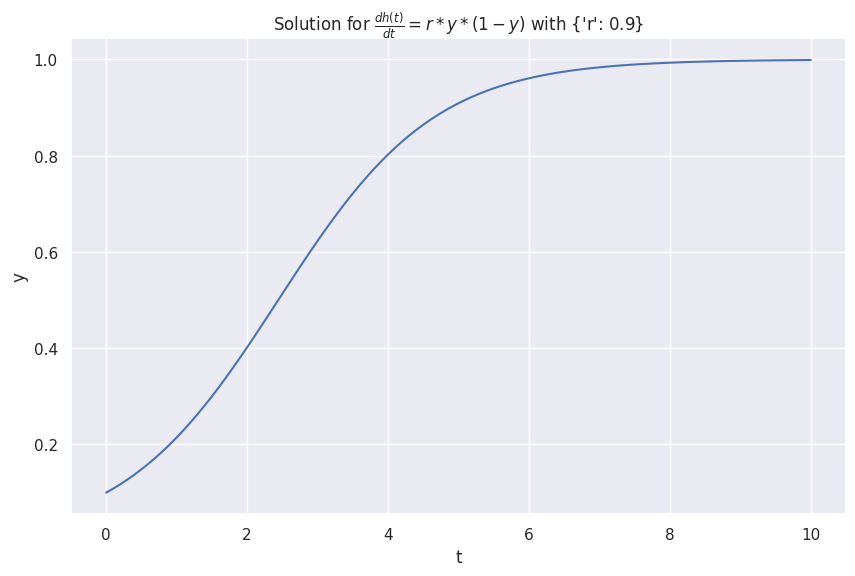

# Neural ODE

Neural ODE is an elegant idea of combining neural networks and differential equations[@Chen2018-mp]. In this section, we will first show some examples of differential equations and then discuss how to combine neural networks and differential equations.


## Ordinary Differential Equations

A first-order ordinary differential equation is as simple as

$$
\begin{equation}
\frac{\mathrm d h(t)}{\mathrm dt} = f_\theta(h(t), t),
\label{eq:1st-order-ode}
\end{equation}
$$

where $h(t)$ is the function that describes the state of a dynamical system. To build up intuitions, we show a few examples of differential equations below.

!!! example "Examples of Differential Equations"

    ??? info ":material-code-json: Utility Code for the Following ODE (Run this first)"

        ```python
        from abc import ABC, abstractmethod
        import numpy as np
        from scipy.integrate import odeint
        import inspect

        from typing import Optional, Any

        import matplotlib.pyplot as plt
        import seaborn as sns; sns.set()

        class DiffEqn(ABC):
            """A first order differential equation and the corresponding solutions.

            :param t: time steps to solve the differential equation for
            :param y_0: initial condition of the ode
            """
            def __init__(self, t: np.ndarray, y_0: float, **fn_args: Optional[Any]):
                self.t = t
                self.y_0 = y_0
                self.fn_args = fn_args

            @abstractmethod
            def fn(self, y: float, t: np.ndarray) -> np.ndarray:
                pass

            def solve(self) -> np.ndarray:
                return odeint(self.fn, self.y_0, self.t)

            @abstractmethod
            def _formula(self) -> str:
                pass

            def __str__(self):
                return f"{self._formula()}"

            def __repr__(self):
                return f"{self._formula()}"

            def plot(self, ax: Optional[plt.Axes]=None):

                if ax is None:
                    _, ax = plt.subplots(figsize=(10, 6.18))

                sns.lineplot(
                    x=self.t, y=self.solve()[:, 0],
                    ax=ax
                )

                ax.set_xlabel("t")
                ax.set_ylabel("y")
                ax.set_title(f"Solution for ${self}$ with {self.fn_args}")

        ```

    === ":material-cursor-default-click: Infection Model"

        The logistic model of infectious disease is

        $$
        \frac{dh(t)}{d t} = r * y * (1-y).
        $$

        ```python
        class Infections(DiffEqn):
            def fn(self, y: float, t: np.ndarray) -> np.ndarray:
                r = self.fn_args["r"]
                dydt = r * y * (1 - y)
                return dydt

            def _formula(self):
                return r"\frac{dh(t)}{d t} = r * y * (1-y)"

        infections_s = Infections(t, 0.1, r=0.9)
        infections_s.plot()
        ```

        


    === ":material-cursor-default-click: Exponential Growth"

        The following equation describes an exponentially growing $h(t)$.

        $$
        \frac{\mathrm d h(t)}{\mathrm d t} = \lambda h(t),
        $$

        with $\lambda > 0$.

        ```python
        class Exponential(DiffEqn):
            def fn(self, y: float, t: np.ndarray) -> np.ndarray:
                lbd = self.fn_args["lbd"]
                dydt = lbd * y

                return dydt

            def _formula(self):
                return r"\frac{dh(t)}{d t} = \lambda h(t)"

        y0_exponential = 1
        t = np.linspace(0, 10, 101)
        lbd = 2

        exponential = Exponential(t, y0_exponential, lbd=lbd)
        exponential.plot()
        ```

        

    === ":material-cursor-default-click: Oscillations"

        We construct an oscillatory system using [sinusoid](https://de.wikipedia.org/wiki/Sinusoid),

        $$
        \frac{dh(t)}{d t} = \sin(\lambda t) t.
        $$

        Naively, we expect the oscillations to be large for larger $t$.
        Taking the limit $t\to\infty$, the first order derivative $\frac{\mathrm dy}{\mathrm d t}\to\infty$. With this limit, we expect the oscillation amplitude to be infinite.

        ```python
        class SinMultiplyT(DiffEqn):
            def fn(self, y: float, t: np.ndarray) -> np.ndarray:
                lbd = self.fn_args["lbd"]
                dydt = np.sin(lbd * t) * t

                return dydt

            def _formula(self):
                return r"\frac{dh(t)}{d t} = \sin(\lambda t) t"

        y0_sin = 1
        t = np.linspace(0, 10, 101)
        lbd = 2
        sin_multiply_t = SinMultiplyT(t, y0_sin, lbd=lbd)
        sin_multiply_t.plot()
        ```

        

    === ":material-cursor-default-click: Receprocal"

        We design a system that grows according to the receprocal of its value,

        $$
        \frac{dh(t)}{d t} = \frac{1}{a * y + b}.
        $$

        ```python
        class Receprocal(DiffEqn):
            def fn(self, y: float, t: np.ndarray) -> np.ndarray:
                shift = self.fn_args["shift"]
                scale = self.fn_args["scale"]
                dydt = 1/(shift + scale * y)
                return dydt

            def _formula(self):
                return r"\frac{dh(t)}{d t} = \frac{1}{shift + scale * y}"

        receprocal = Receprocal(t, 1, shift=-5, scale=-10)
        receprocal.plot()
        ```

        


## Finite Difference Form of Differential Equations

Eq. $\eqref{eq:1st-order-ode}$ can be rewritten in the finite difference form as

$$
\frac{h(t+\Delta t) - h(t)}{\Delta t} = f_\theta(h(t), t),
$$

with $\Delta t$ small enough.

!!! note "Derivatives"

    The definition of the first-order derivative is
    $$
    h'(t) = \lim_{\Delta t\to 0} \frac{h(t+\Delta t) - h(t)}{\Delta t}.
    $$

    In a numerical computation, $\lim$ is approached by taking a small $\Delta t$.

If we take $\Delta t = 1$, the equation becomes

$$
\begin{equation}
h(t+1) = h(t) + f_\theta(h(t), t)
\label{eq:1st-order-ode-finite-difference-deltat-1}
\end{equation}
$$

!!! note "$\Delta t = 1$? Rescale of Time $t$."

    As there is no absolute measure of time $t$, we can always rescale $t$ to $\hat t$ so that $\Delta t = 1$. However, for the sake of clarity, we will keep $t$ as the time variable.


Coming back to neural networks, if $h(t)$ represents the state of a neural network block at depth $t$, Eq. $\eqref{eq:1st-order-ode-finite-difference-deltat-1}$ is nothing fancy but the **residual connection** in ResNet[@He2015-ie]. This connection between the finite difference form of a first-order differential equation and the residual connection leads to the new family of deep neural network models called neural ode[@Chen2018-mp].

In a neural ODE, we treat each layer of a neural network as a function $h$ of depth $t$, i.e., the state of the layer is equivalent to a function $h(t)$.


??? note "Solving Differential Equations"

    The right side of the Eq. $\eqref{eq:1st-order-ode}$ is called the Jacobian. Given any Jacobian $f(h(t), \theta(t), t)$, we can, at least numerically, perform integration to find out the value of $h(t)$ at any $t=t_N$,

    $$
    h(t_N) = \int_{t_0}^{t_i} f(h(t), \theta(t), t) \mathrm dt.
    $$

    In this formalism, we find out the transformed input $h(t_0)$ by solving this differential equation. In traditional neural networks, we achieve this by stacking many layers of neural networks using skip connections.

    In the original Neural ODE paper, the authors used the so-called reverse-model derivative method[@Chen2018-mp].

    We will not dive deep into solving differential equations in this section. Instead, we will show some applications of neural ODEs in section [Time Series Forecasting with Neural ODE](../time-series-deep-learning/timeseries.neural-ode.md).
