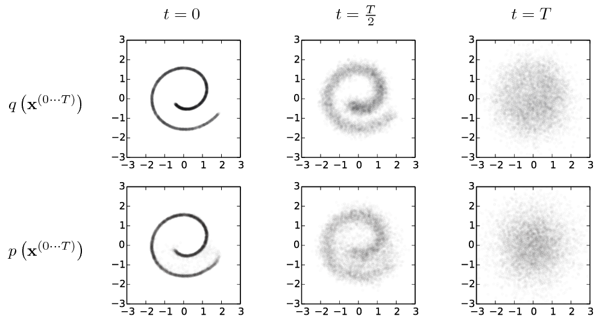
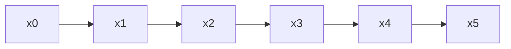
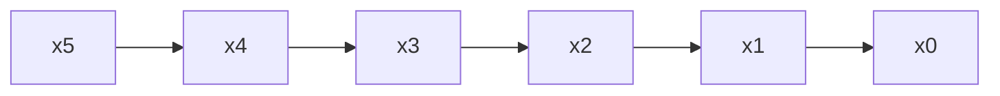
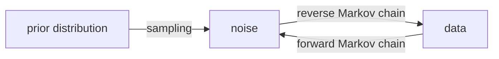

# Denoising Diffusion Probabilistic Models

Many philosophically beautiful deep learning ideas face the tractability problem.
Many deep learning models utilize the concept of latent space, e.g., $\mathbf z$,
which is usually a compression of the real data space, e.g., $\mathbf x$, to enable easier computations for our task.

However, such models usually require the computation of an intractable marginalization of the joint distribution $p(\mathbf x, \mathbf z)$ over the latent space[@Luo2022-hz]. To make such computations tractable, we have to apply approximations or theoretical assumptions.
Diffusion models in deep learning establish the connection between the real data space $\mathbf x$ and the latent space $\mathbf z$ assuming invertible [diffusion processes](https://en.wikipedia.org/wiki/Diffusion_process) [@Sohl-Dickstein2015-th][@Ho2020-er].

## Objective

In a denoising diffusion model, given

- an input $\mathbf x^0$ drawn from a complicated and unknown distribution $q(\mathbf x^0)$,

we find

- a latent space with a simple and manageable distribution, e.g., normal distribution, and
- the transformations from $\mathbf x^0$ to $\mathbf x^n$, as well as
- the transformations from $\mathbf x^n$ to $\mathbf x^0$.

!!! info "Image Data Example"

    The following figure is taken from Sohl-Dickstein et al. (2015)[@Ho2020-er].

    

    The forward process, shown in the first row, diffuses the original spiral data at $t=0$ into a Gaussian noise at $t=T$. The reverse process, shown in the second row, recovers the original data from $t=T$ into the image at $t=0$.

    In the following texts, we use $n$ instead of $t$.

### An Example with $N=5$

For example, with $N=5$, the forward process is

and the reverse process is

The joint distribution we are searching for is

$$
q(\mathbf x^1, \mathbf x^2, \mathbf x^3, \mathbf x^4, \mathbf x^5 \vert \mathbf x^0) = q(\mathbf x^5\vert \mathbf x^4) q(\mathbf x^4\vert \mathbf x^3) q(\mathbf x^3\vert \mathbf x^2)q(\mathbf x^2\vert \mathbf x^1)q(\mathbf x^1\vert \mathbf x^0),
$$

A diffusion model assumes a simple diffusion process, e.g.,

$$
\begin{equation}
q(\mathbf x^n \vert \mathbf x^{n-1}) \equiv \mathcal N (\mathbf x^n ; \sqrt{ 1 - \beta_n} \mathbf x ^{n -1}, \beta_n\mathbf I).
\label{eq-guassian-noise}
\end{equation}
$$

This simulates an information diffusion process. The information in the original data is gradually smeared.

If the chosen diffusion process is revertible, the reverse process of it can be modeled by a similar Markov process

$$
p_\theta (\mathbf x^0, \mathbf x^1, \mathbf x^2, \mathbf x^3, \mathbf x^4, \mathbf x^5) = p_\theta (\mathbf x^0 \vert \mathbf x^1) p_\theta (\mathbf x^1 \vert \mathbf x^2)
p_\theta (\mathbf x^2 \vert \mathbf x^3)
p_\theta (\mathbf x^3 \vert \mathbf x^4)
p_\theta (\mathbf x^4 \vert \mathbf x^5)
p(\mathbf x^5).
$$

This reverse process is the denoising process.

As long as our model estimates $p_\theta (\mathbf x^n \vert \mathbf x^{n-1})$ nicely, we can go $\mathbf x^0 \to \mathbf x^N$ and $\mathbf x^N \to \mathbf x^0$.

### The Reverse Process: A Gaussian Example

With Eq $\eqref{eq-guassian-noise}$, the reverse process is

$$
\begin{equation}
p_\theta (\mathbf x^{n-1} \vert \mathbf x^n) = \mathcal N ( \mathbf x^{n-1} ; \mu_\theta(\mathbf x^n, n), \Sigma_\theta(\mathbf x^n, n)\mathbf I).
\label{eqn-guassian-reverse-process}
\end{equation}
$$

### Summary

- Forward: perturbs data to noise, step by step;
- Reverse: converts noise to data, step by step.

## Optimization

The forward chain is predefined. To close the loop, we have to find $p_\theta$. A natural choice for our loss function is the negative log-likelihood,

$$
\mathbb E_{q(\mathbf x^0)} \left( - \log ( p_\theta (\mathbf x^0) ) \right).
$$

(Ho et al., 2020) proved that the above loss has an upper bound related to the diffusion process defined in Eq $\eqref{eq-guassian-noise}$[^Rasul2021]

$$
\begin{align}
&\operatorname{min}_\theta \mathbb E_{q(\mathbf x^0)} \\
\leq & \operatorname{min}_\theta \mathbb E_{q(\mathbf x^{0:N})} \left[ -\log p(\mathbf x^N) - \sum_{n=1}^{N} \log \frac{p_\theta (\mathbf x^{n-1}\vert \mathbf x^n)}{q(\mathbf x^n \vert \mathbf x^{n-1})} \right] \\
=& \operatorname{min}_\theta \mathbb E_{\mathbf x^0, \epsilon} \left[ \frac{\beta_n^2}{2\Sigma_\theta \alpha_n (1 - \bar \alpha_n)} \lVert \epsilon - \epsilon_\theta ( \sqrt{ \bar \alpha_n} \mathbf x^0 + \sqrt{1-\bar \alpha_n} \epsilon , n ) \rVert \right]
\end{align}
$$

where $\epsilon$ is a sample from $\mathcal N(0, \mathbf I)$. The second step assumes the Gaussian noise in Eq $\eqref{eq-guassian-noise}$, which is equivalent to[^Rasul2021]

$$
q(\mathbf x^n \vert \mathbf x^0) = \mathcal N (\mathbf x^n ; \sqrt{\bar \alpha_n} \mathbf x^0, (1 - \bar \alpha_n)\mathbf I),
$$

with $\alpha_n = 1 - \beta _ n$, $\bar \alpha _ n = \Pi _ {i=1}^n \alpha_i$, and $\Sigma_\theta$ in Eq $\eqref{eqn-guassian-reverse-process}$.

[^Rasul2021]: Rasul K, Seward C, Schuster I, Vollgraf R. Autoregressive Denoising Diffusion Models for Multivariate Probabilistic Time Series Forecasting. arXiv [cs.LG]. 2021. Available: http://arxiv.org/abs/2101.12072
[^Rogge2022]: Rogge N, Rasul K. The Annotated Diffusion Model. In: Hugging Face Blog [Internet]. 7 Jun 2022 [cited 18 Feb 2023]. Available: https://huggingface.co/blog/annotated-diffusion
