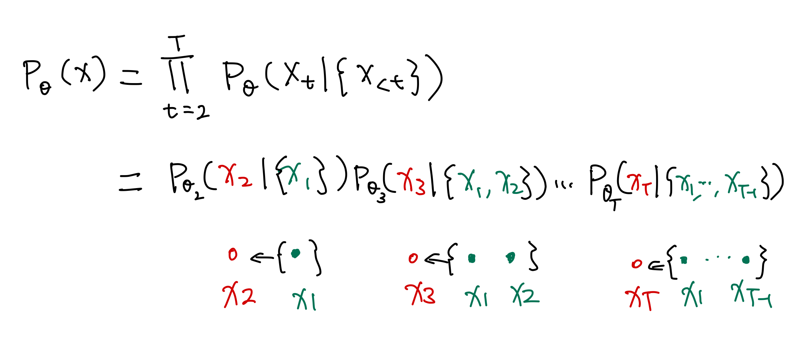
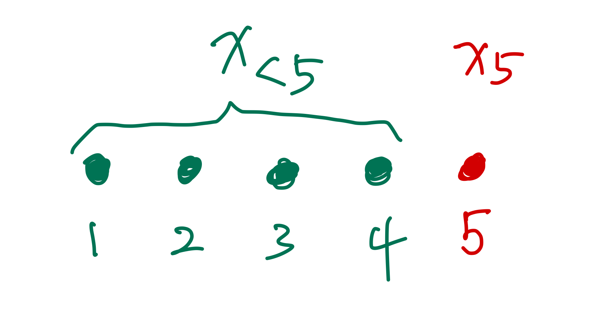

# Autoregressive Model

An autoregressive (AR) model is autoregressive,

$$
\begin{equation}
\log p_\theta (x) = \sum_{t=1}^T \log p_\theta ( x_{t} \mid \{x_{<t}\} ).
\end{equation}
$$

??? note "Notations and Conventions"
    In AR models, we have to mention the preceding nodes ($\{x_{<t}\}$) of a specific node ($x_{t}$). For $t=5$, the relations between $\{x_{<5}\}$ and $x_5$ is shown in the following illustration.

    { align=right }

    There are different notations for such relations.

    - In Uria et al., the authors use $p(x_{o_d}\mid \mathbf x_{o_{<d}})$ [^Uria2016].
    - In Liu et al. and Papamakarios et al., the authors use $p(x_{t}\mid \mathbf x_{1:t-1})$ [^Liu2020][^Papamakarios2017].
    - In Germain et al., the authors use $p(x_t\mid \mathbf x_{<t})$ [^Germain2015].

    In the current review, we expanded the vector notation $\mathbf x_{<t}$ into a set notation as it is not necessarily a vector.

[^Uria2016]: Uria B, Côté M-A, Gregor K, Murray I, Larochelle H. Neural Autoregressive Distribution Estimation. arXiv [cs.LG]. 2016. Available: http://arxiv.org/abs/1605.02226

[^Triebe2019]: Triebe O, Laptev N, Rajagopal R. AR-Net: A simple Auto-Regressive Neural Network for time-series. arXiv [cs.LG]. 2019. Available: http://arxiv.org/abs/1911.12436

[^Ho2019]: Ho G. George Ho. In: Eigenfoo [Internet]. 9 Mar 2019 [cited 19 Sep 2021]. Available: https://www.eigenfoo.xyz/deep-autoregressive-models/

[^Papamakarios2017]: Papamakarios G, Pavlakou T, Murray I. Masked Autoregressive Flow for Density Estimation. arXiv [stat.ML]. 2017. Available: http://arxiv.org/abs/1705.07057

[^Germain2015]: Germain M, Gregor K, Murray I, Larochelle H. MADE: Masked autoencoder for distribution estimation. 32nd International Conference on Machine Learning, ICML 2015. 2015;2: 881–889. Available: http://arxiv.org/abs/1502.03509

[^Liu2020]: Liu X, Zhang F, Hou Z, Wang Z, Mian L, Zhang J, et al. Self-supervised Learning: Generative or Contrastive. arXiv [cs.LG]. 2020. Available: http://arxiv.org/abs/2006.08218

[^Lippe]: Lippe P. Tutorial 12: Autoregressive Image Modeling — UvA DL Notebooks v1.1 documentation. In: UvA Deep Learning Tutorials [Internet]. [cited 20 Sep 2021]. Available: https://uvadlc-notebooks.readthedocs.io/en/latest/tutorial_notebooks/tutorial12/Autoregressive_Image_Modeling.html

[^rogen]: rogen-george. rogen-george/Deep-Autoregressive-Model. In: GitHub [Internet]. [cited 20 Sep 2021]. Available: https://github.com/rogen-george/Deep-Autoregressive-Model
