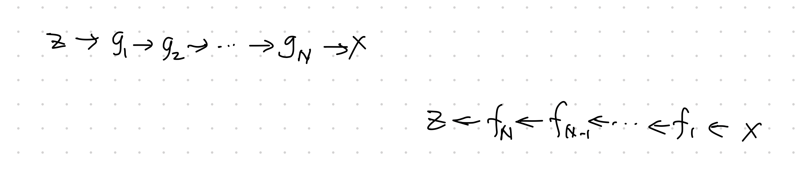

# Flow

For a probability density $p(x)$ and a transformation of coordinate $x=g(z)$ or $z=f(x)$, the density can be expressed using the coordinate transformations, i.e.,

$$
\begin{align}
p(x) &= \tilde p (f(x)) \lvert \operatorname{det} \operatorname{D} g(f(x)) \rvert^{-1} \\
&= \tilde p(f(x)) \lvert \operatorname{det}\operatorname{D} f(x) \rvert
\end{align}
$$

where the Jacobian is

$$
\operatorname{D} g(z) \to \frac{\partial }{\partial z} g.
$$

The operation $g_{*}\circ \tilde p(z)$ is the push forward of $\tilde p(z)$. The operation $g_{*}$ will pushforward simple distribution $\tilde p(z)$ to a more complex distribution $p(x)$.

- The generative direction: sample $z$ from distribution $\tilde p(z)$, apply transformation $g(z)$;
- The normalizing direction: "simplify" $p(x)$ to some simple distribution $\tilde p(z)$.

The key to the flow model is the chaining of the transformations

$$
\operatorname{det} \operatorname{D} f(x) = \Pi_{i=1}^N \operatorname{det} \operatorname{D} f_i (x_i)
$$

where

$$
\begin{align}
x_i &= g_i \circ \cdots \circ g_1 (z)\\
&= f_{i+1} \circ \cdots \circ f_N (x).
\end{align}
$$

[^Liu2020]: Liu X, Zhang F, Hou Z, Wang Z, Mian L, Zhang J, et al. Self-supervised Learning: Generative or Contrastive. arXiv [cs.LG]. 2020. Available: http://arxiv.org/abs/2006.08218
