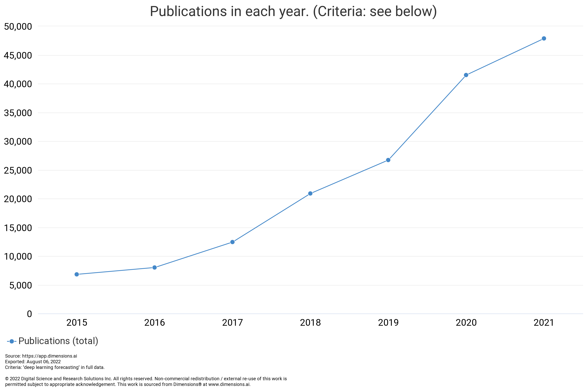

---
hide:
  - navigation
---

# Time Series Forecasting using Deep Learning

Forecasting the future is an extremely valuable superpower. The forecasting game has been dominated by statisticians who are real experts in time series problems. As the amount of data increases, many of the statistical methods are not squeezing enough out of the massive datasets. Consequently, time series forecasting using deep learning emerges and became a fast-growing field. It is trendy, not only as LinkedIn debates but also in academic papers. We plotted the number of related publications per year using [the keyword "deep learning forecasting" on dimensions.ai](https://app.dimensions.ai/analytics/publication/overview/timeline?search_mode=content&search_text=deep%20learning%20forecasting&search_type=kws&search_field=full_search&year_from=2015&year_to=2021)).[@dimensionsai]

<figure markdown>
  
  <figcaption>This chart is obtained on 2022-08-06, from Digital Science’s Dimensions platform, available at https://app.dimensions.ai</figcaption>
</figure>

On the other hand, deep learning methods are not yet winning all the games of forecasting. Time series forecasting is a complicated problem with a great variety of data generating processes (DGP). Some argue that we don't need deep learning to forecast since well tuned statistical models and trees are already performing well and are faster and more interpretable than deep neural networks[@Elsayed2021-ug][@Grinsztajn2022-mu]. Ensembles of statistical models performing great, even outperforming many deep learning models on the [M3 data](https://forecasters.org/resources/time-series-data/m3-competition/)[^nixtla-m3-ensemble].

However, deep learning models are picking up speed. In the [M5 competition](https://mofc.unic.ac.cy/m5-competition/), deep learning "have shown forecasting potential, motivating further research in this direction"[@Makridakis2022-hb]. As the complexity and size of time series data are growing and more and more deep learning forecasting models are being developed, forecasting with deep learning is on the path to be an important alternative to statistical forecasting methods.

In [Coding Tips](engineering/index.md), we provide coding tips to help some readers set up the development environment. In [Deep Learning Fundamentals](deep-learning-fundamentals/index.md), we introduce the fundamentals of deep neural networks and their practices. For completeness, we also provide code and derivations for the models. With these two parts, we introduce time series data and statistical forecasting models in [Time Series Forecasting Fundamentals](time-series/index.md), where we discuss methods to analyze time series data, several universal data generating processes of time series data, and some statistical forecasting methods. Finally, we fulfill our promise in the title in [Time Series Forecasting with Deep Learning](time-series-deep-learning/index.md).

[^nixtla-m3-ensemble]: Nixtla. statsforecast/experiments/m3 at main · Nixtla/statsforecast. In: GitHub [Internet]. [cited 12 Dec 2022]. Available: https://github.com/Nixtla/statsforecast/tree/main/experiments/m3
