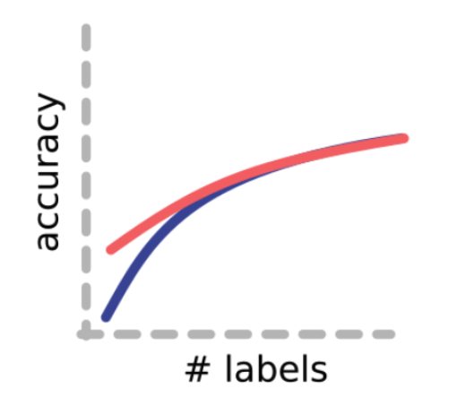

# Introduction

When I switched to data science, I built [my digital garden, datumorphism](https://datumorphism.leima.is/). I deliberately designed this digital garden as my second brain. As a result, most of the articles are fragments of knowledge and require context to understand them.

Making bricks is easy but assembling them into a house is not easy. So I have decided to use this repository to practice my house-building techniques.

I do not have a finished blueprint yet. But I have a framework in my mind: I want to consolidate some of my thoughts and learnings in a good way. However, I do not want to compile a reference book, as [datumorphism](https://datumorphism.leima.is/) already serves this purpose. I should create stories.

## Blueprint

- [ ] Tech Onboarding
  - [ ] Python, Environment, VSCode, Git, ...
  - [ ] Pytorch Lightning
- [ ] Time Series
  - [ ] Data
    - [ ] Datasets
    - [ ] Data Generating Process (DGP)
    - [ ] Data Processing
    - [ ] Data Augmentation
    - [ ] Metrics
  - [ ] Tasks
    - [ ] Forecasting
    - [ ] Classification
    - [ ] Generation
  - [ ] Models (Focus on Deep Models)
    - [ ] AR and Variants
    - [ ] RNN, e.g., LSTM
    - [ ] DeepAR
    - [ ] Conformal Prediction
    - [ ] Transformer
    - [ ] Spatial-temporal Models, e.g., GNN
- [ ] Self-supervised Learning
- [ ] Graph Neural Networks
- [ ] Other Topics
  - [ ] Graph Neural Networks
  - [ ] Spiking Neural Networks
  - [ ] Transformers

## Notations

In this document, we use the following notations.

- Sets, domains, abstract variables, $X$, $Y$;
- Probability distribution $P$, $Q$;
- Probability density $p$, $q$.

## Why Self-supervised Learning

Self-supervised learning helps with downstream visual tasks[^Newell2020].

> Image from [Newell2020](http://arxiv.org/abs/2003.14323)

[^Newell2020]: Newell A, Deng J. How Useful is Self-Supervised Pretraining for Visual Tasks? arXiv [cs.CV]. 2020. Available: http://arxiv.org/abs/2003.14323
