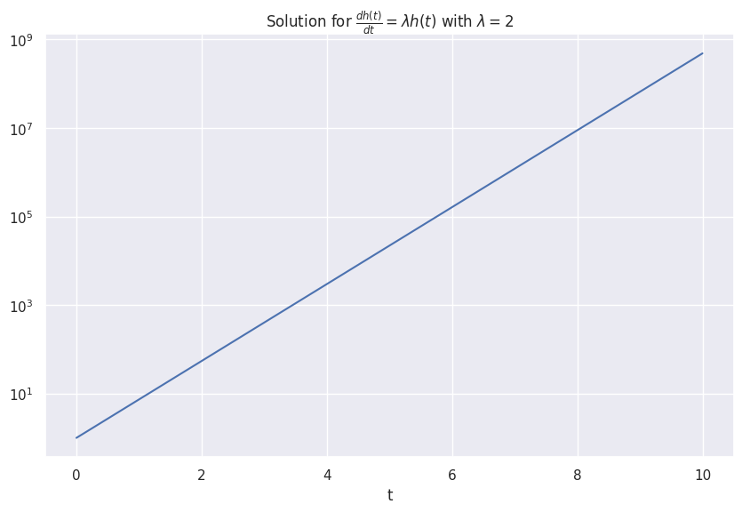

# Neural ODE

Many of real world systems are dynamical systems. Differential equation is a handy tool to model a dynamical system. For example, the action potentials of a squid giant axon can be modeled by the famous [Hodgkin-Huxley model](https://en.wikipedia.org/wiki/Hodgkin%E2%80%93Huxley_model).

Many time series data are generated by dynamical systems. A naive philosophy is to come up with a set of differential equations to model the time series.

In this section, we discuss the creative idea of neural ODE[@Chen2018-mp].

A first order ordinary differential equation is

$$
\frac{\mathrm d h(t)}{\mathrm dt} = f_\theta(h(t), t),
$$

where $h(t)$ is the function that describes a dynamical system.

!!! example "Exponential Growth"

    The following equation describes an exponentially growing $h(t)$.

    $$
    \frac{\mathrm d h(t)}{\mathrm d t} = \lambda h(t),
    $$

    with $\lambda > 0$.

    
