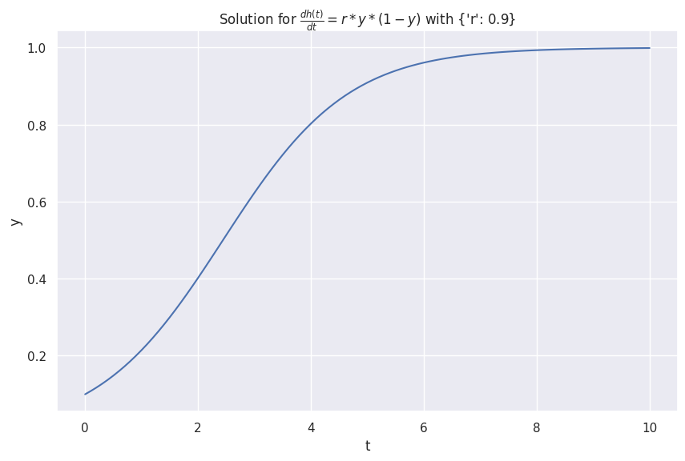
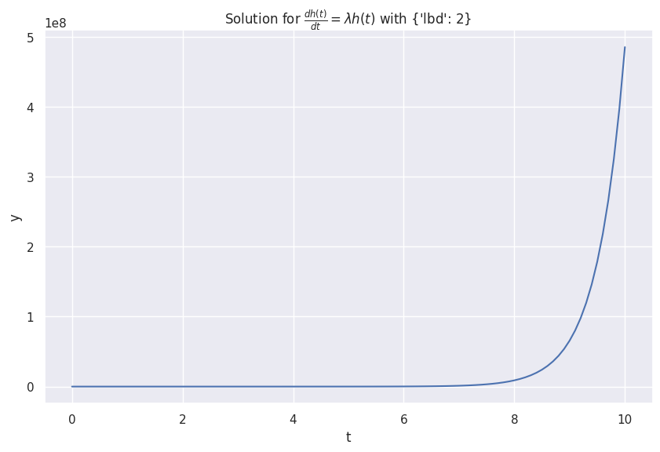
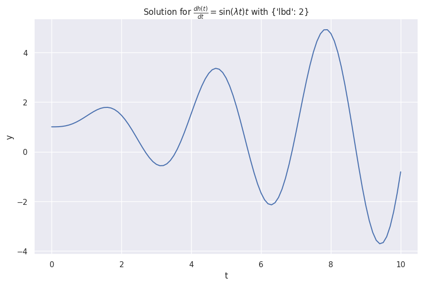
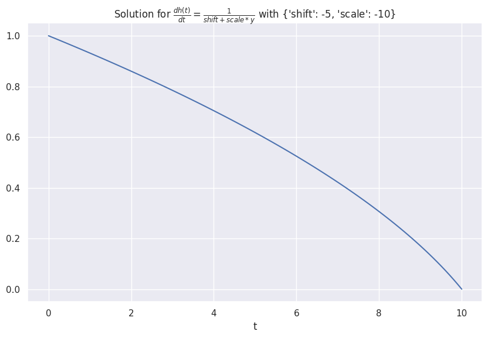

# Neural ODE

Many of real world systems are dynamical systems. Differential equation is a handy tool to model a dynamical system. For example, the action potentials of a squid giant axon can be modeled by the famous [Hodgkin-Huxley model](https://en.wikipedia.org/wiki/Hodgkin%E2%80%93Huxley_model).

Many time series data are generated by dynamical systems. A naive philosophy is to come up with a set of differential equations to model the time series.

In this section, we discuss the creative idea of neural ODE[@Chen2018-mp].

A first order ordinary differential equation is

$$
\frac{\mathrm d h(t)}{\mathrm dt} = f_\theta(h(t), t),
$$

where $h(t)$ is the function that describes a dynamical system.

## Examples of First Order Differential Equations

??? info ":material-code-json: Utility Code for ODE (Run this first)"

    ```python
    from abc import ABC, abstractmethod
    import numpy as np
    from scipy.integrate import odeint
    import inspect

    from typing import Optional, Any

    import matplotlib.pyplot as plt
    import seaborn as sns; sns.set()

    class DiffEqn(ABC):
        """A first order differential equation and the corresponding solutions.

        :param t: time steps to solve the differential equation for
        :param y_0: initial condition of the ode
        """
        def __init__(self, t: np.ndarray, y_0: float, **fn_args: Optional[Any]):
            self.t = t
            self.y_0 = y_0
            self.fn_args = fn_args

        @abstractmethod
        def fn(self, y: float, t: np.ndarray) -> np.ndarray:
            pass

        def solve(self) -> np.ndarray:
            return odeint(self.fn, self.y_0, self.t)

        @abstractmethod
        def _formula(self) -> str:
            pass

        def __str__(self):
            return f"{self._formula()}"

        def __repr__(self):
            return f"{self._formula()}"

        def plot(self, ax: Optional[plt.Axes]=None):

            if ax is None:
                _, ax = plt.subplots(figsize=(10, 6.18))

            sns.lineplot(
                x=self.t, y=self.solve()[:, 0],
                ax=ax
            )

            ax.set_xlabel("t")
            ax.set_ylabel("y")
            ax.set_title(f"Solution for ${self}$ with {self.fn_args}")

    ```

=== ":material-cursor-default-click: Infection Model"

    The logistic model of infectious disease is

    $$
    \frac{dh(t)}{d t} = r * y * (1-y).
    $$

    ```python
    class Infections(DiffEqn):
        def fn(self, y: float, t: np.ndarray) -> np.ndarray:
            r = self.fn_args["r"]
            dydt = r * y * (1 - y)
            return dydt

        def _formula(self):
            return r"\frac{dh(t)}{d t} = r * y * (1-y)"

    infections_s = Infections(t, 0.1, r=0.9)
    infections_s.plot()
    ```

    


=== ":material-cursor-default-click: Exponential Growth"

    The following equation describes an exponentially growing $h(t)$.

    $$
    \frac{\mathrm d h(t)}{\mathrm d t} = \lambda h(t),
    $$

    with $\lambda > 0$.

    ```python
    class Exponential(DiffEqn):
        def fn(self, y: float, t: np.ndarray) -> np.ndarray:
            lbd = self.fn_args["lbd"]
            dydt = lbd * y

            return dydt

        def _formula(self):
            return r"\frac{dh(t)}{d t} = \lambda h(t)"

    y0_exponential = 1
    t = np.linspace(0, 10, 101)
    lbd = 2

    exponential = Exponential(t, y0_exponential, lbd=lbd)
    exponential.plot()
    ```

    

=== ":material-cursor-default-click: Oscillations"

    We construct an oscillatory system using [sinusoid](https://de.wikipedia.org/wiki/Sinusoid),

    $$
    \frac{dh(t)}{d t} = \sin(\lambda t) t.
    $$

    Naively, we expect the oscillations to be large for larger $t$.
    Taking the limit $t\to\infty$, the first order derivative $\frac{\mathrm dy}{\mathrm d t}\to\infty$. With this limit, we expect the oscillation amplitude to be infinite.

    ```python
    class SinMultiplyT(DiffEqn):
        def fn(self, y: float, t: np.ndarray) -> np.ndarray:
            lbd = self.fn_args["lbd"]
            dydt = np.sin(lbd * t) * t

            return dydt

        def _formula(self):
            return r"\frac{dh(t)}{d t} = \sin(\lambda t) t"

    y0_sin = 1
    t = np.linspace(0, 10, 101)
    lbd = 2
    sin_multiply_t = SinMultiplyT(t, y0_sin, lbd=lbd)
    sin_multiply_t.plot()
    ```

    

=== ":material-cursor-default-click: Receprocal"

    We design a system that grows according to the receprocal of its value,

    $$
    \frac{dh(t)}{d t} = \frac{1}{a * y + b}.
    $$

    ```python
    class Receprocal(DiffEqn):
        def fn(self, y: float, t: np.ndarray) -> np.ndarray:
            shift = self.fn_args["shift"]
            scale = self.fn_args["scale"]
            dydt = 1/(shift + scale * y)
            return dydt

        def _formula(self):
            return r"\frac{dh(t)}{d t} = \frac{1}{shift + scale * y}"

    receprocal = Receprocal(t, 1, shift=-5, scale=-10)
    receprocal.plot()
    ```

    
