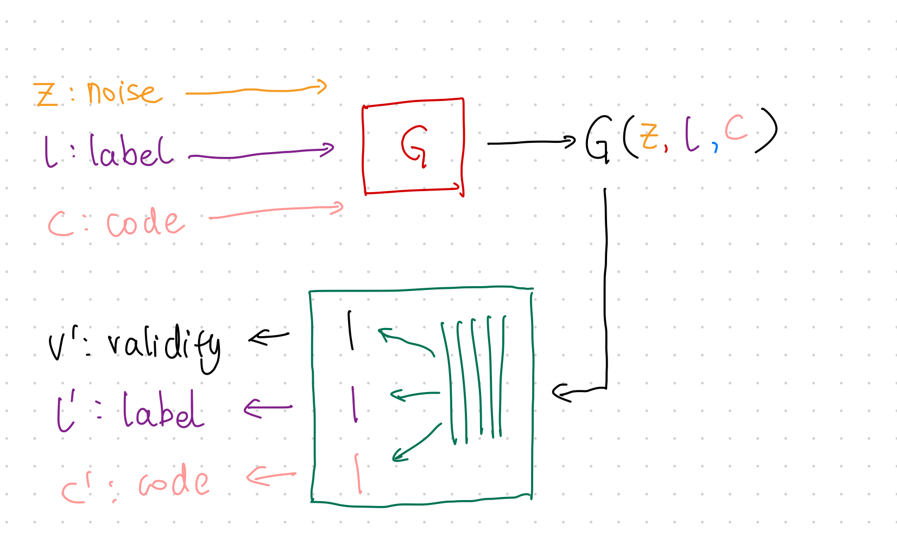

---
tags:
  - WIP
---
# GAN

GAN is a **generative neural sampler**[^Nowozin2016]. To train the sampler, the task of GAN is designed to generate features $X$ from a latent space $\xi$ and class labels $Y$,

$$\xi, Y \to X.$$

Many different formulations of GANs are proposed. As an introduction to this topic, we will discuss vanilla GAN in this section[^Goodfellow2014].


## GAN Theory

### The Minimax Game Loss

The minimax game is a game to "minimizing the possible loss for a worst-case"[^minimax_wiki]. In GAN, the game is to train the generator ${\color{red}G}$ to fool the discriminator ${\color{green}D}$ while minimizing the discrimination error of ${\color{green}D}$.

Goodfellow prosed a loss[^Goodfellow2014]

$$
\begin{equation}
\underset{{\color{red}G}}{\operatorname{min}}\underset{{\color{green}D}}{\operatorname{max}} V({\color{green}D}, {\color{red}G}) = \mathbb E_{x\sim p_{data}} \left[ \log {\color{green}D}(x) \right] + \mathbb E_{z\sim p_z} \left[ \log( 1- {\color{green}D}({\color{red}G}(z)) ) \right].
\end{equation}
$$


### Divergence

Goodfellow et al proved that the global minimum of such a setup is reached only if only $p_{G} = p_\text{data}$. GAN compares the generated distribution to the data distribution, using the Jensen-Shannon divergence[^Goodfellow2014],

$$
\operatorname{D}_{\text{JS}}(p_\text{data}\Vert p_{{\color{red}G}}) = \frac{1}{2}\left[ \operatorname{D}_\text{KL} \left( p_\text{data} \bigg\Vert \frac{p_\text{data} + p_{\color{red}G}}{2} \right) + \operatorname{D}_\text{KL} \left( p_{{\color{red}G}} \bigg\Vert \frac{p_\text{data} + p_{\color{red}G}}{2} \right) \right].
$$

!!! warning "Off by a Constant"

    The value function of GAN for fixed $G$ is slightly different from JS divergence[^Goodfellow2014],

    $$
    \underset{G}{\operatorname{max}}V({\color{red}G},{\color{green}D}) = 2 \operatorname{D}_\text{JS}( p_\text{data} \Vert p_{\color{red}G} ) - \log 4.
    $$


### Alternating Training

GAN training requires two stages,

- train discriminator ${\color{green}D}$, and
- train generator ${\color{red}G}$.


## GAN Code

We built a simple GAN using MNIST dataset.


=== "Result"

    The generated images look quite close to handwritings.

    


=== "Code"

    ```python
    import matplotlib.pyplot as plt
    import torch
    from pathlib import Path
    import torchvision
    import torchvision.transforms as transforms
    from loguru import logger
    from torch import nn
    import click


    logger.debug(f"Setting device ...")
    device = ""
    if torch.cuda.is_available():
        device = torch.device("cuda")
    else:
        device = torch.device("cpu")
    logger.info(f"Device in use: {device}")


    def plot_images(image_samples, target):
        """Plot a grid of images and save to a file."""

        if not Path(target).parent.exists():
            Path(target).parent.mkdir(parents=True)

        # real_samples, mnist_labels = next(iter(train_loader))
        for i in range(16):
            ax = plt.subplot(4, 4, i + 1)
            plt.imshow(image_samples[i].reshape(28, 28), cmap="gray_r")
            plt.xticks([])
            plt.yticks([])
        plt.savefig(target)


    def get_data_loaders(batch_size=32, data_dir="data/mnist", download=True, plot_samples=True):
        """Get MNIST data and built a dataloader for the dataset"""

        transform = transforms.Compose(
            [transforms.ToTensor(), transforms.Normalize((0.5,), (0.5,))]
        )

        train_set = torchvision.datasets.MNIST(
            root=data_dir, train=True, download=download, transform=transform
        )

        train_loader = torch.utils.data.DataLoader(
            train_set, batch_size=batch_size, shuffle=True
        )

        if plot_samples:
            real_samples, mnist_labels = next(iter(train_loader))
            plot_images(real_samples, target="assets/real_images/real_image_samples.png")

        return train_loader


    class Discriminator(nn.Module):
        """The discrimnator should take data that has the dimension of the image and spit out a probability"""
        def __init__(self):
            super().__init__()
            self.model = nn.Sequential(
                nn.Linear(784, 1024),
                nn.ReLU(),
                nn.Dropout(0.3),
                nn.Linear(1024, 512),
                nn.ReLU(),
                nn.Dropout(0.3),
                nn.Linear(512, 256),
                nn.ReLU(),
                nn.Dropout(0.3),
                nn.Linear(256, 1),
                nn.Sigmoid(),
            )

        def forward(self, x):
            x = x.view(x.size(0), 784)
            output = self.model(x)
            return output


    class Generator(nn.Module):
        """The generator should take in some noise data (a latent space data) and spit out an image.
        We use the input noise as a trick to make the generator more general
        """
        def __init__(self):
            super().__init__()
            self.model = nn.Sequential(
                # nn.Linear(10, 100),
                # nn.ReLU(),
                nn.Linear(100, 256),
                nn.ReLU(),
                nn.Linear(256, 512),
                nn.ReLU(),
                nn.Linear(512, 1024),
                nn.ReLU(),
                nn.Linear(1024, 784),
                nn.Tanh(),
            )

        def forward(self, x):
            output = self.model(x)
            output = output.view(x.size(0), 1, 28, 28)
            return output


    @click.command()
    @click.option("--epochs", default=50, help="Number of epochs for the training")
    @click.option("--learning_rate", "-lr", default=0.0001, help="Learning rate for the optimizer")
    @click.option("--batch_size", default=32, help="Batch size")
    @click.option("--data_dir", default="data/mnist", help="Directory for storing the dataset")
    @click.option("--download_mnist", "-d", default=True, type=bool, help="Whether to download MNIST data")
    @click.option("--random_seed", "-rs", default=42, type=int, help="Random seed for the random generators")
    def main(epochs, learning_rate, batch_size, data_dir, download_mnist, random_seed):

        latent_space_dim = 100

        torch.manual_seed(random_seed)

        # check the dtypes
        logger.debug(
            f"torch tensor dtype: {torch.tensor([1.2, 3]).dtype}"
        )
        # torch.set_default_dtype(torch.float64)
        # logger.debug(
        #     f"set torch tensor dtype to 64: {torch.tensor([1.2, 3]).dtype}"
        # )

        train_loader = get_data_loaders(
            batch_size=batch_size,
            data_dir=data_dir,
            download=download_mnist
        )
        logger.debug(f"Training data is ready")

        discriminator = Discriminator().to(device=device)
        generator = Generator().to(device=device)

        loss_function = nn.BCELoss()

        optimizer_discriminator = torch.optim.Adam(
            discriminator.parameters(), lr=learning_rate
        )
        optimizer_generator = torch.optim.Adam(generator.parameters(), lr=learning_rate)

        for epoch in range(epochs):
            for n, (real_samples, mnist_labels) in enumerate(train_loader):
                # We prepare some data for training the discriminator
                # Here we will prepare both the generated data and the real data
                real_samples = real_samples.to(device=device)
                real_samples_labels = torch.ones((batch_size, 1)).to(device=device)
                latent_space_samples = torch.randn((batch_size, latent_space_dim)).to(device=device)
                # logger.debug(f"Latent space samples: {latent_space_samples}")
                generated_samples = generator(latent_space_samples)
                # logger.debug(f"Generated samples:{generated_samples}")
                generated_samples_labels = torch.zeros((batch_size, 1)).to(device=device)
                all_samples = torch.cat((real_samples, generated_samples))
                all_samples_labels = torch.cat((real_samples_labels, generated_samples_labels))

                # Training the discriminator
                # The discrinimator is trained using the samples we generated above, i.e.
                # the generated samples and the real images
                discriminator.zero_grad()
                output_discriminator = discriminator(all_samples)
                loss_discriminator = loss_function(output_discriminator, all_samples_labels)
                loss_discriminator.backward()
                optimizer_discriminator.step()

                # Generate some noise data for training the generator
                #
                latent_space_samples_generator = torch.randn((batch_size, latent_space_dim)).to(device=device)

                # Training the generator using the training optimizer
                generator.zero_grad()
                generated_samples_generator = generator(latent_space_samples_generator)
                output_discriminator_generated = discriminator(generated_samples_generator)
                loss_generator = loss_function(
                    output_discriminator_generated, real_samples_labels
                )
                loss_generator.backward()
                optimizer_generator.step()

                # Show loss
                if n == batch_size - 1:
                    print(f"Epoch: {epoch} Loss D.: {loss_discriminator}")
                    print(f"Epoch: {epoch} Loss G.: {loss_generator}")

            logger.debug(f"Plotting for epoch: {epoch} ...")
            latent_space_samples_epoch = torch.randn(batch_size, latent_space_dim).to(device=device)
            generated_samples_epoch = generator(latent_space_samples_epoch)
            generated_samples_epoch = generated_samples_epoch.cpu().detach()
            plot_images(generated_samples_epoch, target=f"assets/generated_images/generated_image_samples_{epoch}.png")
            logger.debug(f"Saved plots for epoch: {epoch}")

        latent_space_samples = torch.randn(batch_size, latent_space_dim).to(device=device)
        generated_samples = generator(latent_space_samples)

        logger.debug(f"Plot generated images...")
        generated_samples = generated_samples.cpu().detach()
        plot_images(generated_samples, target="assets/generated_images/generated_image_samples.png")


    if __name__ == "__main__":
        main()
    ```


## f-GAN

The essence of [GAN](gan.md#divergence) is comparing the generated distribution $p_G$ and the data distribution $p_\text{data}$. The vanilla GAN considers the Jensen-Shannon divergence $\operatorname{D}_\text{JS}(p_\text{data}\Vert p_{G})$. The discriminator ${\color{green}D}$ serves the purpose of forcing this divergence to be small.

!!! question "Why do we need the discriminator?"
    If the JS divergence is an objective, why do we need the discriminator? Even in f-GAN we need a functional to approximate the f-divergence. This functional we choose works like the discriminator of GAN.

There exists a more generic form of JS divergence, which is called [f-divergence](../../concepts/f-divergence.md)[^f-divergence_wiki]. f-GAN obtains the model by estimating the f-divergence between the data distribution and the generated distribution[^Nowozin2016].


### Variational Divergence Minimization


The Variational Divergence Minimization (VDM) extends the variational estimation of f-divergence[^Nowozin2016]. VDM searches for the saddle point of an objective $F({\color{red}\theta}, {\color{blue}\omega})$, i.e., min w.r.t. $\theta$ and max w.r.t ${\color{blue}\omega}$, where ${\color{red}\theta}$ is the parameter set of the generator ${\color{red}Q_\theta}$, and ${\color{blue}\omega}$ is the parameter set of the variational approximation to estimate f-divergence, ${\color{blue}T_\omega}$.

The objective $F({\color{red}\theta}, {\color{blue}\omega})$ is related to the choice of $f$ in f-divergence and the variational functional ${\color{blue}T}$,

$$
\begin{align}
& F(\theta, \omega)\\
=& \mathbb E_{x\sim p_\text{data}} \left[ {\color{blue}T_\omega}(x) \right] - \mathbb E_{x\sim {\color{red}Q_\theta} } \left[ f^*({\color{blue}T_\omega}(x)) \right] \\
=& \mathbb E_{x\sim p_\text{data}} \left[ g_f(V_{\color{blue}\omega}(x)) \right] - \mathbb E_{x\sim {\color{red}Q_\theta} } \left[ f^*(g_f(V_{\color{blue}\omega}(x))) \right].
\end{align}
$$

In the above objective,

- $f^*$ is the [Legendre–Fenchel transformation](https://en.wikipedia.org/wiki/Convex_conjugate) of $f$, i.e., $f^*(t) = \operatorname{sup}_{u\in \mathrm{dom}_f}\left\{ ut - f(u) \right\}$.


??? tip "$T$"
    The function $T$ is used to estimate the lower bound of f-divergence[^Nowozin2016].


??? tip "Choice of $g_f$ and $V$"

    Nowozin et al provided a table for $g_f$ and $V$[^Nowozin2016].

    


We estimate

- $\mathbb E_{x\sim p_\text{data}}$ by sampling from the mini-batch, and
- $\mathbb E_{x\sim {\color{red}Q_\theta} }$ by sampling from the generator.


!!! example "Reduce to GAN"

    The VDM loss can be reduced to the [loss of GAN](gan.md#the-minimax-game-loss) by setting[^Nowozin2016]

    $$
    \begin{align}
    \log {\color{green}D_\omega} =& g_f(V_{\color{blue}\omega}(x))  \\
    \log \left( 1 - {\color{green}D_\omega} \right) =& -f^*\left( g_f(V_{\color{blue}\omega}(x)) \right).
    \end{align}
    $$

    It is straightforward to validate that the following result is a solution to the above set of equations,

    $$
    g_f(V) = \log \frac{1}{1 + e^{-V}}.
    $$


### Code

- [minlee077/f-GAN-pytorch](https://github.com/minlee077/f-GAN-pytorch)
- [shayneobrien/generative-models](https://github.com/shayneobrien/generative-models/blob/master/src/f_gan.py)


## InfoGAN

In GAN, the latent space input is usually random noise, e.g., Gaussian noise. The objective of [GAN](gan.md) is a very generic one. It doesn't say anything about how exactly the latent space will be used. This is not desirable in many problems. We would like to have more interpretability in the latent space. InfoGAN introduced constraints to the objective to enforce the interpretability of the latent space[^Chen2016].


### Constraint

The constraint InfoGAN proposed is [mutual information](../../concepts/mutual-information.md),

$$
\underset{{\color{red}G}}{\operatorname{min}} \underset{{\color{green}D}}{\operatorname{max}} V_I ({\color{green}D}, {\color{red}G}) = V({\color{green}D}, {\color{red}G}) - \lambda I(c; {\color{red}G}(z,c)),
$$

where

- $c$ is the latent code,
- $z$ is the random noise input,
- $V({\color{green}D}, {\color{red}G})$ is the objective of GAN,
- $I(c; {\color{red}G}(z,c))$ is the mutual information between the input latent code and generated data.


Using the lambda multiplier, we punish the model if the generator loses information in latent code $c$.


### Training



The training steps are almost the same as [GAN](gan.md) but with one extra loss to be calculated in each mini-batch.

1. Train $\color{red}G$ using loss: $\operatorname{MSE}(v', v)$;
2. Train $\color{green}D$ using loss: $\operatorname{MSE}(v', v)$;
3. Apply Constraint:
    1. Sample data from mini-batch;
    2. Calculate loss $\lambda_{l} H(l';l)+\lambda_c \operatorname{MSE}(c,c')$


### Python Code


[eriklindernoren/PyTorch-GAN](https://github.com/eriklindernoren/PyTorch-GAN/blob/master/implementations/infogan/infogan.py)


[^Nowozin2016]: Nowozin S, Cseke B, Tomioka R. f-GAN: Training Generative Neural Samplers using Variational Divergence Minimization. arXiv [stat.ML]. 2016. Available: http://arxiv.org/abs/1606.00709

[^minimax_wiki]: Contributors to Wikimedia projects. Minimax. In: Wikipedia [Internet]. 5 Aug 2021 [cited 6 Sep 2021]. Available: https://en.wikipedia.org/wiki/Minimax


[^Goodfellow2014]: Goodfellow IJ, Pouget-Abadie J, Mirza M, Xu B, Warde-Farley D, Ozair S, et al. Generative Adversarial Networks. arXiv [stat.ML]. 2014. Available: http://arxiv.org/abs/1406.2661

[^Liu2020]: Liu X, Zhang F, Hou Z, Wang Z, Mian L, Zhang J, et al. Self-supervised Learning: Generative or Contrastive. arXiv [cs.LG]. 2020. Available: http://arxiv.org/abs/2006.08218

[^Arjovsky2017]: Arjovsky M, Chintala S, Bottou L. Wasserstein GAN. arXiv [stat.ML]. 2017. Available: http://arxiv.org/abs/1701.07875


[^f-divergence_wiki]: Contributors to Wikimedia projects. F-divergence. In: Wikipedia [Internet]. 17 Jul 2021 [cited 6 Sep 2021]. Available: https://en.wikipedia.org/wiki/F-divergence#Instances_of_f-divergences


[^Nowozin2016]: Nowozin S, Cseke B, Tomioka R. f-GAN: Training Generative Neural Samplers using Variational Divergence Minimization. arXiv [stat.ML]. 2016. Available: http://arxiv.org/abs/1606.00709


[^convex_conjugate_wiki]: Contributors to Wikimedia projects. Convex conjugate. In: Wikipedia [Internet]. 20 Feb 2021 [cited 7 Sep 2021]. Available: https://en.wikipedia.org/wiki/Convex_conjugate


[^Chen2016]: Chen X, Duan Y, Houthooft R, Schulman J, Sutskever I, Abbeel P. InfoGAN: Interpretable Representation Learning by Information Maximizing Generative Adversarial Nets. arXiv [cs.LG]. 2016. Available: http://arxiv.org/abs/1606.03657

[^Agakov2004]: Agakov DBF. The im algorithm: a variational approach to information maximization. Adv Neural Inf Process Syst. 2004. Available: https://books.google.com/books?hl=en&lr=&id=0F-9C7K8fQ8C&oi=fnd&pg=PA201&dq=Algorithm+variational+approach+Information+Maximization+Barber+Agakov&ots=TJGrkVS610&sig=yTKM2ZdcZQBTY4e5Vqk42ayUDxo
