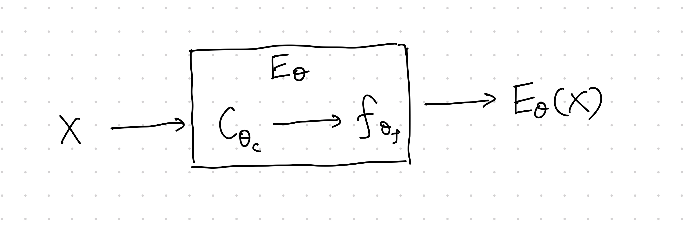

# Deep Infomax

!!! tip "Max Global Mutual Information"

    Why not just use the global mutual information of the input and encoder output as the objective?

    > ... maximizing MI between the complete input and the encoder output (i.e.,globalMI) is ofteninsufficient for learning useful representations.
    >
    > -- Devon et al[^Devon2018]

Mutual information maximization is performed on the input of the encoder $X$ and the encoded feature $\hat X=E_\theta (X)$,

$$
\operatorname{arg~max}_\theta I(X;E_\theta (X)).
$$

Being a quantity that is notoriously hard to compute, mutual information $I(X;E_\theta (X))$ is usually estimated using its lower bound, which depends on a choice of a functional $T_\omega$. Thus the objective will be maximizing a parametrized mutual information estimation,

$$
\operatorname{arg~max}_{\theta, \omega} \hat I_\omega(X;E_\theta (X))
$$

!!! info "Local or Global"
    Two approaches to apply mutual information on encoders:

    - Global mutual information of full input and full encoding. This is useful for reconstruction of the input.
    - Local mutual information of local patches of input full encoding. This is useful for classification.

## Local Mutual Information

To compare local features to the encoder output, we need to extract values from inside the encoder, i.e.,

$$
E_{\theta_f, \theta_C} = f_{\theta_f} \circ C_{\theta_C}.
$$

The first step, $C_{\theta_C}$ is to map the input into feature maps, the second step, $f_{\theta_f}$ maps the feature maps into the encoding. The feature map $C_{\theta_C}$ is splitted into patches, $C_{\theta_C}=\left\{ C_\theta^{(i)} \right\}$. The objective is

$$
\operatorname{arg~max}_{\theta_f, \theta_C, \omega}\mathbb E_{i} \left[ \hat I_\omega( C_{\theta_C}^{(i)} ;E_\theta (X)) \right].
$$

!!! tip "Why does local mutual information help"
    Devon et al explained the idea behind choosing local mutual information[^Devon2018].

    Global mutual information doesn't specify what is the meaningful information. Some very local noise can also be treated as meaningful information too.

    Local mutual information splits the input into patches, and calculate the mutual information between each patch and the encoding. If the model only uses some information from a few local patches, the mutual information objective will be small after averaging all the patches. Thus local mutual information forces the model to use information that is global in the input.

## Code

- [rdevon/DIM](https://github.com/rdevon/DIM): by the authors
- [DuaneNielsen/DeepInfomaxPytorch](https://github.com/DuaneNielsen/DeepInfomaxPytorch): a clean implementation

[^Devon2018]: Devon Hjelm R, Fedorov A, Lavoie-Marchildon S, Grewal K, Bachman P, Trischler A, et al. Learning deep representations by mutual information estimation and maximization. arXiv [stat.ML]. 2018. Available: http://arxiv.org/abs/1808.06670

[^Newell2020]: Newell A, Deng J. How Useful is Self-Supervised Pretraining for Visual Tasks? arXiv [cs.CV]. 2020. Available: http://arxiv.org/abs/2003.14323
