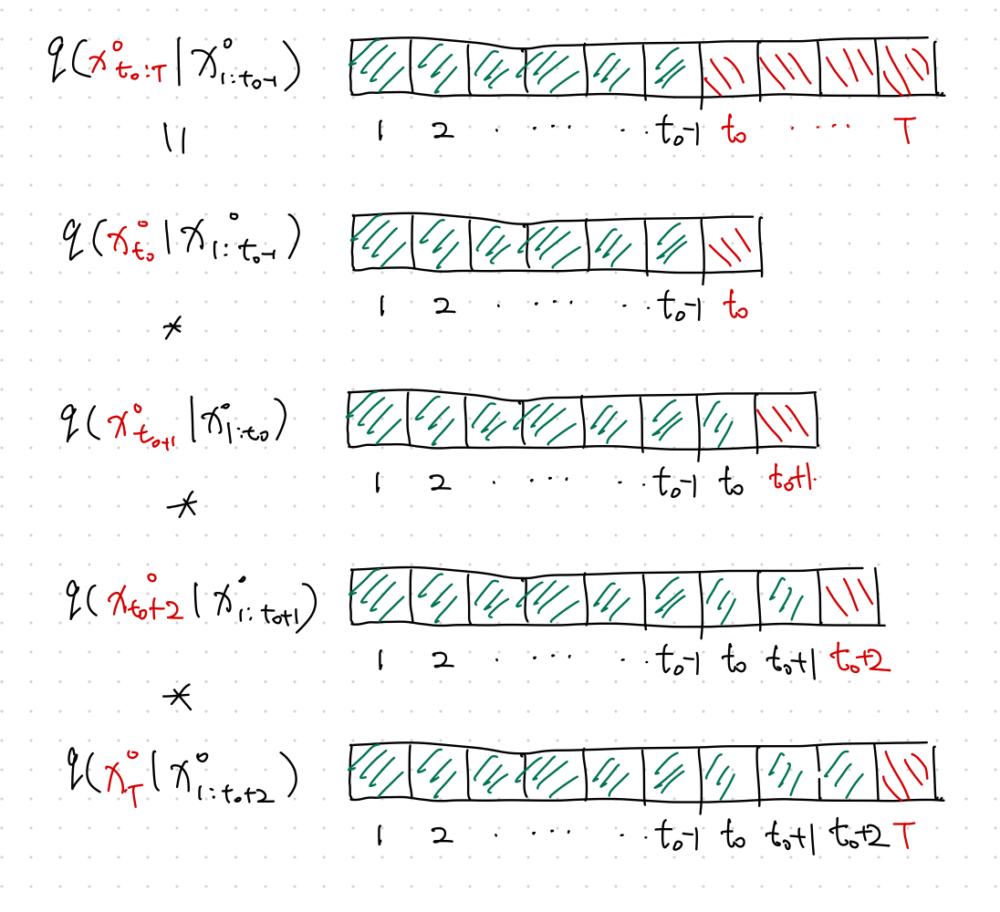
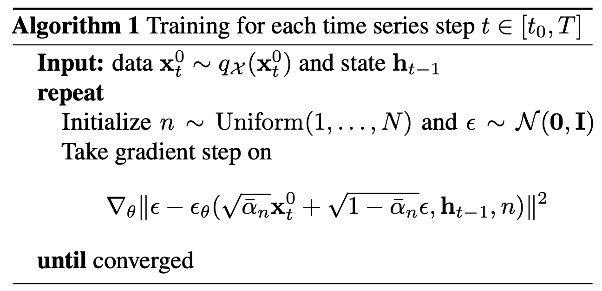

# TimeGrad Using Diffusion Model

Rasul et al., (2021) proposed a probabilistic forecasting model using denoising diffusion models.

## Autoregressive

!!! info "Multivariate Forecasting Problem"

    Given an input sequence $\mathbf x_{t-K: t}$, we forecast $\mathbf x_{t+1:t+H}$.

!!! info "Notation"

    We use $x^0$ to denote the actual time series. The super script ${}^{0}$ will be used to represents the non-diffused values.

To apply the [denoising diffusion model](../../energy-based-models/ebm.diffusion) in a multivariate forecasting problem, we define our forecasting task as the following autoregressive problem,

$$
q(\mathbf x^0_{t - K:t} \vert \mathbf x^0_{1:t_0 - 1}) = \Pi_{t=t_0}^T q(\mathbf x^0_t \vert \mathbf x^0_{1:t-1}).
$$

At each time step $t$, we build a denoising diffusion model.

## Time Dynamics

Note that in denoising diffusion model, we minimize

$$
\operatorname{min}_\theta \mathbb E_{q(\mathbf x^0)} \left[ -\log p_\theta (\mathbf x^0) \right]
$$

The above loss becomes that of the denoising model for a single time step. Explicitly,

$$
\operatorname{min}_\theta \mathbb E_{q(\mathbf x^0_t )} \left[ -\log p_\theta (\mathbf x^0_t) \right].
$$

Time dynamics can be easily captured by some RNN. To include the time dynamics, we use the RNN state built using the time series data of the previous time step $\mathbf h_{t-1}$[^Rasul2021]

$$
\operatorname{min}_\theta \mathbb E_{q(\mathbf x^0_t )} \left[ -\log p_\theta (\mathbf x^0_t \vert \mathbf h_{t-1}) \right].
$$

Apart from the usual time dimension $t$, the autoregressive denoising diffusion model has another dimension to optimize: the diffusion step $n$ for each time $t$.

The loss for each time step $t$ is[^Rasul2021]

$$
\begin{equation}
\mathcal L_t = \mathbb E_{\mathbf x^0_t, \epsilon, n} \left[ \lVert \epsilon - \epsilon_\theta ( \sqrt{\bar \alpha_n} \mathbf x^0_t + \sqrt{1-\bar \alpha_n}\epsilon, \mathbf h_{t-1}, n ) \rVert^2  \right].
\label{eq:ddpm-loss}
\end{equation}
$$

That being said, we just need to minimize $\mathcal L_t$ for each time step $t$.

## Training Algorithm

The input data is sliced into fixed length time series $\mathbf x_t^0$. Since Eq \eqref{eq:ddpm-loss} shows that a loss can be calculated for arbitrary $n$ without depending on any previous diffusion steps $n-1$, the training can be done by both random sampling in $\mathbf x_t^0$ and $n$. See Rasul et al. (2021)[^Rasul2021].

## How to Forecast

After training, we obtain the time dynamics encoding $\mathbf h_T$, with which the denoising steps can be calculated using the reverse process

$$
\mathbf x^{n-1}_{T+1} = \frac{1}{\alpha_n} \left( \mathbf x^n_{T+1} - \frac{\beta_n}{1 - \bar\alpha_n} \epsilon_\theta( \mathbf x^n_{T+1}, \mathbf h_{T}, n ) \right) + \sqrt{\Sigma_\theta} \mathbf z,
$$

where $\mathbf z \sim \mathcal N(\mathbf 0, \mathbf I)$.

For example,

$$
\mathbf x^{0}_{T+1} = \frac{1}{\alpha_1} \left( \mathbf x^1_{T+1} - \frac{\beta_1}{1 - \bar\alpha_1} \epsilon_\theta( \mathbf x^1_{T+1}, \mathbf h_{T}, 1 ) \right) + \sqrt{\Sigma_\theta} \mathbf z.
$$

## It is Probabilistic

The quantiles is calculated by repeating many times for each forecasted time step[^Rasul2021].

## Code

An implementation of the model can be found in the package [pytorch-ts](https://github.com/zalandoresearch/pytorch-ts) [@Rasul_PyTorchTS].

[^Rasul2021]: Rasul K, Seward C, Schuster I, Vollgraf R. Autoregressive Denoising Diffusion Models for Multivariate Probabilistic Time Series Forecasting. arXiv [cs.LG]. 2021. Available: http://arxiv.org/abs/2101.12072
