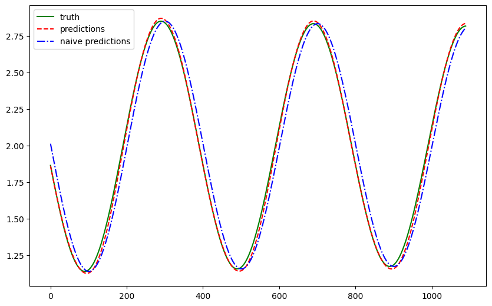

# Forecasting with Feedforward Neural Networks

!!! info ":material-code-json: Jupyter Notebook Available"
    We have a [:notebook: notebook](../../notebooks/feedforward_neural_netwroks_timeseries) for this section which includes all the code used in this section.


!!! info ":simple-abstract: Introduction to Neural Networks"
    We explain the theories of neural networks in [this section](../neural-net.md). Please read it first if you are not familiar with neural networks.


Feedforward neural networks are simple but powerful models for time series forecasting. In this section, we will build a simple feedforward neural network to forecast our [pendulum physics data](timeseries.dataset.pendulum.md).


## Feedforward Neural Network Model


=== ":material-chart-line: Feedforward Neural Network"

    We build a feedforward neural network with 5 hidden layers. The input is passed to the first hidden layer, and the output of the first hidden layer is passed to the second hidden layer. The output of the second hidden layer is passed to the third hidden layer, and so on. The output of the last hidden layer is passed to the output layer. The output layer outputs the forecasted values.

    ```mermaid
    flowchart TD

    input_layer["Input Layer (100)"]
    output_layer["Output Layer (1)"]

    subgraph hidden_layers["Hidden Layers"]
        hidden_layer_1["Hidden Layer (512)"]
        hidden_layer_2["Hidden Layer (256)"]
        hidden_layer_3["Hidden Layer (64)"]
        hidden_layer_4["Hidden Layer (256)"]
        hidden_layer_5["Hidden Layer (512)"]

        hidden_layer_1 --> hidden_layer_2
        hidden_layer_2 --> hidden_layer_3
        hidden_layer_3 --> hidden_layer_4
        hidden_layer_4 --> hidden_layer_5
    end

    input_layer --> hidden_layers
    hidden_layers --> output_layer
    ```

=== ":material-code-json: Code"

    ```python
    from typing import Dict, List

    import dataclasses

    from torch.utils.data import Dataset, DataLoader
    from torch import nn
    import torch


    @dataclasses.dataclass
    class TSFFNParams:
        """A dataclass to be served as our parameters for the model.

        :param hidden_widths: list of dimensions for the hidden layers
        """

        hidden_widths: List[int]


    class TSFeedForward(nn.Module):
        """Feedforward networks for univaraite time series modeling.

        :param history_length: the length of the input history.
        :param horizon: the number of steps to be forecasted.
        :param ffn_params: the parameters for the FFN network.
        """

        def __init__(
            self, history_length: int, horizon: int, ffn_params: TSFFNParams
        ):
            super().__init__()
            self.ffn_params = ffn_params
            self.history_length = history_length
            self.horizon = horizon

            self.regulate_input = nn.Linear(
                self.history_length, self.ffn_params.hidden_widths[0]
            )

            self.hidden_layers = nn.Sequential(
                *[
                    self._linear_block(dim_in, dim_out)
                    for dim_in, dim_out in
                    zip(
                        self.ffn_params.hidden_widths[:-1],
                        self.ffn_params.hidden_widths[1:]
                    )
                ]
            )

            self.regulate_output = nn.Linear(
                self.ffn_params.hidden_widths[-1], self.horizon
            )

        @property
        def ffn_config(self) -> Dict:
            return dataclasses.asdict(self.ffn_params)

        def _linear_block(self, dim_in, dim_out):
            return nn.Sequential(*[nn.Linear(dim_in, dim_out), nn.ReLU()])

        def forward(self, x: torch.Tensor) -> torch.Tensor:
            x = self.regulate_input(x)
            x = self.hidden_layers(x)

            return self.regulate_output(x)
    ```


## Results

We take 100 time steps as the input history and forecast 1 time step into the future, but with a gap of 10 time steps.


!!! info "Why the Gap"

    Since the differences between each steps are tiny, forecasting immediate next step is quite easy. We add a gap to make the forecasting problem a bit harder.


??? info "Training"

    The details for model training can be found in this [:notebook: notebook](../../notebooks/feedforward_neural_netwroks_timeseries). We will skip the details but show the loss curve here.

    


We plotted the forecasts for a test dataset that was held out from training. The forecasts are plotted in red and the ground truth is plotted in green. For a sense of goodness, we also added the naive forecast (forecasting the last observed value) in blue.



The feedforward neural network learned the damped sine wave pattern of the pendulum. To quantify the results, we compute a few metrics.

| Metric                                   | FFN    | Naive      |
| ---------------------------------------- | ------ | ---------- |
| Mean Absolute Error                      | 0.0251 | 0.0084     |
| Mean Squared Error                       | 0.0010 | 8.7556e-05 |
| Symmetric Mean Absolute Percentage Error | 0.1115 | 0.0630     |

Since the differences between each time step are small, the naive forecast performs quite well.


## Multi-horizon Forecasting

We perform a similar experiment but forecast 3 time steps into the future. We plot out some samples. In the plot, the orange shaded regions are the predictions. From these samples, we observe that the forecasts make sense.


To observe the quality of the whole time range, we plot out the first forecast step and the corresponding ground truth. The naive forecast plotted in blue has an obvious shift, while the feedforward neural network plotted in red is much closer to the ground truth.


| Metric | FFN | Naive |
| --- | --- | --- |
| Mean Absolute Error | 0.024640 | 0.109485 |
| Mean Squared Error | 0.001116 | 0.014723 |
| Symmetric Mean Absolute Percentage Error | 0.015637 | 0.059591 |
