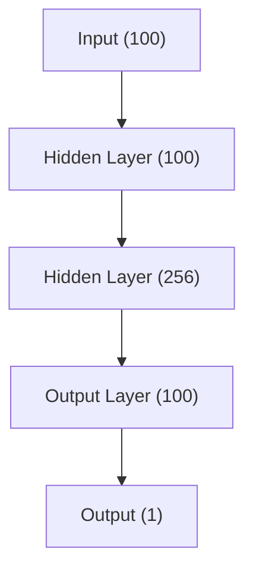

# Time Series Forecasting with Neural ODE

!!! info ":material-code-json: Jupyter Notebook Available"

    We have a [:notebook: notebook](../../notebooks/neuralode_timeseries) for this section which includes all the code used in this section.

!!! info ":simple-abstract: Introduction to Neural ODE"

    We explain the theories of neuralode in [this section](../dynamical-systems/neural-ode.md). Please read it first if you are not familiar with neural ode.

In the section [Neural ODE](../dynamical-systems/neural-ode.md), we have introduced the concept of neural ODE. In this section, we will show how to use neural ODE to do time series forecasting.

## A Neural ODE Model

We built a single hidden layer neural network as the field,

The model is built using the package called [torchdyn](https://github.com/DiffEqML/torchdyn) [@Poli_TorchDyn_Implicit_Models].

!!! note "Packages"

    Apart from the torchdyn package we used here, there is another package called [torchdiffeq](https://github.com/rtqichen/torchdiffeq) [@Chen_torchdiffeq_2021] which is developed by the authors of neural ode.

## Single Step Forecasts

We trained the model using a history length of 100 and only forecast one step (with a gap of 3 between the input and target). The result is shown below.

Neural ODE is a good forecaster for our pendulum dataset since the pendulum is simply generated by a differential equation. The metrics are also computed and listed below.

| Metric | Neural ODE | Naive |
| --- | --- | ---- |
| Mean Absolute Error | **0.003052** | 0.092666 |
| Mean Squared Error | **0.000009** | 0.010553 |
| Symmetric Mean Absolute Percentage Error | **0.021231** | 0.376550 |

??? info "Training"

    The training loss is shown below.

    

## Multi-Step Forecasts

We perform a similar experiment but forecast 3 steps.

| Metric | Neural ODE | Naive |
| --- | --- | ---- |
| Mean Absolute Error |  |  |
| Mean Squared Error |  |  |
| Symmetric Mean Absolute Percentage Error |  |  |
