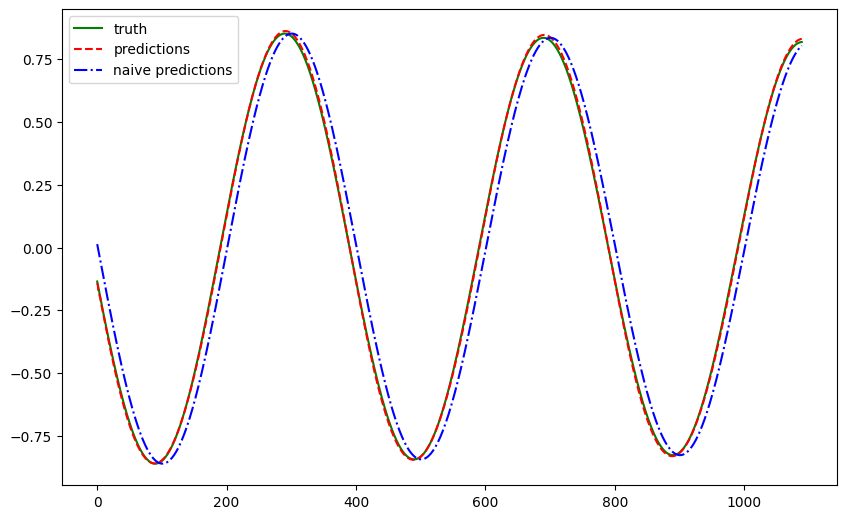

# Forecasting with RNN

!!! info ":material-code-json: Jupyter Notebook Available"
    We have a [:notebook: notebook](../../notebooks/rnn_timeseries) for this section which includes all the code used in this section.


!!! info ":simple-abstract: Introduction to Neural Networks"
    We explain the theories of neural networks in [this section](../recurrent-neural-networks.md). Please read it first if you are not familiar with neural networks.


In section [Recurrent Neural Network](../recurrent-neural-networks.md) we discussed the basics of RNN. In this section, we will build an RNN model to forecast our [pendulum time series data](timeseries.dataset.pendulum.md).

## RNN Model


=== ":simple-abstract: RNN Model Description"

    We build an RNN model with an input size of 96, a hidden size of 64 and one single layer.

=== ":material-code-json: RNN Model Code"

    ```python
    from typing import Dict

    import dataclasses

    from torch.utils.data import Dataset, DataLoader
    from torch import nn
    import torch


    @dataclasses.dataclass
    class TSRNNParams:
        """A dataclass to be served as our parameters for the model.

        :param hidden_size: number of dimensions in the hidden state
        :param input_size: input dim
        :param num_layers: number of units stacked
        """

        input_size: int
        hidden_size: int
        num_layers: int = 1


    class TSRNN(nn.Module):
        """RNN for univaraite time series modeling.

        :param history_length: the length of the input history.
        :param horizon: the number of steps to be forecasted.
        :param rnn_params: the parameters for the RNN network.
        """

        def __init__(self, history_length: int, horizon: int, rnn_params: TSRNNParams):
            super().__init__()
            self.rnn_params = rnn_params
            self.history_length = history_length
            self.horizon = horizon

            self.regulate_input = nn.Linear(
                self.history_length, self.rnn_params.input_size
            )

            self.rnn = nn.RNN(
                input_size=self.rnn_params.input_size,
                hidden_size=self.rnn_params.hidden_size,
                num_layers=self.rnn_params.num_layers,
                batch_first=True
            )

            self.regulate_output = nn.Linear(
                self.rnn_params.hidden_size, self.horizon
            )

        @property
        def rnn_config(self) -> Dict:
            return dataclasses.asdict(self.rnn_params)

        def forward(self, x: torch.Tensor) -> torch.Tensor:
            x = self.regulate_input(x)
            x, _ = self.rnn(x)

            return self.regulate_output(x)
    ```


## Training

??? info "Training"

    The details for model training can be found in this [:notebook: notebook](../../notebooks/rnn_timeseries_univariate). We will skip the details but show the loss curve here.

    


With just a few seconds of training, our RNN model can capture the pattern of the pendulum time series data.



The metrics are listed in the following table.

| Metric | Value |
| --- | --- |
| Mean Absolute Error | 0.0112 |
| Mean Squared Error | 0.0002 |
| Symmetric Mean Absolute Percentage Error | 0.0601 |
