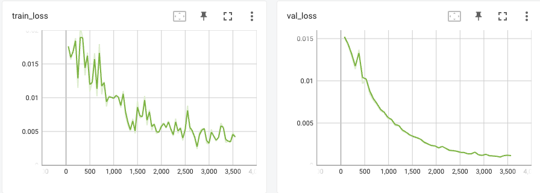

# Transformers for Time Series Forecasting

!!! info ":material-code-json: Jupyter Notebook Available"
    We have a [:notebook: notebook](../../notebooks/transformer_timeseries_univariate) for this section which includes all the code used in this section.

!!! info ":simple-abstract: Introduction to Transformers"
    We explain the theories of transformers in [this section](../transformers/transformers.vanilla.md). Please read it first if you are not familiar with transformers.

[Transformer](../transformers/transformers.vanilla.md) is a good candidate for time series forecasting due to its sequence modeling capability[@Ahmed2022-wl][@Wen2022-fc]. In this section, we will introduce some basic ideas of transformer-based models for time series forecasting.

## Transformer for Univariate Time Series Forecasting

We take a simple [Univariate time series forecasting](../time-series/timeseries-forecast.tasks.md) task as an example. There are implementations of transformers for multivariate time series forecasting with all sorts of covariates, but we focus on univariate forecasting problem for simplicity.

### Dataset

In this example, we use the [pendulumn physics dataset](timeseries.dataset.pendulum.md).

### Model

We built a naive transformer that only has an encoder. The input is passed to a linear layer to convert the tensor to the shape accepted by the encoder. The tensor is then passed to the encoder. The output of the encoder is passed to another linear layer to convert the tensor to the shape of the output.

??? note "Decoder is Good for Covariates"

    A decoder in a transformer model is good for capturing [future covariates](../time-series/timeseries-forecast.tasks.md). In our problem, we do not have any covariates at all.

??? note "Positional Encoder"

    In this experiment, we do not include positional encoder as it introduces more complexities but it doesn't help that much in our case.

### Evaluations

??? info "Training"

    The details for model training can be found in this [:notebook: notebook](../../notebooks/transformer_timeseries_univariate). We will skip the details but show the loss curve here.

    

We trained the model using a history length of 50 and plotted the forecasts for a test dataset that was held out from training. The forecasts are plotted in red and the ground truth is plotted in blue.

The forecasts roughly captured the patterns of the pendulum. To quantify the results, we compute a few metrics.

| Metric | Vanilla Transformer | Naive |
| --- | --- | --- |
| Mean Absolute Error | 0.050232 | 0.092666 |
| Mean Squared Error | 0.003625 | 0.010553 |
| Symmetric Mean Absolute Percentage Error | 0.108245 | 0.376550 |

## Multi-horizon Forecasting

We perform a similar experiment for multi-horizon forecasting (horizon=3). We plot out some samples. In the plot, the orange-shaded regions are the predictions.

To verify that the forecasts make sense, we also plot out a few samples.

The following is a table of the metrics.

| Metric | Vanilla Transformer | Naive |
| --- | --- | --- |
| Mean Absolute Error | 0.057219 | 0.109485 |
| Mean Squared Error | 0.004241 | 0.014723 |
| Symmetric Mean Absolute Percentage Error | 0.112247 | 0.423563 |

## Generalization

The vanilla transformer has its limitations. For example, it doesn't capture the correlations between the series that well. There are many variants of transformers that are designed just for time series forecasting[@Lim2019-hd][@Wu2021-zp][@Zhou2020-ov][@Nie2022-ww][@Zhou2022-ry][@Liu2023-wf].

A few forecasting packages implemented transformers for time series forecasting. For example, the [neuralforecast](https://github.com/Nixtla/neuralforecast) package by Nixtla has [implemented](https://nixtla.mintlify.app/neuralforecast/models.html#c-transformer-based) TFT, Informer, AutoFormer, FEDFormer, and PatchTST, as of November 2023. An alternative is [darts](https://github.com/unit8co/darts). These packages provide documentation and we encourage the reader to check them out for more complicated use cases of transformer-based models.
