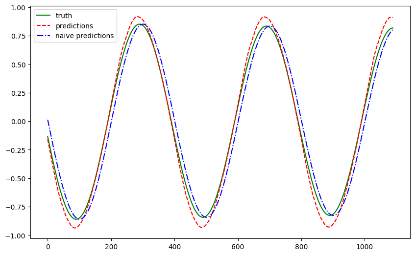

# Transformers for Time Series Forecasting

!!! info ":material-code-json: Jupyter Notebook Available"
    We have a [notebook](../../notebooks/transformer_timeseries_univariate) for this section which includes all the code used in this section.


!!! info ":simple-abstract: Introduction to Transformers"
    We explain the theories of transformers in [this section](../transformers/transformers.vanilla.md). Please read it first if you are not familiar with transformers.


[Transformer](../transformers/transformers.vanilla.md) is a good candidate for time series forecasting due to its sequence modeling capability. In this section, we will introduce some basic ideas of transformer-based models for time series forecasting.

## Transformer for Univariate Time Series Forecasting

We take a simple [Univariate time series forecasting](../time-series/timeseries-forecast.tasks.md) task as an example. There are implementations of transformers for multivariate time series forecasting with all sorts of covariates, but we focus on univariate forecasting problem for simplicity.


### Dataset

We create a synthetic dataset based on the physical model called pendulum. The pendulum is modeled as a damped harmonic oscillator, i.e.,

$$
\theta(t) = \theta(0) \cos(2 \pi t / p)\exp(-\beta t),
$$

where $\theta(t)$ is the angle of the pendulum at time $t$.
The period $p$ is calculated using

$$
p = 2 \pi \sqrt(L / g),
$$

with $L$ being the length of the pendulum and $g$ being the surface gravity.

=== "Pendulum Angle"

    

=== ":material-code-json: Code"

    ```python
    import math
    from functools import cached_property
    from typing import Dict, List

    import pandas as pd

    class Pendulum:
        """Class for generating time series data for a pendulum.

        The pendulum is modelled as a damped harmonic oscillator, i.e.,

        $$
        \theta(t) = \theta(0) \cos(2 \pi t / p)\exp(-\beta t),
        $$

        where $\theta(t)$ is the angle of the pendulum at time $t$.
        The period $p$ is calculated using

        $$
        p = 2 \pi \sqrt(L / g),
        $$

        with $L$ being the length of the pendulum
        and $g$ being the surface gravity.

        :param length: Length of the pendulum.
        :param gravity: Acceleration due to gravity.
        """

        def __init__(self, length: float, gravity: float = 9.81) -> None:
            self.length = length
            self.gravity = gravity

        @cached_property
        def period(self) -> float:
            """Calculate the period of the pendulum."""
            return 2 * math.pi * math.sqrt(self.length / self.gravity)

        def __call__(
            self,
            num_periods: int,
            num_samples_per_period: int,
            initial_angle: float = 0.1,
            beta: float = 0,
        ) -> Dict[str, List[float]]:
            """Generate time series data for the pendulum.

            Returns a list of floats representing the angle
            of the pendulum at each time step.

            :param num_periods: Number of periods to generate.
            :param num_samples_per_period: Number of samples per period.
            :param initial_angle: Initial angle of the pendulum.
            """
            time_step = self.period / num_samples_per_period
            steps = []
            time_series = []
            for i in range(num_periods * num_samples_per_period):
                t = i * time_step
                angle = (
                    initial_angle
                    * math.cos(2 * math.pi * t / self.period)
                    * math.exp(-beta * t)
                )
                steps.append(t)
                time_series.append(angle)

            return {"t": steps, "theta": time_series}

    pen = Pendulum(length=100)
    df = pd.DataFrame(pen(10, 400, initial_angle=1, beta=0.001))

    _, ax = plt.subplots(figsize=(10, 6.18))
    df.plot(x="t", y="theta", ax=ax)
    ```

We take this time series and ask our model to forecast the next step (**forecast horizon is 1**).


### Model

We built a naive transformer that only has an encoder. The input is passed to a linear layer to convert the tensor to the shape accepted by the positional encoder and the encoder. The tensor is then passed to the positional encoder and the encoder. The output of the encoder is passed to another linear layer to convert the tensor to the shape of the output.


??? note "Decoder is Good for Covariates"
    A decoder in a transformer model is good for capturing [future covariates](../time-series/timeseries-forecast.tasks.md). In our problem, we do not have any covariates at all.


### Result

We trained the model using a history length of 100 and plotted the forecasts for a test dataset that was held out from training. The forecasts are plotted in red and the ground truth is plotted in blue.



The forecasts roughly captured the patterns of the pendulum. To quantify the results, we compute a few metrics.

| Metric | Value |
| --- | --- |
| Mean Absolute Error | 0.2311 |
| Mean Squared Error | 0.0836 |
| Symmetric Mean Absolute Percentage Error | 0.7106 |
