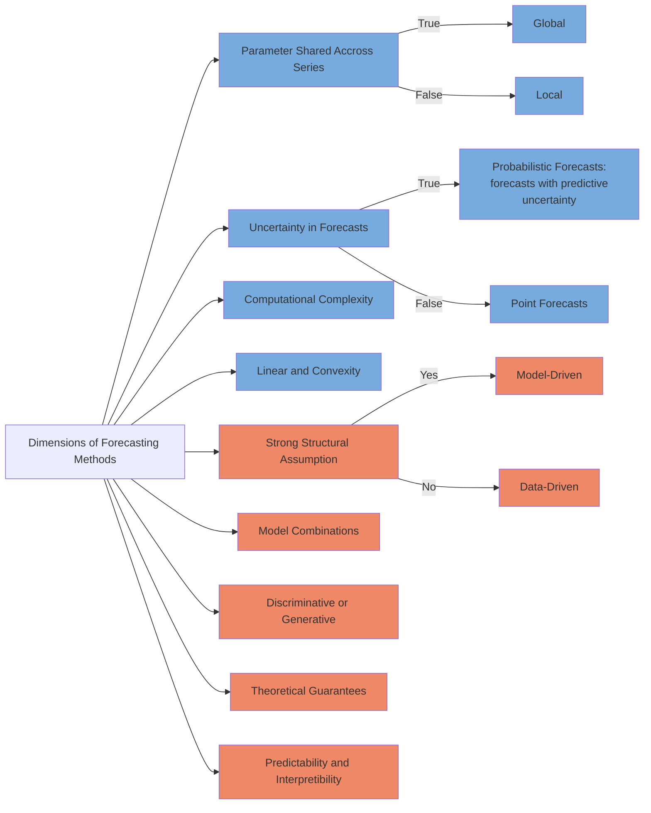

# Time Series Data and Statistical Forecasting Mothods

## Time Series Data

Time series data comes from a variety of data generating processes. There are also different formulations and views of time series data.

Time series data can be formulated as a sequence of vector functions of time [@Dorffner1996-rd]. There are many different types of tasks on time series data, for example,

- classification,
- anomaly detection, and
- forecasting.

In this chapter, we focus on the forecasting problem.

## The Forecasting Problem

To make it easier to formulate the forecasting problem, we group the time series features based on the role they play in a forecasting problem. Given a dataset $\mathcal D$, with

1. $y^{(i)}_t$, the sequential variable to be forecasted,
2. $x^{(i)}_t$, exogenous data for the time series data,
3. $u^{(i)}_t$, some features that can be obtained or planned in advance,

where ${}^{(i)}$ indicates the $i$th variable, ${}_ t$ denotes time. In a forecasting task, we use $y^{(i)} _ {t-K:t}$, $x^{(i) _ {t-K:t}}$, and $u^{(i)} _ {t-K:t+H}$, to forecast the future $y^{(i)} _ {t+1:t+H}$. In these notations, $K$ is the input sequence length and $H$ is the forecast horizon.

A forecasting model $f$ will use $x^{(i)} _ {t-K:t}$ and $u^{(i)} _ {t-K:t+H}$ to forecast $y^{(i)} _ {t+1:t+H}$.

In the section [Time Series Forecasting Tasks](timeseries-forecast.tasks.md), we will discuss more details of the forecasting problem.

## Categories of Forecasting Methods

[Januschowsk et al](https://www.sciencedirect.com/science/article/pii/S0169207019301529) proposed a framework to classify the different forecasting methods[@Januschowski2020-ys]. We illustrate the different methods in the following charts. For simplicity, we simply merge all the possible dimensions in one chart.

