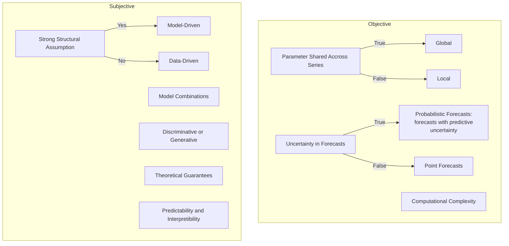

# Time Series Forecasting using Deep Learning

Time series forecasting using deep learning is a fast growing topic in the research community. To get a grasp of the trend, we created the following chart using [the keyword "deep learning forecasting" on dimensions.ai](https://app.dimensions.ai/analytics/publication/overview/timeline?search_mode=content&search_text=deep%20learning%20forecasting&search_type=kws&search_field=full_search&year_from=2015&year_to=2021)).[@dimensionsai]

<figure markdown>
  
  <figcaption>This chart is obtained on 2022-08-06, from Digital Science’s Dimensions platform, available at https://app.dimensions.ai</figcaption>
</figure>

## Time Series Data

Time series data comes from a variety of data generating processes. There are also different formulations and views of time series data.

Time series data can be formulated time series data as sequence of vectors as a function of time.[@Dorffner1996-rd] There are many different types of tasks on time series data, for example,

- classification,
- anomaly detection, and
- forecasting.

In this chapter, we focus on the forecasting problem.

## The Forecasting Problem

To make it easier to formulate the forecasting problem, we group the time series features based on the role they play in a forecasting problem. Given a dataset $\mathcal D$, with

1. $y^{(i)}_t$, the sequential variable to be forecasted,
2. $x^{(i)}_t$, exogenous data for the time series data,
3. $u^{(i)}_t$, some features that can be obtained or planned in advance,

where ${}^{(i)}$ indicates the $i$th variable, ${}_ t$ denotes time. In a forecasting task, we use $y^{(i)} _ {t-K:t}$, $x^{(i) _ {t-K:t}}$, and $u^{(i)} _ {t-K:t+H}$, to forecast the future $y^{(i)} _ {t+1:t+H}$. In these notations, $K$ is the input sequence length and $H$ is the forecast horizon.

A forecasting model $f$ will use $x^{(i)} _ {t-K:t}$ and $u^{(i)} _ {t-K:t+H}$ to forecast $y^{(i)} _ {t+1:t+H}$.

## The Time Delay Embedding Representation

The time delay embedding representation of a time series forecasting problem is a concise representation of the forecasting problem [@Hewamalage2022-sc].

For simplicity, we only write down the representation for a problem with time series $y_{1}, \cdots, y_{t}$, and forecasting $y_{t+1}$. We rewrite the series into a matrix, in an autoregressive way,

$$
\begin{align}
\mathbf Y = \begin{bmatrix}
y_1 & y_2 & \cdots & y_p &\Big| & {\color{red}y_{p+1}} \\
y_{1+1} & y_{1+2} & \cdots & y_{1+p} &\Big| &  {\color{red}y_{1+p+1}} \\
\vdots & \vdots & \ddots & \vdots &\Big| &  {\color{red}\vdots} \\
y_{i-p+1} & y_{i-p+2} & \cdots & y_{i} &\Big| &  {\color{red}y_{i+1}} \\
\vdots & \vdots & \ddots & \vdots &\Big| &  {\color{red}\vdots} \\
y_{t-p+1} & y_{t-p+2} & \cdots & y_{t} &\Big| &  {\color{red}y_{t+1}} \\
\end{bmatrix}
\end{align}
$$

which indicates that we will use everything on the left, a matrix of shape $(t-p+1,p)$, to predict the vector on the right (in red).

## Methods of Forecasting Methods

T. Januschowsk et al proposed a framework to classify the different forecasting methods.[@Januschowski2020-ys] We illustrate the different methods in the following charts.

