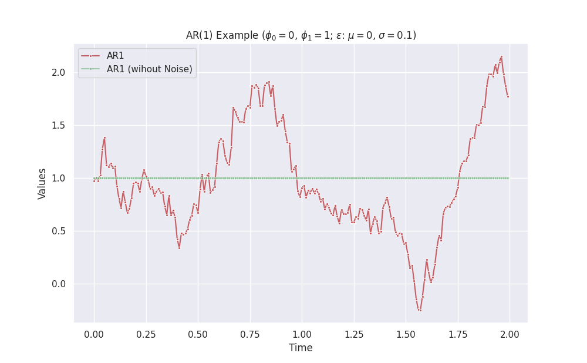
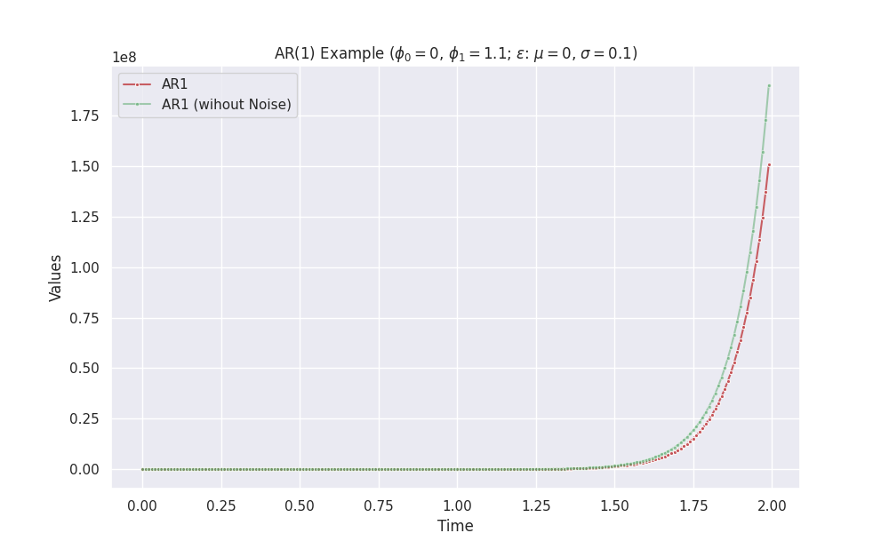
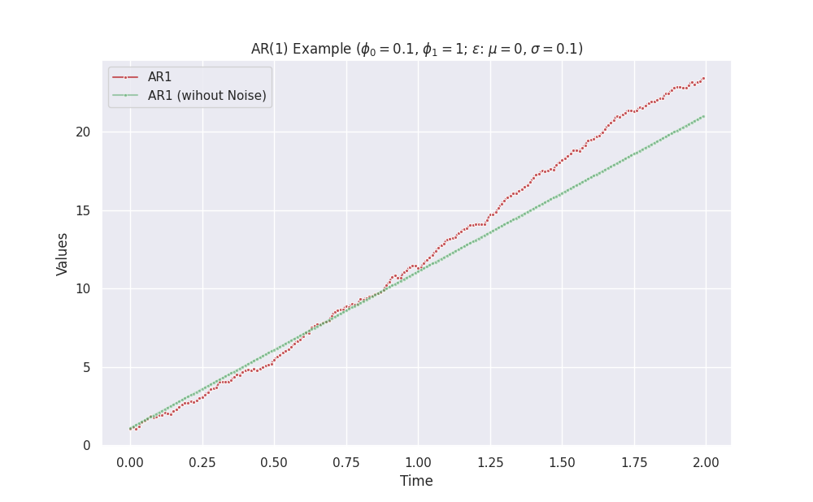

# AR

Autoregressive (AR) models are simple model to model time series. A general AR(p) model is described by the following process:

$$
s(t) = \phi_0 + \sum_{i=1}^p \phi_i s(t-i) + \epsilon.
$$


## AR(1)

A first order AR model, aka AR(1), is as simple as

$$
s(t) = \phi_0 + \phi_1 s(t-1) + \epsilon.
$$


By staring at this equation, we can build up our intuitions.

| $\phi_0$ | $\phi_1$ | $\epsilon$ | Behavior |
|:----:|:----:|:----:|:----:|
| - | $0$ | - | constant + noise |
| $0$  |  $1$  | -  |  constant + noise  |
| $0$ |  $\phi_1>1$ or $0\le\phi_1 \lt 1$  |  - |  exponential + noise |


!!! note "Exponential Behavior doesn't Always Approach Positive Inifinity"

    For example, the combination $\phi_0=0$ and $\phi_1>1$ without noise leads to exponential growth if the initial series value is positive. However, it approaches negative infinity if the initial series is negative.


=== "Example: Constant"

    

=== "Example: Decay"

    

=== "Example: Exponential"

    

=== "Example: Linear"

    

=== "Code: Python"

    ```python
    import copy
    from dataclasses import dataclass
    from typing import Dict, Iterator

    import matplotlib.pyplot as plt
    import numpy as np
    import pandas as pd

    import seaborn as sns; sns.set()


    class GaussianEpsilon:
        """Gaussian noise

        :param mu: mean value of the noise
        :param std: standard deviation of the noise
        """

        def __init__(self, mu, std, seed=None):
            self.mu = mu
            self.std = std
            self.rng = np.random.default_rng(seed=seed)

        def __next__(self):
            return self.rng.normal(self.mu, self.std)


    class ZeroEpsilon:
        """Constant noise

        :param epsilon: the constant value to be returned
        """

        def __init__(self, epsilon=0):
            self.epsilon = epsilon

        def __next__(self):
            return self.epsilon


    @dataclass(frozen=True)
    class ARModelParams:
        """Parameters of our AR model,

        $$s(t+1) = \phi_0 + \phi_1 s(t) + \epsilon.$$

        :param delta_t: step size of time in each iteration
        :param phi0: pho_0 in the AR model
        :param phi1: pho_1 in the AR model
        :param epsilon: noise iterator, e.g., Gaussian noise
        :param initial_state: a dictionary of the initial state, e.g., `{"s": 1}`
        """

        delta_t: float
        phi0: float
        phi1: float
        epsilon: Iterator
        initial_state: Dict[str, float]


    class AR1Stepper:
        """Stepper that calculates the next step in time in an AR model

        :param model_params: parameters for the AR model
        """

        def __init__(self, model_params):
            self.model_params = model_params
            self.current_state = copy.deepcopy(self.model_params.initial_state)

        def __iter__(self):
            return self

        def __next__(self):
            phi0 = self.model_params.phi0
            phi1 = self.model_params.phi1
            epsilon = next(self.model_params.epsilon)

            next_s = (
                self.model_params.phi0
                + self.model_params.phi1 * self.current_state["s"]
                + epsilon
            )
            self.current_state = {"s": next_s}

            return copy.deepcopy(self.current_state)


    def visualize_vr1(delta_t, phi0, phi1, length=200, savefig=False):
        mu = 0
        std = 0.1
        geps = GaussianEpsilon(mu=mu, std=std)
        zeps = ZeroEpsilon()

        initial_state = {"s": -1}

        ar1_params = ARModelParams(
            delta_t=delta_t, phi0=phi0, phi1=phi1, epsilon=geps, initial_state=initial_state
        )
        ar1_params_zero_noise = ARModelParams(
            delta_t=delta_t, phi0=phi0, phi1=phi1, epsilon=zeps, initial_state=initial_state
        )

        ar1_stepper = AR1Stepper(model_params=ar1_params)
        ar1_stepper_no_noise = AR1Stepper(model_params=ar1_params_zero_noise)

        history = []
        history_zero_noise = []
        for l in range(length):
            history.append(next(ar1_stepper))
            history_zero_noise.append(next(ar1_stepper_no_noise))

        df = pd.DataFrame(history)
        df_zero_noise = pd.DataFrame(history_zero_noise)

        fig, ax = plt.subplots(figsize=(10, 6.18))
        sns.lineplot(
            x=np.linspace(0, length - 1, length) * delta_t,
            y=df.s,
            ax=ax,
            marker=".",
            label="AR1",
            color="r",
            alpha=0.9,
        )
        sns.lineplot(
            x=np.linspace(0, length - 1, length) * delta_t,
            y=df_zero_noise.s,
            ax=ax,
            marker=".",
            label="AR1 (wihout Noise)",
            color="g",
            alpha=0.5,
        )

        ax.set_title(
            f"AR(1) Example ($\phi_0={phi0}$, $\phi_1={phi1}$; $\epsilon$: $\mu={mu}$, $\sigma={std}$; $s(0)={initial_state['s']}$)"
        )
        ax.set_xlabel("Time")
        ax.set_ylabel("Values")

        if savefig:
            plt.savefig(
                f"/work/timeseries-dgp-ar-var/exports/ar1-phi0-{phi0}-phi1-{phi1}-std-{std}-init-{initial_state['s']}.png"
            )
    ```

    Call the function `visualize_vr1` to make some plots.

    ```python
    visualize_vr1(delta_t = 0.01, phi0 = 0, phi1 = 1.1, length = 200, savefig=True)
    ```


[^Kumar2022]: Kumar A. Autoregressive (AR) models with Python examples. In: Data Analytics [Internet]. 25 Apr 2022 [cited 11 Aug 2022]. Available: https://vitalflux.com/autoregressive-ar-models-with-python-examples/
