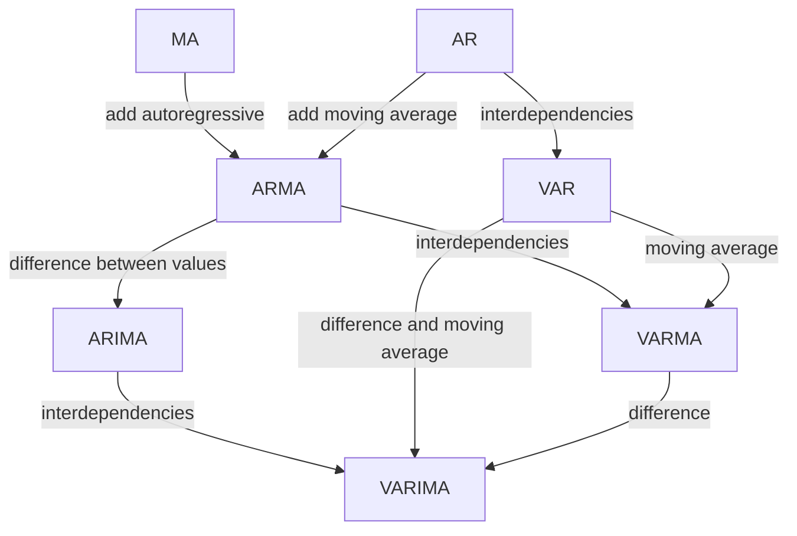

# Multivariate Time Series Forecasting

## AR, MA, Integrated, and Vector

[^wu2020]: Wu Z, Pan S, Long G, Jiang J, Chang X, Zhang C. Connecting the Dots: Multivariate Time Series Forecasting with Graph Neural Networks. arXiv [cs.LG]. 2020. Available: http://arxiv.org/abs/2005.11650
