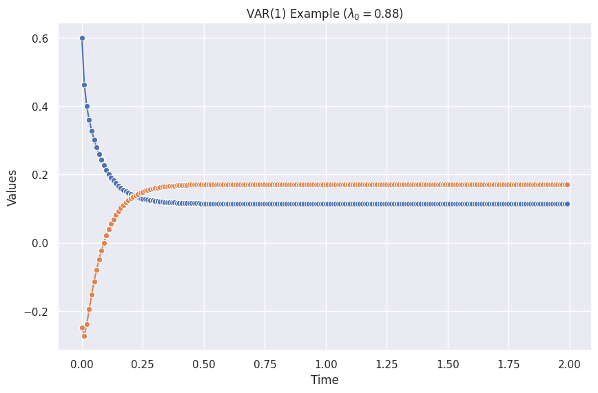
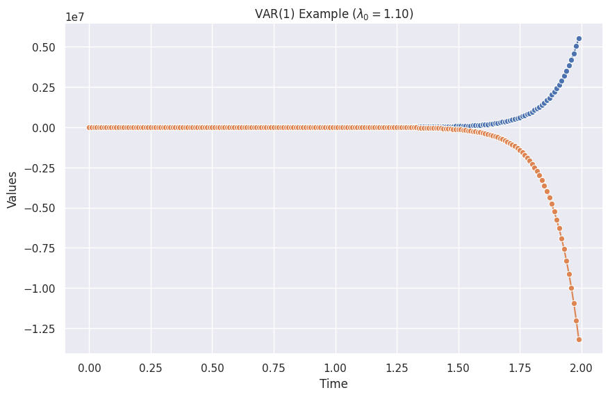
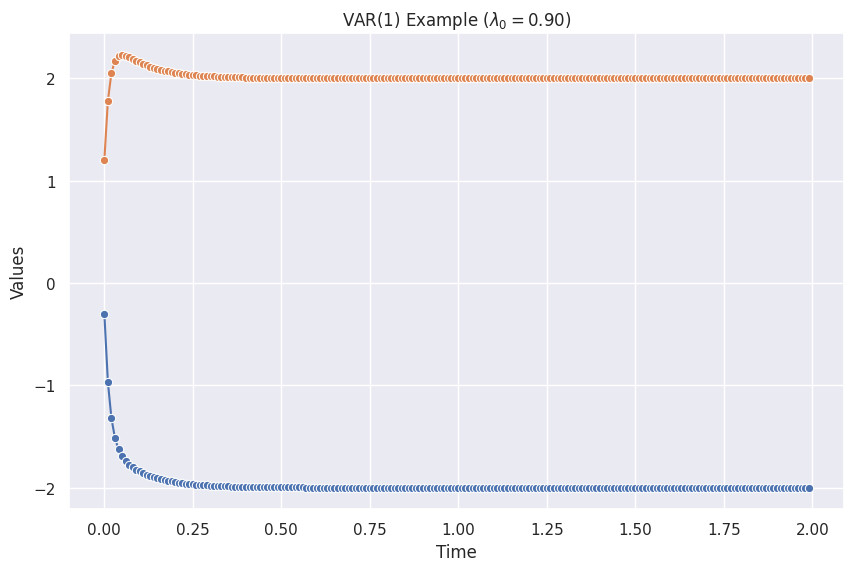
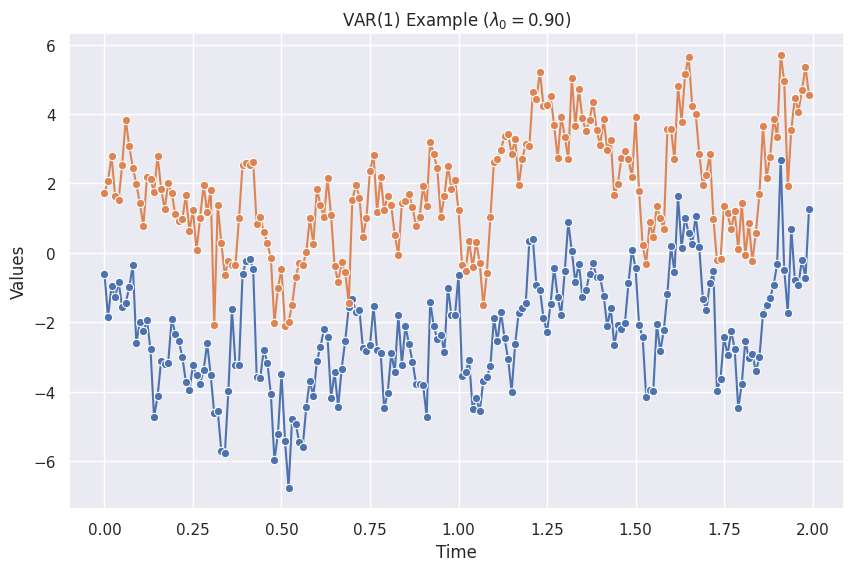
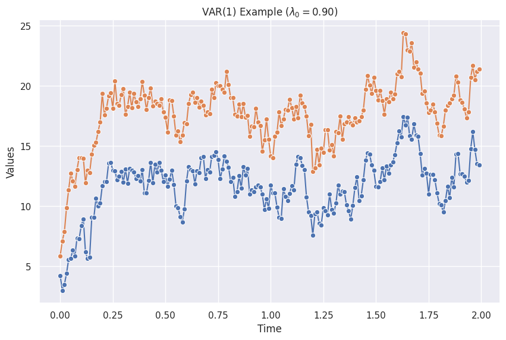

# VAR


## VAR(1)

VAR(1) is similar to [AR(1)](timeseries-basics.ar.md) but models time series with interactions between the series. For example, a two dimensional VAR(1) model is

$$
\begin{pmatrix}s^{(1)}(t+1) \\ s^{(2)}(t+1) \end{pmatrix} = \begin{pmatrix} \phi^{(1)}_0 \\ \phi^{(2)}_0 \end{pmatrix} +  \begin{pmatrix}\phi_{1, 11} & \phi_{1, 12}\\ \phi_{1, 21} & \phi_{1, 22} \end{pmatrix} \begin{pmatrix}s^{(1)}(t) \\ s^{(2)}(t) \end{pmatrix} + \begin{pmatrix}\epsilon^{(1)} \\ \epsilon^{(2)} \end{pmatrix}.
$$

A more compact form is

$$
\mathbf s (t+1) = \boldsymbol \phi_0 + \boldsymbol \phi_1 \mathbf s(t) + \boldsymbol \epsilon.
$$

!!! note "Stability of VAR"

    For VAR(1), our series blows up when the max eigenvalue of the matrix $\boldsymbol \phi_1$ is large than 1[^Zvot2006]. Otherwise ,we get stable series.

    In the following examples, we denote the largest eigenvalue of $\boldsymbol \phi_1$ as $\lambda_0$.


=== "VAR(1) Stable"

    

    The figure is created using the code from the "Python Code" tab, and the following parameters.

    ```python
    var_params_stable = VAR1ModelParams(
        delta_t = 0.01,
        phi0 = np.array([0.1, 0.1]),
        phi1 = np.array([
            [0.5, -0.25],
            [-0.35, 0.45+0.2]
        ]),
        epsilon = ConstantEpsilon(epsilon=np.array([0,0])),
        initial_state = np.array([1, 0])
    )

    var1_visualize(var_params=var_params_stable)
    ```


=== "VAR(1) Unstable"

    

    The figure is created using the code from the "Python Code" tab, and the following parameters.

    ```python
    var_params_unstable = VAR1ModelParams(
        delta_t = 0.01,
        phi0 = np.array([0.1, 0.1]),
        phi1 = np.array([
            [0.5, -0.25],
            [-0.35, 0.45+0.5]
        ]),
        epsilon = ConstantEpsilon(epsilon=np.array([0,0])),
        initial_state = np.array([1, 0])
    )

    var1_visualize(var_params=var_params_unstable)
    ```

=== "VAR(1) without Noise"

    

    The figure is created using the code from the "Python Code" tab, and the following parameters.

    ```python
    var_params_no_noise = VAR1ModelParams(
        delta_t = 0.01,
        phi0 = np.array([-1, 1]),
        phi1 = np.array([
            [0.7, 0.2],
            [0.2, 0.7]
        ]),
        epsilon = ConstantEpsilon(epsilon=np.array([0,0])),
        initial_state = np.array([1, 0])
    )

    var1_visualize(var_params=var_params_no_noise)
    ```

=== "VAR(1) with Zero Mean Noise"

    

    The figure is created using the code from the "Python Code" tab, and the following parameters.

    ```python
    var_params_zero_mean_noise = VAR1ModelParams(
        delta_t = 0.01,
        phi0 = np.array([-1, 1]),
        phi1 = np.array([
            [0.7, 0.2],
            [0.2, 0.7]
        ]),
        epsilon = MultiGaussianNoise(mu=np.array([0, 0]), cov=np.array([[1, 0.5],[0.5, 1]])),
        initial_state = np.array([1, 0])
    )

    var1_visualize(var_params=var_params_zero_mean_noise)
    ```

=== "VAR(1) with Nonzero Mean Noise"

    

    The figure is created using the code from the "Python Code" tab, and the following parameters.

    ```python
    var_params_nonzero_mean_noise = VAR1ModelParams(
        delta_t = 0.01,
        phi0 = np.array([-1, 1]),
        phi1 = np.array([
            [0.7, 0.2],
            [0.2, 0.7]
        ]),
        epsilon = MultiGaussianNoise(mu=np.array([1, 2]), cov=np.array([[1, 0.5],[0.5, 1]])),
        initial_state = np.array([1, 0])
    )

    var1_visualize(var_params=var_params_nonzero_mean_noise)
    ```

=== "Python Code"

    ```python
    import copy
    from dataclasses import dataclass
    from typing import Iterator
    import numpy as np

    class MultiGaussianNoise:
    """A multivariate Gaussian noise

    :param mu: means of the variables
    :param cov: covariance of the variables
    :param seed: seed of the random number generator for reproducibility
    """

    def __init__(self, mu: np.ndarray, cov: np.ndarray, seed: Optional[float] = None):
        self.mu = mu
        self.cov = cov
        self.rng = np.random.default_rng(seed=seed)

    def __next__(self) -> np.ndarray:
        return self.rng.multivariate_normal(self.mu, self.cov)

    class ConstantEpsilon:
    """Constant noise

    :param epsilon: the constant value to be returned
    """
    def __init__(self, epsilon=0):
        self.epsilon = epsilon

    def __next__(self):
        return self.epsilon


    @dataclass(frozen=True)
    class VAR1ModelParams:
        """Parameters of our VAR model,

        :param delta_t: step size of time in each iteration
        :param phi0: pho_0 in the AR model
        :param phi1: pho_1 in the AR model
        :param epsilon: noise iterator, e.g., Gaussian noise
        :param initial_state: a dictionary of the initial state, e.g., `{"s": 1}`
        """

        delta_t: float
        phi0: np.ndarray
        phi1: np.ndarray
        epsilon: Iterator
        initial_state: np.ndarray


    class VAR1Stepper:
        """Calculate the next values using VAR(1) model.

        :param model_params: the parameters of the VAR(1) model, e.g.,
            [`VAR1ModelParams`][eerily.data.generators.var.VAR1ModelParams]
        """

        def __init__(self, model_params):
            self.model_params = model_params
            self.current_state = copy.deepcopy(self.model_params.initial_state)

        def __iter__(self):
            return self

        def __next__(self):

            epsilon = next(self.model_params.epsilon)
            phi0 = self.model_params.phi0
            phi1 = self.model_params.phi1

            self.current_state = phi0 + np.matmul(phi1, self.current_state) + epsilon

            return copy.deepcopy(self.current_state)


    class Factory:
        """A generator that creates the data points based on the stepper."""
        def __init__(self):
            pass

        def __call__(self, stepper, length):
            i = 0
            while i < length:
                yield next(stepper)
                i += 1
    ```

    We create a function to visualize the series.

    ```python
    def var1_visualize(var_params):
        phi1_eig_max = max(np.linalg.eig(var_params.phi1)[0])

        var1_stepper = VAR1Stepper(model_params=var_params)

        length = 200
        fact = Factory()
        history = list(fact(var1_stepper, length=length))

        df = pd.DataFrame(history, columns=["s1", "s2"])
        print(df.head())

        fig, ax = plt.subplots(figsize=(10, 6.18))

        sns.lineplot(
            x=np.linspace(0, length-1, length) * var_params.delta_t,
            y=df.s1,
            ax=ax,
            marker="o",
        )

        sns.lineplot(
            x=np.linspace(0, length-1, length) * var_params.delta_t,
            y=df.s2,
            ax=ax,
            marker="o",
        )

        ax.set_title(f"VAR(1) Example ($\lambda_0={phi1_eig_max:0.2f}$)")
        ax.set_xlabel("Time")
        ax.set_ylabel("Values")
    ```


[^Zvot2006]: Zivot E, Wang J. Modeling Financial Time Series with S-PLUS®. Springer New York; 2006. [doi:10.1007/978-0-387-32348-0](https://link.springer.com/book/10.1007/978-0-387-21763-5)
