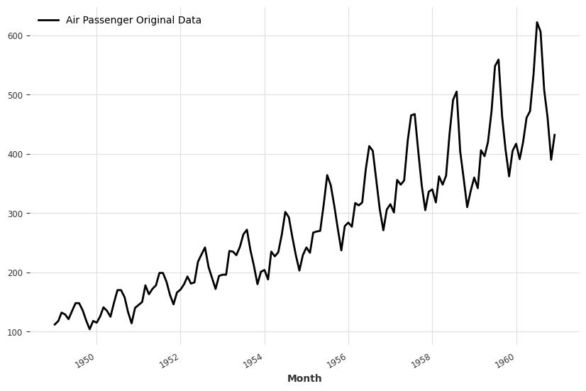
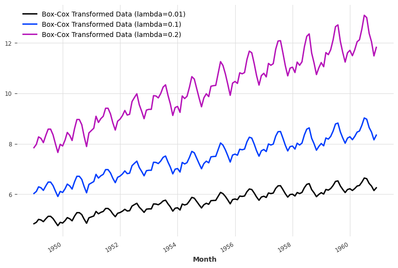
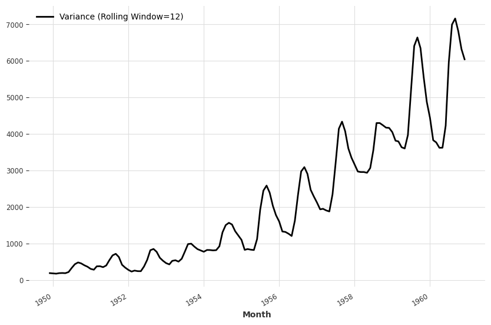
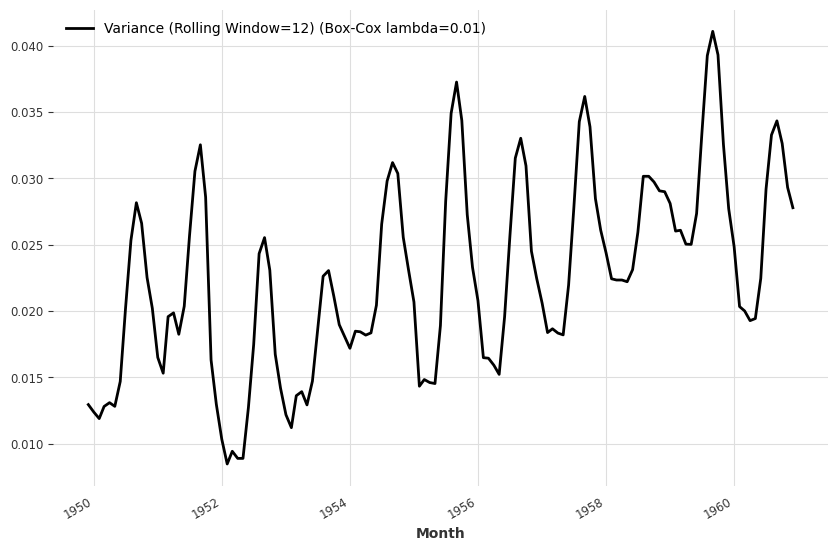

# Box-Cox Transformation

Many time series models require [stationary data](timeseries-data.analysis.md). However, real-world time series data may be non-stationary and [heteroscedastic](https://en.wikipedia.org/wiki/Homoscedasticity_and_heteroscedasticity)[^scedasticity]. Box-cox transformation is useful when reducing the non-stationarity and heteroscedasticity.

!!! note ""
    Rob J Hyndman and George Athanasopoulos's famous textbook FPP2 provides some [nice examples of box-cox transformations](https://otexts.com/fpp2/transformations.html#mathematical-transformations).

To see Box-Cox transformation in action, we show an example using the [air passenger dataset](https://www.kaggle.com/datasets/rakannimer/air-passengers).

The air passenger dataset is a monthly dataset. We can observe the trend and varying variance simply by eyes.

Applying Box-Cox transformations with different lambdas leads to different results shown below.

To check the variance, we plot out the variance rolling on a 12-month window.

Box-Cox transformation with $\lambda =0.1$ reduces the variability in variance.

!!! warning "Box-Cox May not Always Reach Perfect Stationary Data"
    Box-Cox transformation is a simple transformation that helps us reduce the non-stationarity and heteroscedasticy. However, we may not always be able to convert the dataset to stationary and homoscedastic data. This can be observed by performing checks using tools such as [`stationarity_tests` in Darts](https://unit8co.github.io/darts/generated_api/darts.utils.statistics.html?highlight=trend#darts.utils.statistics.remove_trend).

[^scedasticity]: Homoscedasticity and heteroscedasticity. (2023, June 2). In Wikipedia. https://en.wikipedia.org/wiki/Homoscedasticity_and_heteroscedasticity
