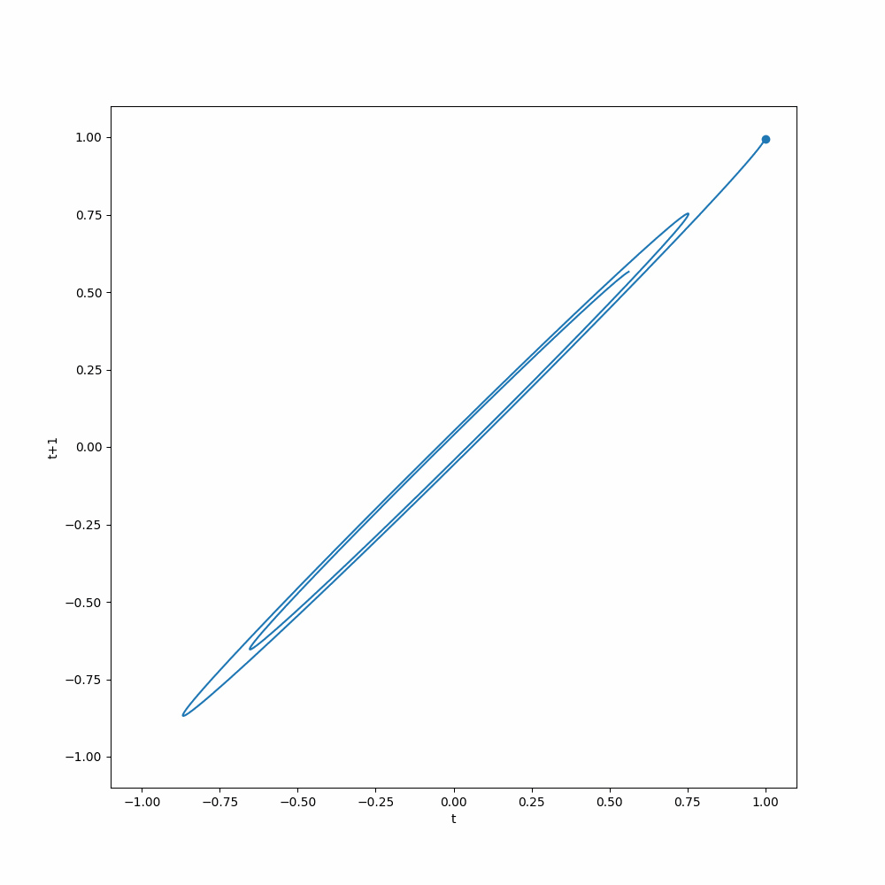

# The Time Delay Embedding Representation

The time delay embedding representation of a time series forecasting problem is a concise representation of the forecasting problem [@Hewamalage2022-sc]. This is also called rolling in many time series analyses [@Zivot2006-es].

For simplicity, we only write down the representation for a problem with time series $y_{1}, \cdots, y_{t}$, and forecasting $y_{t+1}$. We rewrite the series into a matrix, in an autoregressive way,

$$
\begin{align}
\mathbf Y = \begin{bmatrix}
y_1 & y_2 & \cdots & y_p &\Big| & {\color{red}y_{p+1}} \\
y_{1+1} & y_{1+2} & \cdots & y_{1+p} &\Big| &  {\color{red}y_{1+p+1}} \\
\vdots & \vdots & \ddots & \vdots &\Big| &  {\color{red}\vdots} \\
y_{i-p+1} & y_{i-p+2} & \cdots & y_{i} &\Big| &  {\color{red}y_{i+1}} \\
\vdots & \vdots & \ddots & \vdots &\Big| &  {\color{red}\vdots} \\
y_{t-p+1} & y_{t-p+2} & \cdots & y_{t} &\Big| &  {\color{red}y_{t+1}} \\
\end{bmatrix}
\end{align}
$$

which indicates that we will use everything on the left, a matrix of shape $(t-p+1,p)$, to predict the vector on the right (in red). This is a useful representation when building deep learning models as many of the neural networks require fixed-length inputs.


## Taken's Theorem

The reason that time delayed embedding representation is useful is that it is a representation of the original time series that preserves the dynamics of the original time series, if any. The math behind it is the Taken's theorem [@Takens1981-kh].

To illustrate the idea, we take our [pendulum dataset](../time-series-deep-learning/timeseries.dataset.pendulum.md) as an example. The pendulum dataset describes a damped pendulum, for the math and visualizations please refer to [the corresponding page](../time-series-deep-learning/timeseries.dataset.pendulum.md). Here we apply the time delay embedding representation to the pendulum dataset by setting both the history length and the target length to 1, so that we can better visualize it.


=== ":material-chart-line: Animation of Delayed Embedding"

    We plot out the delayed embedding representation of the pendulum dataset. The x-axis is the value of the pendulum angle at time $t$, and the y-axis is the value of the pendulum angle at time $t+1$. The animation shows how the delayed embedding representation evolves over time and shows attractor behavior. If a model can capture this dynamics, it can make good predictions.

    

=== ":material-code-json: Code"

    The notebook for more about the dataset itself is [here](../../notebooks/pendulum_dataset).


    ```python
    from functools import cached_property
    from typing import List, Tuple

    import matplotlib as mpl
    import matplotlib.animation as animation
    import matplotlib.pyplot as plt
    import pandas as pd
    from ts_dl_utils.datasets.dataset import DataFrameDataset
    from ts_dl_utils.datasets.pendulum import Pendulum


    ds_de = DataFrameDataset(dataframe=df["theta"][:200], history_length=1, horizon=1)

    class DelayedEmbeddingAnimation:
        """Builds an animation for univariate time series
        using delayed embedding.

        ```python
        fig, ax = plt.subplots(figsize=(10, 10))

        dea = DelayedEmbeddingAnimation(dataset=ds_de, fig=fig, ax=ax)
        ani = dea.build(interval=10, save_count=dea.time_steps)
        ani.save("results/pendulum_dataset/delayed_embedding_animation.mp4")
        ```

        :param dataset: a PyTorch dataset, input and target should have only length 1
        :param fig: figure object from matplotlib
        :param ax: axis object from matplotlib
        """
        def __init__(
            self, dataset: DataFrameDataset, fig: mpl.figure.Figure, ax: mpl.axes.Axes
        ):
            self.dataset = dataset
            self.ax = ax
            self.fig = fig

        @cached_property
        def data(self) -> List[Tuple[float, float]]:
            return [(i[0][0], i[1][0]) for i in self.dataset]

        @cached_property
        def x(self):
            return [i[0] for i in self.data]

        @cached_property
        def y(self):
            return [i[1] for i in self.data]

        def data_gen(self):
            for i in self.data:
                yield i

        def animation_init(self) -> mpl.axes.Axes:
            ax.plot(
                self.x,
                self.y,
            )
            ax.set_xlim([-1.1, 1.1])
            ax.set_ylim([-1.1, 1.1])
            ax.set_xlabel("t")
            ax.set_ylabel("t+1")

            return self.ax

        def animation_run(self, data: Tuple[float, float]) -> mpl.axes.Axes:
            x, y = data
            self.ax.scatter(x, y)
            return self.ax

        @cached_property
        def time_steps(self):
            return len(self.data)

        def build(self, interval: int = 10, save_count: int = 10):
            return animation.FuncAnimation(
                self.fig,
                self.animation_run,
                self.data_gen,
                interval=interval,
                init_func=self.animation_init,
                save_count=save_count,
            )


    fig, ax = plt.subplots(figsize=(10, 10))

    dea = DelayedEmbeddingAnimation(dataset=ds_de, fig=fig, ax=ax)

    ani = dea.build(interval=10, save_count=dea.time_steps)

    gif_writer = animation.PillowWriter(fps=5, metadata=dict(artist="Lei Ma"), bitrate=100)

    ani.save("results/pendulum_dataset/delayed_embedding_animation.gif", writer=gif_writer)
    # ani.save("results/pendulum_dataset/delayed_embedding_animation.mp4")
    ```


In some advanced deep learning models, delayed embedding plays a crucial role. For example, Large Language Models (LLM) can perform good forecasts by taking in delayed embedding of time series[@Rasul2023-ep].
