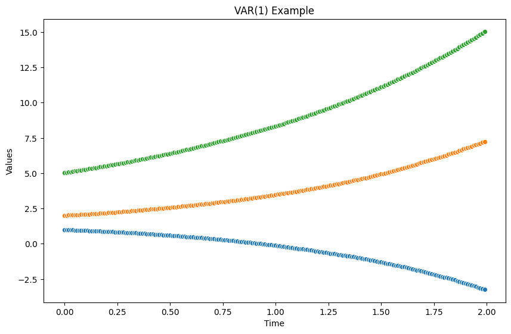
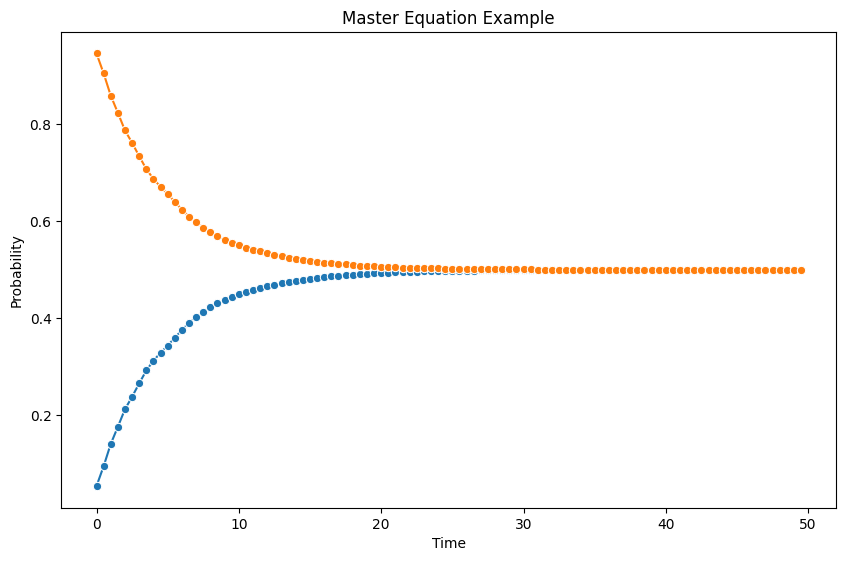

# Time Series Data Generating Process: Interactions

The interactions between the series can be modeled as explicit interactions, e.g., many spiking neurons, or through hidden variables, e.g., hidden state model[^hmm].

## Explicit Interactions

### VAR(1)

We use a very simple VAR(p) model to generate a time series dataset with two variables.

$$
\partial_t \begin{pmatrix}s_1 \\ s_2 \end{pmatrix} = \begin{pmatrix}\phi_{11} & \phi_{12}\\ \phi_{21} & \phi_{22} \end{pmatrix} \begin{pmatrix}s_1 \\ s_2 \end{pmatrix} + \begin{pmatrix} u_1 \\ u_2 \end{pmatrix}.
$$


=== "VAR(1) Example"

    


=== "Code"

    ```python
    class GaussianPhi:
        def __init__(self, mu, cov_diag, seed=None):
            self.d = int(np.sqrt(len(mu)))
            self.mu = mu
            self.cov = cov_diag
            self.rng = np.random.default_rng(seed=seed)

        def __next__(self):
            return self.rng.multivariate_normal(self.mu, self.cov).reshape((self.d, self.d))


    class VAR1Stepper:
        def __init__(self, delta_t, phis, us, initial_state):
            self.delta_t = delta_t
            self.phis = copy.deepcopy(phis)
            self.us = copy.deepcopy(us)
            self.current_state = copy.deepcopy(initial_state)
            self.vars = list(initial_state.keys())

        def __iter__(self):
            return self

        def __next__(self):

            phi = next(self.phis)
            current_state = np.array(list(self.current_state.values()))

            next_state = current_state + np.matmul(phi, current_state) * self.delta_t + self.us * self.delta_t
            self.current_state = dict(zip(self.vars, next_state))

            return copy.deepcopy(self.current_state)

    def var1_1(delta_t=0.01, length=200):
        mu = np.array([0.5, -0.25, -0.1, -0.35, 0.45, 0.1, -0.45, -0.1, 0.6])
        cov_diag = np.diag([0.001, 0.001, 0.001, 0.002, 0.001, 0.001,  0.001, 0.001, 0.001,])
        gphi = GaussianPhi(mu=mu, cov_diag = cov_diag)
        initial_state = {"s1": 1, "s2": 2, "s3": 5}

        us = np.array([-0.07, -0.14, -0.05])
        var1_stepper = VAR1Stepper(delta_t=delta_t, phis=gphi, us=us, initial_state=initial_state)

        history = []
        for l in range(length):
            history.append(next(var1_stepper))

        df = pd.DataFrame(history)

        fig, ax = plt.subplots(figsize=(10, 6.18))

        sns.lineplot(
            x=np.linspace(0, length-1, length) * delta_t,
            y=df.s1,
            ax=ax,
            marker="o",
        )

        sns.lineplot(
            x=np.linspace(0, length-1, length) * delta_t,
            y=df.s2,
            ax=ax,
            marker="o",
        )

        sns.lineplot(
            x=np.linspace(0, length-1, length) * delta_t,
            y=df.s3,
            ax=ax,
            marker="o",
        )

        ax.set_title("VAR(1) Example")
        ax.set_xlabel("Time")
        ax.set_ylabel("Values")

    var1_1()
    ```


??? example "Master Equation for Fun"

    We obtain a master equation when the variables represent probabilities, i.e., $s_1 + s_2=1$.

    === "Example"

        


    === "Code"

        ```python
        class GaussianR:
            def __init__(self, mu, std, seed=None):
                self.mu = mu
                self.std = std
                self.rng = np.random.default_rng(seed=seed)

            def __next__(self):
                return self.rng.normal(self.mu, self.std)


        class GaussianRSin:
            def __init__(self, step_size, std, seed=None):
                self.std = std
                self.rng = np.random.default_rng(seed=seed)
                self.step = 0

            def __next__(self):
                while True:
                    mu = np.sin(self.step * step_size)
                    yield self.rng.normal(self.mu, self.std)
                    self.step += 1


        class MasterEquatioinDegenerateStepper:
            def __init__(self, delta_t, rs, initial_state):
                self.delta_t = delta_t
                self.rs = copy.deepcopy(rs)
                self.current_state = copy.deepcopy(initial_state)

            def __iter__(self):
                return self

            def __next__(self):

                r = next(self.rs)
                p1_current = self.current_state["p1"]
                p2_current = self.current_state["p2"]

                p1_next = (1 - r * self.delta_t) * p1_current + r * self.delta_t * p2_current
                p2_next = r*self.delta_t * p1_current + (1 - r*self.delta_t) * p2_current

                self.current_state["r"] = r
                self.current_state["p1"] = p1_next
                self.current_state["p2"] = p2_next

                return copy.deepcopy(self.current_state)

        me1_delta_t = 0.5

        me1_gr = GaussianR(mu=0.1, std=0.01)

        me1_initial_state = {"p1": 0, "p2": 1}

        me1_stepper = MasterEquatioinDegenerateStepper(
            delta_t=me1_delta_t,
            rs=me1_gr,
            initial_state=me1_initial_state
        )

        me1_length = 100
        me1_history = []
        for _ in range(me1_length):
            me1_history.append(next(me1_stepper))

        df_me1 = pd.DataFrame(me1_history)

        fig, ax = plt.subplots(figsize=(10, 6.18))

        sns.lineplot(
            x=np.linspace(0, me1_length-1, me1_length) * me1_delta_t,
            y=df_me1.p1,
            ax=ax,
            marker="o",
        )

        sns.lineplot(
            x=np.linspace(0, me1_length-1, me1_length) * me1_delta_t,
            y=df_me1.p2,
            ax=ax,
            marker="o",
        )

        ax.set_title("Master Equation Example")
        ax.set_xlabel("Time")
        ax.set_ylabel("Probability")
        ```


[^hmm]: Contributors to Wikimedia projects. Hidden Markov model. In: Wikipedia [Internet]. 22 Oct 2022 [cited 22 Nov 2022]. Available: https://en.wikipedia.org/wiki/Hidden_Markov_model
