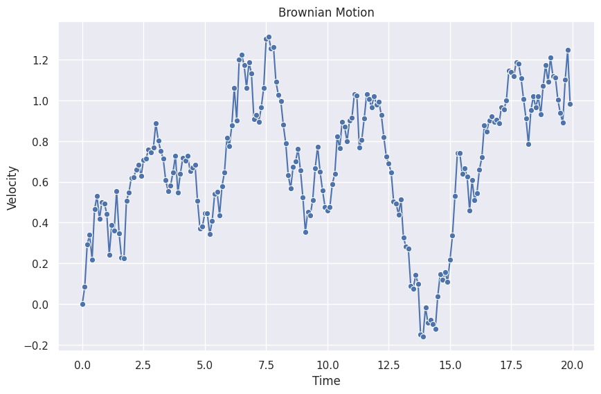

# Time Series Data Generating Process: Langevin Equation

Among the many data generating processes (DGP), Langevin equation is one of the most interesting DGP.

## Brownian Motion

Brownian motion as a very simple stochastic process can be described by the Langevin equation[^ma-sp]. In this section, we simulate a time series from Brownian motion.

Macroscopically, Brownian Motion can be described by the notion of random forces on the particles,

$$
\frac{d}{dt} v(t) + \gamma v(t) = R(t),
$$

where $v(t)$ is the velocity at time $t$ and $R(t)$ is the stochastic force density from the reservoir particles. Solving the equation, we get

$$
v(t) = v(0)e^{-\gamma t} + \int_0^t dt' e^{-\gamma (t-t')} R(t') .
$$

To generate a dataset numerically, we discretize it by replacing the integral with a sum,

$$
v(t) = v(0) e^{-\gamma t} + \sum_{n=0}^N \Delta t e^{-\gamma (t - t_n)} R(t_n)
$$

where $t_i = i * \Delta t$ and $t = t_n$, thus the equation is further simplified,

$$
v(N\Delta t) = v(0) e^{-\gamma N\Delta t} + \sum_{n=0}^N  e^{-\gamma (N - n)\Delta t} R(n\Delta t) \Delta t.
$$


=== "Brownian Motion"

    The following is a simulated 1D Brownian motion.

    

=== "Python Code"


    ```python
    import numpy as np
    import matplotlib.pyplot as plt
    import seaborn as sns; sns.set()

    ## Define Brownian Motion
    def gaussian_forece_density(mu: float, sigma: float, length: int) -> np.ndarray:
        """Generate the full history of the force density

        :param mu: the mean of the Guassian distribution
        :param sigma: the variance of the Gaussian distribution
        :param length: the total length of the time series
        """
        return np.random.default_rng().normal(mu, sigma, length)


    def brownian_motion(
        gamma: float, force_density_history: np.ndarray, v_0: float, delta_t: float, length: int
    ) -> np.ndarray:
        """Generates the full history of simulated 1D brownian motion.

        :param gamma: decay factor in Brownian motion
        :param force_density_history: the full history of the force density,
        e.g., an array of Gaussian distribution
        :param v_0: initial velocity
        :param delta_t: the time step size when simulating Brownian motion
        :param length: total length of the time series
        """

        n_steps = np.linspace(0, length - 1, num=length)
        decay_history = v_0 * np.exp(-1 * gamma * n_steps * delta_t)
        integrand_decay_history = np.exp(-1 * gamma * (length - n_steps) * delta_t )

        dynamic_history = [0]
        for step in range(1, length):
            v_step =  (
                dynamic_history[-1]
                + integrand_decay_history[step] * force_density_history[step] * delta_t
            )

            dynamic_history.append(v_step)


        return decay_history + dynamic_history


    ## Generating time series
    length = 200
    delta_t = 0.1

    bm_fd = gaussian_forece_density(0, 1, length)

    bm_history = brownian_motion(0, bm_fd, v_0=0, delta_t=delta_t, length=length)


    ## Visualizations
    fig, ax = plt.subplots(figsize=(10, 6.18))

    sns.lineplot(
        x=np.linspace(0, length-1, length) * delta_t,
        y=bm_history,
        ax=ax,
        marker="o",
    )

    ax.set_title("Brownian Motion")
    ax.set_xlabel("Time")
    ax.set_ylabel("Velocity")
    ```


[^ma-sp]: Ma L. Brownian Motion — Statistical Physics Notes. In: Statistical Physics [Internet]. [cited 17 Nov 2022]. Available: https://statisticalphysics.leima.is/nonequilibrium/brownian-motion.html
