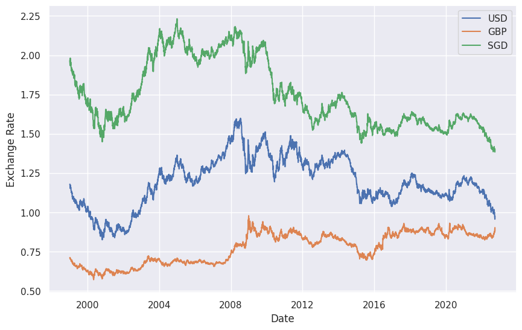
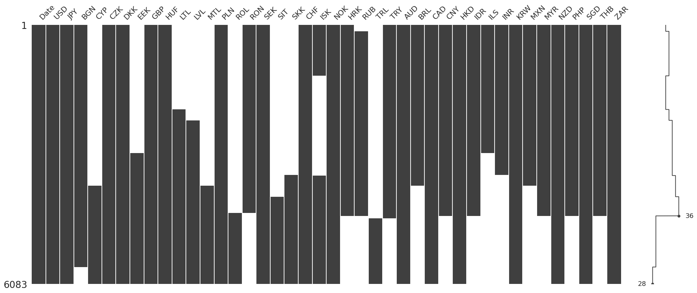

# Time Series Dataset: ECB Exchange Rate

We download the time series data in zip format using [this link](https://www.ecb.europa.eu/stats/eurofxref/eurofxref-hist.zip).

We [find](https://deepnote.com/workspace/lm-3917ee58-3e0d-43ba-a6c8-13241298300c/project/time-series-notebooks-deae214e-e319-4268-ac24-de1038ff0b94) 41 currencies in this dataset. The earliest date is 1999-01-04.

=== "Example Plots"

    

=== "Missing Values"

    
