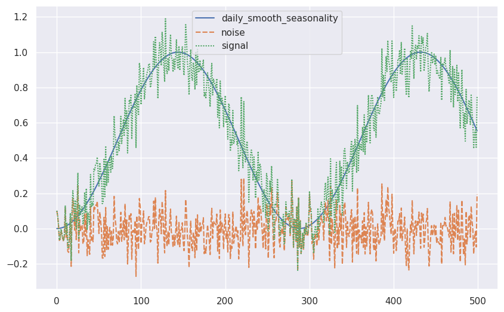

# Synthetic Time Series

With a proper understanding of the [DGP](timeseries-generating-process.md), we can build data generators around the DGP we choose.

## GluonTS

[GluonTS](https://github.com/awslabs/gluonts) is a python package for probabilistic time series modeling. It comes with a simple yet easy to use synthetic data generator. For example, to generate a time series of random Gaussian, we only need the following code[^gluonts-synth].

```python
from gluonts.dataset.artificial import recipe as rcp
g_rg = rcp.RandomGaussian(stddev=2)
g_rp_series = rcp.evaluate(g_rg, 100)
```

For more complicated multivariate time series, we create recipes for our variables. We steal the example in the [GluonTS](https://ts.gluon.ai/stable/tutorials/data_manipulation/synthetic_data_generation.html#Simple-Examples) tutorial.

```python
from gluonts.dataset.artificial import recipe as rcp
import matplotlib.pyplot as plt
import seaborn as sns; sns.set()

daily_smooth_seasonality = rcp.SmoothSeasonality(period=288, phase=-72)
noise = rcp.RandomGaussian(stddev=0.1)
signal = daily_smooth_seasonality + noise

recipe = dict(
    daily_smooth_seasonality=daily_smooth_seasonality, noise=noise, signal=signal
)
rec_eval = rcp.evaluate(recipe, 500)

fig, ax = plt.subplots(figsize=(10, 6.18))
sns.lineplot(rec_eval)
```




[^gluonts-synth]: Synthetic data generation. In: GluonTS documentation [Internet]. [cited 13 Nov 2022]. Available: https://ts.gluon.ai/stable/tutorials/data_manipulation/synthetic_data_generation.html
