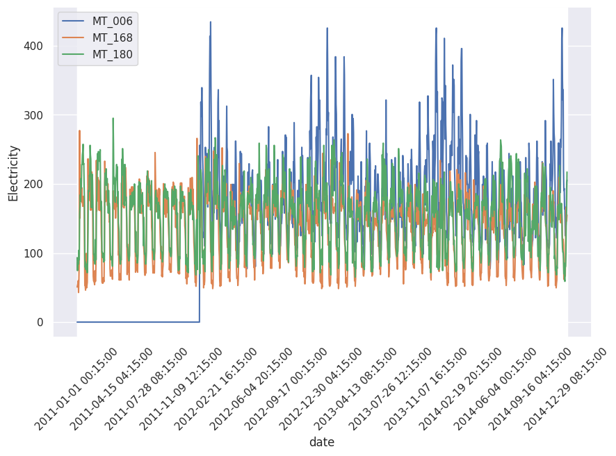
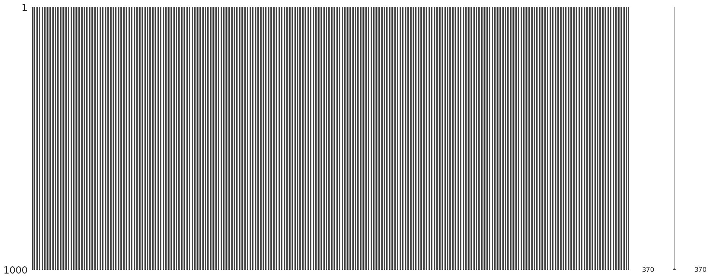

# Time Series Dataset: Electricity

This dataset is provided [as the "ElectricityLoadDiagrams20112014 Data Set" on the UCI website](https://archive.ics.uci.edu/ml/datasets/ElectricityLoadDiagrams20112014). It is the time series of electricity consumption of 370 points/clients.

We download the time series data in zip format using [this link](https://www.ecb.europa.eu/stats/eurofxref/eurofxref-hist.zip).

We [find](https://deepnote.com/workspace/lm-3917ee58-3e0d-43ba-a6c8-13241298300c/project/time-series-notebooks-deae214e-e319-4268-ac24-de1038ff0b94) that

- in total 140256 rows and 370 series,
- the earliest time is 2011-01-01 00:15:00,
- the latest time is 2015-01-01 00:00:00,
- a fixed time interval of 15 minutes.


=== "Example Plots"

    We only plot out three series. We only plot every 100 time steps.

    

=== "Missing Values"

    We fine no missing values.

    


## Loading and Basic Cleaning

We provide some code to load the data from the UCI website.

```python
import requests, zipfile, io
import pandas as pd

# Download from remote URL
data_uri = "https://archive.ics.uci.edu/ml/machine-learning-databases/00321/LD2011_2014.txt.zip"

r = requests.get(data_uri)

z = zipfile.ZipFile(io.BytesIO(r.content))
z.extractall("data/uci_electricity/")

# Load as pandas dataframe
df = pd.read_csv(
    "data/uci_electricity/LD2011_2014.txt", delimiter=";", decimal=','
).rename(columns={"Unnamed: 0": "date"}).set_index("date")
df.index = pd.to_datetime(df.index)
```
