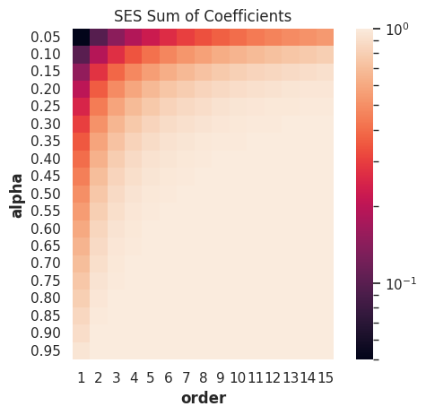
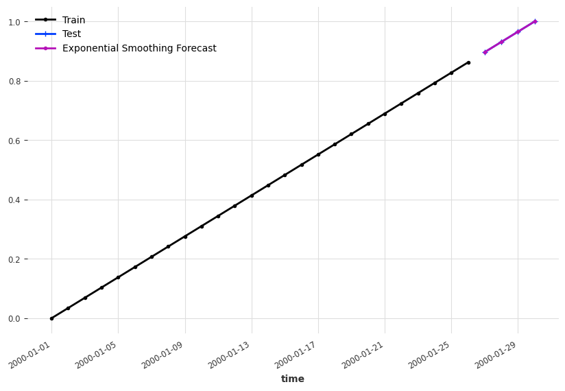
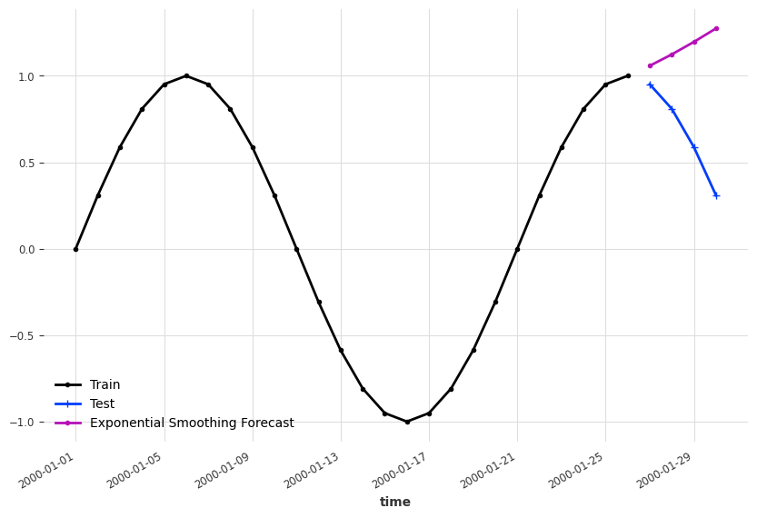
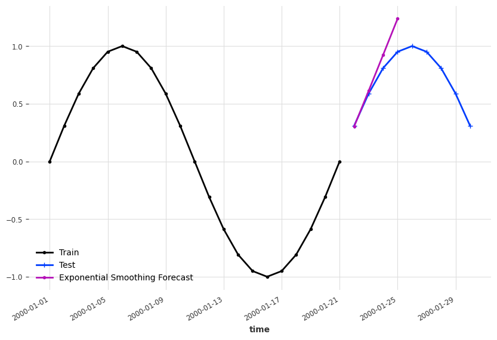
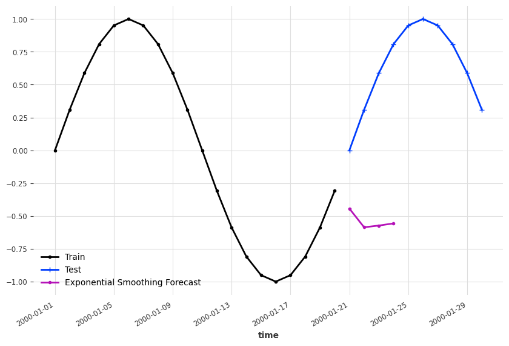
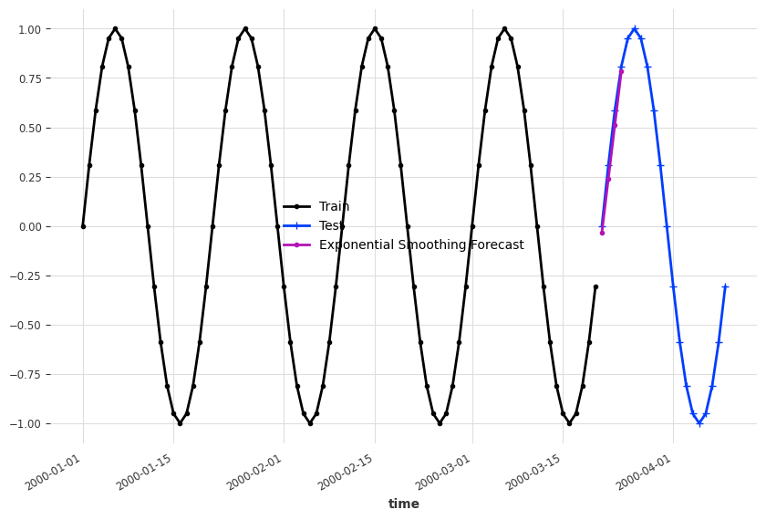

# Naive Forecasts

In some sense, time series forecasting is easy, if we have low expectations. From a dynamical system point of view, our future is usually not too different from our current state.

## Last Observation

Assuming our time series is not changing dramatically, we can take our last observation as our forecast.

!!! note "Example: Last Observation as Forecast"

    Assuming we have the simplest dynamical system,

    $$
    \frac{\mathrm d y(t)}{\mathrm dt} = f(y, t, \theta),
    $$

    where $y(t)$ is the time series generator function, $t$ is time, $\theta$ is some parameters defining the function $f$.

    For example,

    $$
    \frac{\mathrm d y(t)}{\mathrm dt} = t
    $$

    is an linear growing time series.

    We would imagine, it won't be too crazy if we just take the last observed value as our forecast.

    === ":material-chart-line: Naive Last Value Forecasts"

        

    === ":material-code-json: Code"

        ```python
        import matplotlib.pyplot as plt

        from darts.utils.timeseries_generation import linear_timeseries

        ts = linear_timeseries(length=30)
        ts.plot(marker=".")

        ts_train, ts_test = ts.split_before(0.9)
        ts_train.plot(marker=".", label="Train")
        ts_test.plot(marker="+", label="Test")

        ts_last_value_naive_forecast = ts_train.shift(1)[-1]

        fig, ax = plt.subplots(figsize=(10, 6.18))
        ts_train.plot(marker=".", label="Train", ax=ax)
        ts_test.plot(marker="+", label="Test", ax=ax)
        ts_last_value_naive_forecast.plot(marker=".", label="Last Value Naive Forecast")
        ```

There are also slightly more complicated naive forecasting methods.

## Mean Forecast

In some bounded time series, the mean of the past values is also a good naive candidate[^Hyndman2021].

!!! note "Example: Naive Mean Forecast"

    === ":material-chart-line: Naive Mean Forecast"

        

    === ":material-code-json: Code"

        ```python
        import matplotlib.pyplot as plt

        from darts.utils.timeseries_generation import sine_timeseries
        from darts.models.forecasting.baselines import NaiveMean

        ts_sin = sine_timeseries(length=30, value_frequency=0.05)

        ts_sin.plot(marker=".")


        ts_sin_train, ts_sin_test = ts_sin.split_before(0.9)

        ts_sin_train.plot(marker=".", label="Train")
        ts_sin_test.plot(marker="+", label="Test")


        naive_mean_model = NaiveMean()
        naive_mean_model.fit(ts_sin_train)
        ts_mean_naive_forecast = naive_mean_model.predict(1)

        fig, ax = plt.subplots(figsize=(10, 6.18))
        ts_sin_train.plot(marker=".", label="Train", ax=ax)
        ts_sin_test.plot(marker="+", label="Test", ax=ax)
        ts_mean_naive_forecast.plot(marker=".", label="Naive Mean Forecast")
        ```


## Simple Exponential Smoothing

Simple Exponential Smoothing (SES) is a naive smoothing method to account for the historical values of a time series, when forecasting. The expanded form of SES is[^Hyndman2021]

$$
y(t) = \alpha ( y(t-1) + (1-\alpha) y(t-2) + (1-\alpha)^2 y(t-3) + \cdots )
$$

!!! warning "Truncated SES is Biased"

    Naively speaking, if the history is constant, we have to forecast the same constant. For example, if we have $y(t) = y(t_0)$, the smoothing

    $$
    y(t) = \alpha (1 + (1-\alpha) + \cdots) y(t_0)
    $$

    should equal to $y(t_0)$, i.e.,

    $$
    \alpha (1 + (1-\alpha) + \cdots)  = 1.
    $$

    The series indeed sums up to $1/\alpha$ when $n\to\infty$ since

    $$
    \sum_{n=0}^\infty (1-\alpha) = \frac{1}{\alpha}.
    $$

    However, if we truncate the series to finite values, we will have

    $$
    \sum_{n=0}^N (1-\alpha) \leq \frac{1}{\alpha}.
    $$

    Then our naive forecast for constant series is

    $$
    y(t) = \alpha \sum_{n=0}^N  (1-\alpha)  y(t_0) \leq y(t_0),
    $$

    when $y(t_0)$ is positive.

    As an intuiation, we plot out the sum of the coefficients for different
    orders and $\alpha$s.

    === ":material-chart-line: SES Coefficients"

        

    === ":material-code-json: Code"

        ```python
        from itertools import product
        import pandas as pd
        import seaborn as sns; sns.set()
        from matplotlib.colors import LogNorm

        def ses_coefficients(alpha, order):
            return (
                np.power(
                        np.ones(int(order)) * (1-alpha), np.arange((order))
                    ) * alpha
            )

        alphas = np.linspace(0.05, 0.95, 19)
        orders = list(range(1, 16))

        # Create dataframes for visualizations
        df_ses_coefficients = pd.DataFrame(
            [[alpha, order] for alpha, order in product(alphas, orders)],
            columns=["alpha", "order"]
        )
        df_ses_coefficients["ses_coefficients_sum"] = df_ses_coefficients.apply(
            lambda x: ses_coefficients(x["alpha"], x["order"]).sum(), axis=1
        )

        # Visualization
        g = sns.heatmap(
            data=df_ses_coefficients.pivot(
                "alpha", "order", "ses_coefficients_sum"
            ),
            square=True, norm=LogNorm(),
            fmt="0.2g",
            yticklabels=[f"{i:0.2f}" for i in alphas],
        )

        g.set_title("SES Sum of Coefficients");
        ```


!!! info "Holt-Winters' Exponential Smoothing"
    In applications, the Holt-Winters' exponential smoothing is more practical[^Hyndman2021][^nist][^HWES-numpyro].

    We created some demo time series and apply the Holt-Winters' exponential smoothing.
    To build see where exponential smoothing works, we forecast at different dates.

    === ":material-chart-line: Linear Example"
        

    === ":material-chart-line: Sine Example 1"
        

    === ":material-chart-line: Sine Example 2"
        

    === ":material-chart-line: Sine Example 3"
        

    === ":material-chart-line: Sine Example 3, Longer History"
        

    === ":material-code-json: Code"

        ```python
        import matplotlib.pyplot as plt

        from darts.utils.timeseries_generation import sine_timeseries
        from darts.models.forecasting.baselines import NaiveMean

        ts_sin = sine_timeseries(length=30, value_frequency=0.05)

        ts_sin.plot(marker=".")

        ts_sin_train, ts_sin_test = ts_sin.split_before(0.7)

        es_model = ExponentialSmoothing()

        es_model.fit(ts_sin_train)
        es_model_sin_forecast = es_model.predict(4)

        fig, ax = plt.subplots(figsize=(10, 6.18))
        ts_sin_train.plot(marker=".", label="Train", ax=ax)
        ts_sin_test.plot(marker="+", label="Test", ax=ax)
        es_model_sin_forecast.plot(marker=".", label="Exponential Smoothing Forecast")
        ```


## Other

Other naive forecasts, such as naive drift, are introduced in (Hyndman, et al., 2021)[^Hyndman2021].


[^Hyndman2021]: Hyndman, R.J., & Athanasopoulos, G. (2021) Forecasting: principles and practice, 3rd edition, OTexts: Melbourne, Australia. OTexts.com/fpp3. Accessed on 2023-02-13.
[^nist]: 6.4.3.5. Triple Exponential Smoothing. In: NIST Engineering Statistics Handbook [Internet]. [cited 16 Feb 2023]. Available: https://www.itl.nist.gov/div898/handbook/pmc/section4/pmc435.htm
[^HWES-numpyro]: Example: Holt-Winters Exponential Smoothing — NumPyro  documentation. In: NumPyro [Internet]. [cited 16 Feb 2023]. Available: https://num.pyro.ai/en/stable/examples/holt_winters.html
