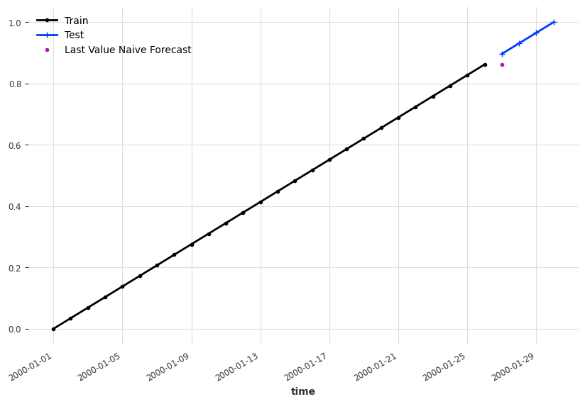
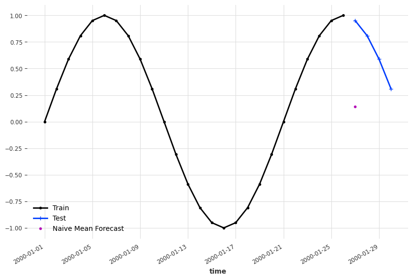

# Naive Forecasts

In some sense, time series forecasting is easy, if we have low expectations. From a dynamical system point of view, our future is usually not too different from our current state.

## Last Observation

Assuming our time series is not changing dramatically, we can take our last observation as our forecast.

!!! note "Example: Last Observation as Forecast"

    Assuming we have the simplest dynamical system,

    $$
    \frac{\mathrm d y(t)}{\mathrm dt} = f(y, t, \theta),
    $$

    where $y(t)$ is the time series generator function, $t$ is time, $\theta$ is some parameters defining the function $f$.

    For example,

    $$
    \frac{\mathrm d y(t)}{\mathrm dt} = t
    $$

    is an linear growing time series.

    We would imagine, it won't be too crazy if we just take the last observed value as our forecast.

    === ":material-chart-line: Naive Last Value Forecasts"

        

    === ":material-code-json: Code"

        ```python
        import matplotlib.pyplot as plt

        from darts.utils.timeseries_generation import linear_timeseries

        ts = linear_timeseries(length=30)
        ts.plot(marker=".")

        ts_train, ts_test = ts.split_before(0.9)
        ts_train.plot(marker=".", label="Train")
        ts_test.plot(marker="+", label="Test")

        ts_last_value_naive_forecast = ts_train.shift(1)[-1]

        fig, ax = plt.subplots(figsize=(10, 6.18))
        ts_train.plot(marker=".", label="Train", ax=ax)
        ts_test.plot(marker="+", label="Test", ax=ax)
        ts_last_value_naive_forecast.plot(marker=".", label="Last Value Naive Forecast")
        ```

There are also slightly more complicated naive forecasting methods.

## Mean Forecast

In some bounded time series, the mean of the past values is also a good naive candidate[^Hyndman2021].

!!! note "Example: Naive Mean Forecast"

    === ":material-chart-line: Naive Mean Forecast"

        

    === ":material-code-json: Code"

        ```python
        import matplotlib.pyplot as plt

        from darts.utils.timeseries_generation import sine_timeseries
        from darts.models.forecasting.baselines import NaiveMean

        ts_sin = sine_timeseries(length=30, value_frequency=0.05)

        ts_sin.plot(marker=".")


        ts_sin_train, ts_sin_test = ts_sin.split_before(0.9)

        ts_sin_train.plot(marker=".", label="Train")
        ts_sin_test.plot(marker="+", label="Test")


        naive_mean_model = NaiveMean()
        naive_mean_model.fit(ts_sin_train)
        ts_mean_naive_forecast = naive_mean_model.predict(1)

        fig, ax = plt.subplots(figsize=(10, 6.18))
        ts_sin_train.plot(marker=".", label="Train", ax=ax)
        ts_sin_test.plot(marker="+", label="Test", ax=ax)
        ts_mean_naive_forecast.plot(marker=".", label="Naive Mean Forecast")
        ```

## Other

Other naive forecasts, such as naive drift, are introduced in (Hyndman, et al., 2021)[^Hyndman2021].


[^Hyndman2021]: Hyndman, R.J., & Athanasopoulos, G. (2021) Forecasting: principles and practice, 3rd edition, OTexts: Melbourne, Australia. OTexts.com/fpp3. Accessed on 2023-02-13.
