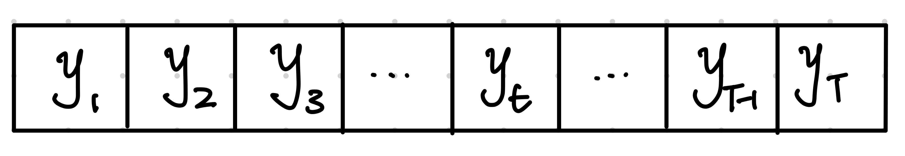
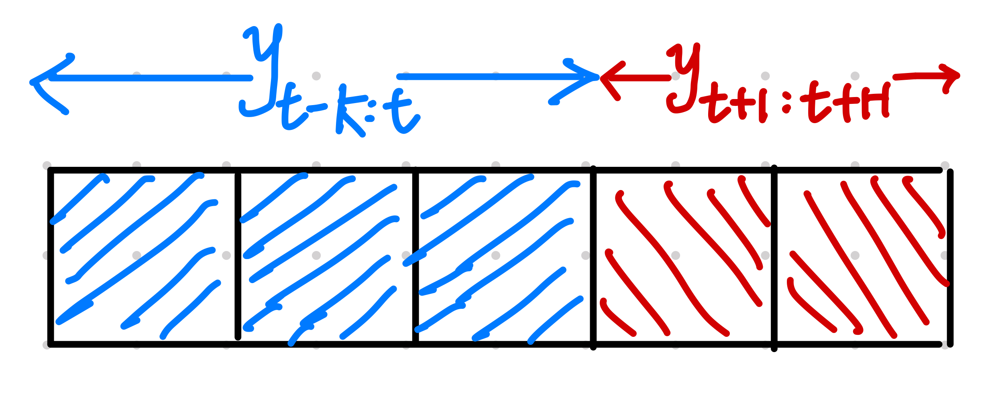

# Time Series Forecasting Tasks

There are many different types of time series forecasting tasks. Forecasting tasks can be categorized by different criteria. For example, we can categorize them by the number of variables in the series and their relations to each other.

## Forecasting Univariate Time Series

In a univariate time series forecasting task, we are given a single time series and asked to forecast future steps of the series.

Given a time series $\{y_{t}\}$, we train a model to forecast $\color{red}y_{t+1:t+H}$ using input $\color{blue}y_{t-K:t}$, i.e., we build a model $f$ such that

$$
f({\color{blue}y_{t-K:t}}) \to {\color{red}y_{t+1:t+H}}.
$$

## Forecasting Multivariate Time Series

In a multivariate time series forecasting task, we will deal with multiple time series.
