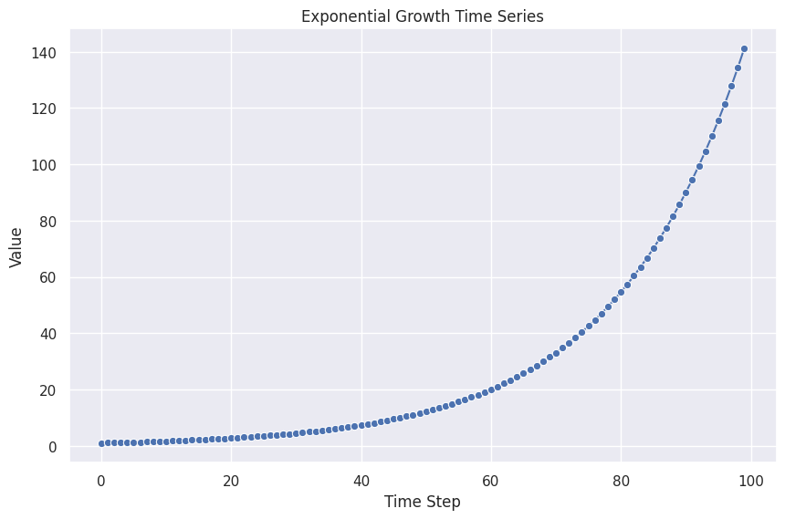
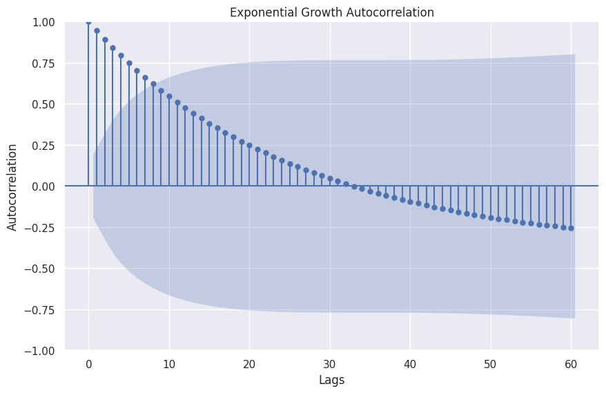
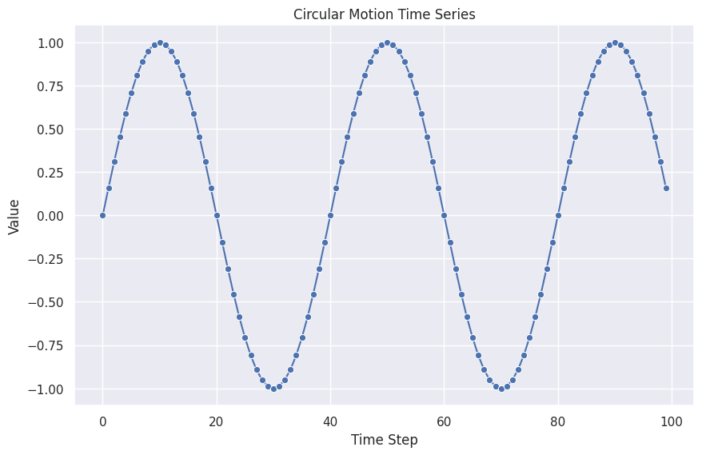
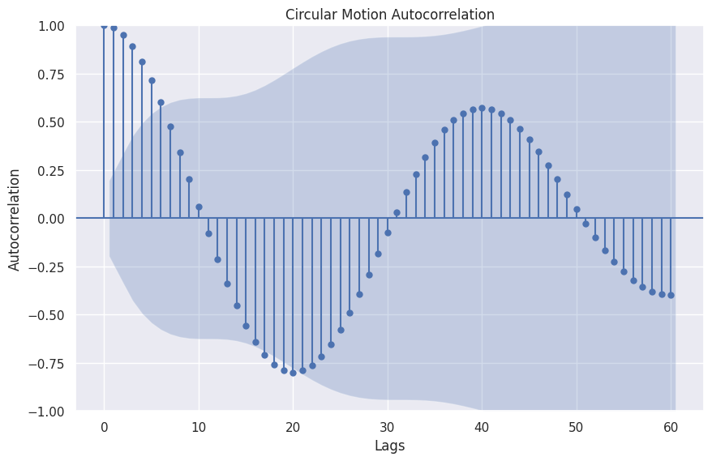
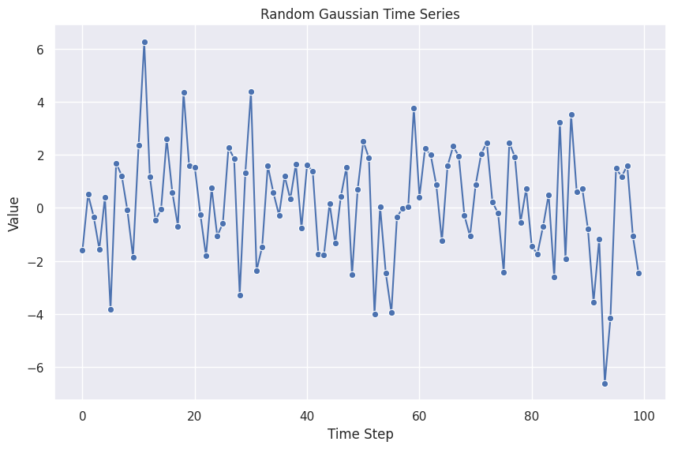
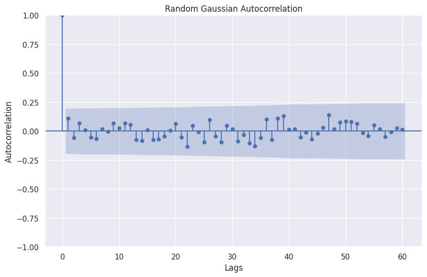

# Generating Processes for Time Series

The data generating processes (DGP) for time series is diverse. For example, in physics, we have all sort of dynamical systems that generates time series data and many dynamics models are formulated based on the time series data. In industries, time series data are often coming from stochastic processes.

## Simple Examples of DGP

!!! example "Exponential Growth"

    Exponential growth is a frequently observed natural and economical phenomena.

    $$
    y = e^{c \cdot t}
    $$

    
    

!!! example "Circular Motion"

    Circular motion shows some cyclic patterns.

    $$
    y = sin(w \cdot t)
    $$

    

    

!!! example "Random Gaussian"

    Time series can also be noisy Gaussian samples.

    
    

## General Linear Processes

A popular model for modeling as well as generating time series is the autoregressive (AR) model. An AR is formulated as

$$
x_t = \phi_0 + \phi_1 x_{t-1} + \epsilon_t.
$$

??? note "AR(p) and the Lag Operator"

    A general autoregressive model of p-th order is

    $$
    x_t = \sum_l \phi _i x_{t-i} + \epsilon_t,
    $$

    where $l$ is the lag.

    Define a lag operator $\hat L$ with $\hat L x_t = x_{t-1}$. The definition can also be rewritten using the lag operator

    $$
    x_t = \sum_l \phi _i {\hat L}^i x_{t} + \epsilon_t.
    $$

We write down each time step in the following table.

| $t$ | $x_t$ |
|:---:|:---:|
| 0 | $y_0$ |
| 1 | $\phi_0 + \phi_1 y_0 + \epsilon_1$ |
| 2 | $\phi_0 + \phi_1 (\phi_0 + \phi_1 y_0 + \epsilon_1) + \epsilon_2 = \phi_0 (1 +  \phi_1) + \phi_1^2 y_0 + \phi_1\epsilon_1 + \epsilon_2$ |
| 3 | $\phi_0 + \phi_1 (\phi_0 +  \phi_1\phi_0 + \phi_1^2 y_0 + \phi_1\epsilon_1 + \epsilon_2) + \epsilon_3 = \phi_0(1 + \phi_1 +  \phi_1^2) + \phi_1^3 y_0 + \phi_1^2\epsilon_1 + \phi_1\epsilon_2 + \epsilon_3$ |
| ... | ... |
| $t$ | $\phi_0 \sum_{i=0}^{t-1} \phi_1^i + \phi_1^t y_0 + \sum_{i=1}^{t-1} \phi_1^{t-i} \epsilon_{i}$ |

We have found a new formula for AR(1), i.e.

$$
x_t = \phi_0 \sum_{i=0}^{t-1} \phi_1^i + \phi_1^t y_0 + \sum_{i=1}^{t-1} \phi_1^{t-i} \epsilon_{i},
$$

which is very similar to a general linear process[^Das2019]

$$
x_t - \mu = \sum_{i=0}^\tau \alpha_i \epsilon_{t-i}.
$$

The general linear process is the Taylor expansion of a arbitrary DGP $x_t = \operatorname{DGP}(\epsilon_t, ...)$[^Das2019].

[^Das2019]: Das P. Econometrics in Theory and Practice. Springer Nature Singapore; [doi:10.1007/978-981-32-9019-8](https://link.springer.com/book/10.1007/978-981-32-9019-8)
