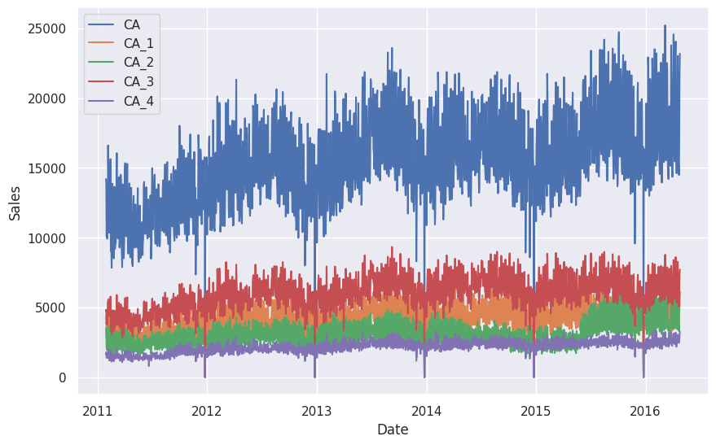
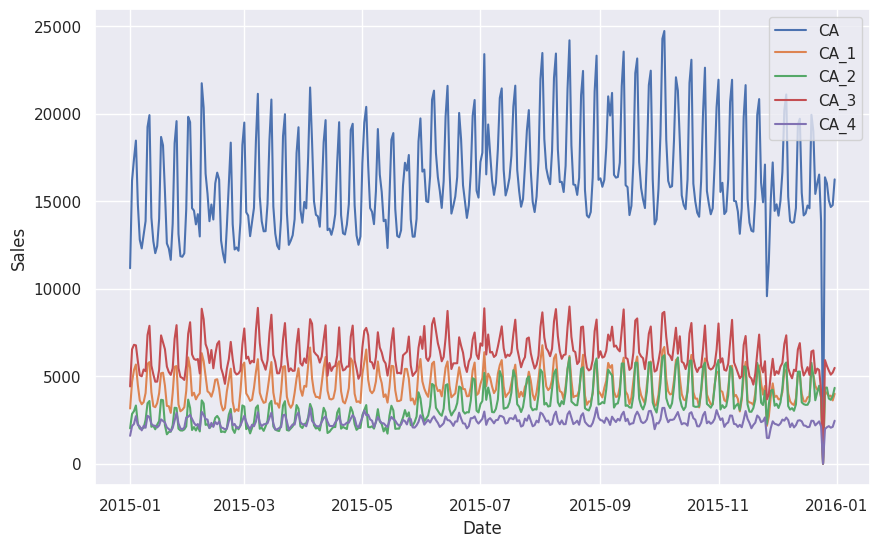

# Hierarchical Time Series Data

Many real world time series data asserts some internal structure among the series. For example, the dataset used in the [M5 competition](https://mofc.unic.ac.cy/m5-competition/) is the sales data of different items but with the store and category information provided[^Makridakis2022]. For simplicity, we simplified the dataset to only include the hierarchy of stores.


=== ":material-information-outline: Hierarchy Structure"

    The simplified dataset can be found [here](https://github.com/datumorphism/dataset-m5-simplified/blob/main/dataset/m5_store_sales.csv). The original data can [be found on the website of IIF](https://forecasters.org/resources/time-series-data/). In this simplified version of the M5 dataset, we have the following hierarchy.

    ```mermaid
    flowchart LR

    top["Total Sales"]

    ca["Sales in California"]
    tx["Sales in Texas"]
    wi["Sales in Wisconsin"]

    top --- ca
    top --- tx
    top --- wi

    subgraph California
    ca1["Sales in Store #1 in CA"]
    ca2["Sales in Store #2 in CA"]
    ca3["Sales in Store #3 in CA"]
    ca4["Sales in Store #4 in CA"]

    ca --- ca1
    ca --- ca2
    ca --- ca3
    ca --- ca4
    end


    subgraph Texas
    tx1["Sales in Store #1 in TX"]
    tx2["Sales in Store #2 in TX"]
    tx3["Sales in Store #3 in TX"]

    tx --- tx1
    tx --- tx2
    tx --- tx3

    end


    subgraph Wisconsin
    wi1["Sales in Store #1 in WI"]
    wi2["Sales in Store #2 in WI"]
    wi3["Sales in Store #3 in WI"]

    wi --- wi1
    wi --- wi2
    wi --- wi3

    end
    ```

    The above tree is useful when thinking about the hierarchies. For example, it explicitly tells us that the sales in store #1, #2, #3 in TX should sum up to the sales in TX.


=== ":material-chart-line: Visualization"

    We plotted the sales in CA as well as the individual stores in CA. We can already observe some synchronized anomalies.

    

    


## Summing Matrix

The relations between the series is represented using an **summing matrix** $\mathbf S$, which connects the bottom level series $\mathbf b$ and all the possible levels $\mathbf s$[^Hyndman2021]

$$
\mathbf y(t) = \mathbf S \mathbf b.
$$

!!! example "Summing Matrix Example"

    We take part of the above dataset and only consider the hierarchy of states,

    $$
    s(t) = s_\mathrm{CA}(t) + s_\mathrm{TX}(t) + s_\mathrm{WI}(t).
    $$

    The hierarchy is also revealed in the following tree.

    ```mermaid
    flowchart TD

    top["Total Sales"]

    ca["Sales in California"]
    tx["Sales in Texas"]
    wi["Sales in Wisconsin"]

    top --- ca
    top --- tx
    top --- wi
    ```

    In this example, the bottom level series are denoted as

    $$
    \mathbf b(t) = \begin{pmatrix}
    s_\mathrm{CA}(t) \\
    s_\mathrm{TX}(t) \\
    s_\mathrm{WI}(t)
    \end{pmatrix},
    $$

    and all the possible levels are denoted as

    $$
    \mathbf y(t) = \begin{pmatrix}
    s(t) \\
    s_\mathrm{CA}(t) \\
    s_\mathrm{TX}(t) \\
    s_\mathrm{WI}(t)
    \end{pmatrix}.
    $$

    The summing matrix is

    $$
    \mathbf S = \begin{pmatrix}
    1 & 1 & 1 \\
    1 & 0 & 0 \\
    0 & 1 & 0 \\
    0 & 0 & 1
    \end{pmatrix}.
    $$


[^Makridakis2022]: Makridakis S, Spiliotis E, Assimakopoulos V. The M5 competition: Background, organization, and implementation. Int J Forecast. 2022;38: 1325–1336. doi:10.1016/j.ijforecast.2021.07.007
[^Hyndman2021]: Hyndman, R.J., & Athanasopoulos, G. (2021) Forecasting: principles and practice, 3rd edition, OTexts: Melbourne, Australia. OTexts.com/fpp3. Accessed on 2022-11-27.
