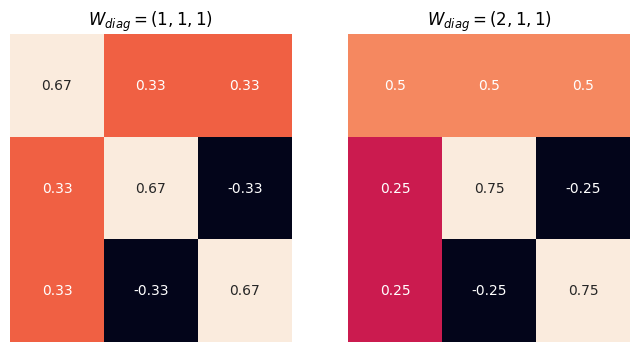

# Hierarchical Time Series Reconciliation

Reconciliation is a post-processing method to adjust the forecasts to be coherent. Given **base forecasts** $\hat{\mathbf y}(t)$ (forecasts for all levels but each level forecasted independently), we use $\mathbf P$ to map them to the bottom-level forecasts

$$
\begin{equation}
\tilde{\mathbf b}(t) = \mathbf P \hat{\mathbf y}(t).
\end{equation}
$$

!!! note "$P$ and $S$"

    In the [previous section](../timeseries-hierarchical.data), we discussed the summing matrix $\color{blue}S$. The summing matrix maps the bottom-level forecasts $\color{red}{\mathbf b}(t)$ to all forecasts on all levels $\color{green}\mathbf y(t)$. The example we provided was

    $${\color{green}\begin{pmatrix}
    s(t) \\
    s_\mathrm{CA}(t) \\
    s_\mathrm{TX}(t) \\
    s_\mathrm{WI}(t)
    \end{pmatrix}} = {\color{blue}\begin{pmatrix}
    1 & 1 & 1 \\
    1 & 0 & 0 \\
    0 & 1 & 0 \\
    0 & 0 & 1
    \end{pmatrix}} {\color{red}\begin{pmatrix}
    s_\mathrm{CA}(t) \\
    s_\mathrm{TX}(t) \\
    s_\mathrm{WI}(t)
    \end{pmatrix}}.
    $$

    If we forecast different levels independently, the forecasts we get

    $$
    \hat{\mathbf y}(t) = \begin{pmatrix}
    \hat s(t) \\
    \hat s_\mathrm{CA}(t) \\
    \hat s_\mathrm{TX}(t) \\
    \hat s_\mathrm{WI}(t)
    \end{pmatrix},
    $$

    are not necessarily coherent. However, if we can choose a proper $\mathbf P$, we can convert the base forecasts into some bottom-level forecasts

    $$
    \begin{pmatrix}
    \tilde s_\mathrm{CA}(t) \\
    \tilde s_\mathrm{TX}(t) \\
    \tilde s_\mathrm{WI}(t)
    \end{pmatrix} = \mathbf P \begin{pmatrix}
    \hat s(t) \\
    \hat s_\mathrm{CA}(t) \\
    \hat s_\mathrm{TX}(t) \\
    \hat s_\mathrm{WI}(t)
    \end{pmatrix}.
    $$

    From the usage, $\mathbf S$ and $\mathbf P$ are like conjugates. We have the following relation

    $$
    \begin{pmatrix}
    \tilde s_\mathrm{CA}(t) \\
    \tilde s_\mathrm{TX}(t) \\
    \tilde s_\mathrm{WI}(t)
    \end{pmatrix} = \mathbf P \mathbf S {\color{red}\begin{pmatrix}
    s_\mathrm{CA}(t) \\
    s_\mathrm{TX}(t) \\
    s_\mathrm{WI}(t)
    \end{pmatrix}}.
    $$

    It is clear that $\mathbf P \mathbf S$ is identity if we set

    $$
    \begin{pmatrix}
    \tilde s_\mathrm{CA}(t) \\
    \tilde s_\mathrm{TX}(t) \\
    \tilde s_\mathrm{WI}(t)
    \end{pmatrix} = {\color{red}\begin{pmatrix}
    s_\mathrm{CA}(t) \\
    s_\mathrm{TX}(t) \\
    s_\mathrm{WI}(t)
    \end{pmatrix}}.
    $$

    However, this is not the only $\mathbf P$ we can choose.


To generate the coherent forecasts $\tilde{\mathbf y}(t)$, we use [the summing matrix](timeseries-hierarchical.data.md#summing-matrix) to map the bottom level forecasts to base forecasts of all levels[^Hyndman2021][@Rangapuram2021-xi]

$$
\begin{equation}
\tilde{\mathbf y}(t) = \mathbf S\tilde{\mathbf b}(t) = \mathbf S \mathbf P \hat{\mathbf y}(t).
\label{eq:reconciliation-compact-form}
\end{equation}
$$

!!! example "Walmart Sales in Stores"

    We reuse the example of the [Walmart sales data](timeseries-hierarchical.data.md). The base forecasts for all levels are

    $$
    \hat{\mathbf y}(t) = \begin{pmatrix}
    \hat s(t) \\
    \hat s_\mathrm{CA}(t) \\
    \hat s_\mathrm{TX}(t) \\
    \hat s_\mathrm{WI}(t)
    \end{pmatrix}.
    $$

    The simplest mapping to the bottom-level forecasts is

    $$
    \tilde{\mathbf b}(t) = \begin{pmatrix}
    0 & 1 & 0 & 0 \\
    0 & 0 & 1 & 0 \\
    0 & 0 & 0 & 1
    \end{pmatrix}\begin{pmatrix}
    \hat s(t) \\
    \hat s_\mathrm{CA}(t) \\
    \hat s_\mathrm{TX}(t) \\
    \hat s_\mathrm{WI}(t)
    \end{pmatrix}.
    $$

    where

    $$
    \tilde{\mathbf b}(t) = \begin{pmatrix}
    \tilde s_\mathrm{CA}(t) \\
    \tilde s_\mathrm{TX}(t) \\
    \tilde s_\mathrm{WI}(t)
    \end{pmatrix}
    $$

    are the bottom-level forecasts to be transformed into coherent forecasts.

    In this simple method, our mapping matrix $\mathbf P$ can be

    $$
    \mathbf P = \begin{pmatrix}
    0 & 1 & 0 & 0 \\
    0 & 0 & 1 & 0 \\
    0 & 0 & 0 & 1
    \end{pmatrix}.
    $$

    Using this $\mathbf P$, we get

    $$
    \tilde{\mathbf b}(t) = \hat{\mathbf b}(t) = \begin{pmatrix}
    \hat s_\mathrm{CA}(t) \\
    \hat s_\mathrm{TX}(t) \\
    \hat s_\mathrm{WI}(t)
    \end{pmatrix}.
    $$

    The last step is to apply the summing matrix

    $$
    \mathbf S = \begin{pmatrix}
    1 & 1 & 1 \\
    1 & 0 & 0 \\
    0 & 1 & 0 \\
    0 & 0 & 1
    \end{pmatrix},
    $$

    so that

    $$
    \tilde{\mathbf y}(t) = \mathbf S \tilde{\mathbf b}(t) = \begin{pmatrix}
     \hat s_\mathrm{CA}(t) + \hat s_\mathrm{TX}(t) + \hat s_\mathrm{WI}(t) \\
    \hat s_\mathrm{CA}(t) \\
    \hat s_\mathrm{TX}(t) \\
    \hat s_\mathrm{WI}(t)
    \end{pmatrix}.
    $$

    In summary, our coherent forecasts for each level are

    $$
    \begin{align}
    \tilde s (t) &= \hat s_\mathrm{CA}(t) + \hat s_\mathrm{TX}(t) + \hat s_\mathrm{WI}(t) \\
    \tilde s_\mathrm{CA}(t) &= \hat s_\mathrm{CA}(t) \\
    \tilde s_\mathrm{TX}(t) &= \hat s_\mathrm{TX}(t) \\
    \tilde s_\mathrm{WI}(t) &= \hat s_\mathrm{WI}(t).
    \end{align}
    $$

    The $\mathbf P$ we used in this example represents the **bottom-up method**.

    Results like $\tilde s_\mathrm{CA}(t) = \hat s_\mathrm{CA}(t)$ look comfortable but they are not necessary. In other reconciliation methods, these relations might be broken, i.e., $\tilde s_\mathrm{CA}(t) = \hat s_\mathrm{CA}(t)$ may not be true.


!!! note "Component Form"

    We rewrite

    $$
    \tilde{\mathbf y}(t) = \mathbf S \mathbf P \hat{\mathbf y}(t)
    $$

    using the component form

    $$
    \tilde y_i = S_{ij} G_{jk} \hat y_k.
    $$


There is more than one $\mathbf P$ that can map the forecasts to the bottom-level forecasts. Three of the so-called single-level approaches[^Hyndman2021] are bottom-up, top-down, and middle-out[@Rangapuram2021-xi].

Apart from these intuitive methods, Wickramasuriya et al. (2017) proposed the MinT method to find the optimal $\mathbf P$ matrix that gives us the minimal trace of the covariance of the **reconciled forecast error**[@Wickramasuriya2019-cv],

$$
\tilde{\boldsymbol \epsilon} = \mathbf y(t) - \tilde{\mathbf y}(t),
$$

with $\mathbf y$ being the ground truth and $\tilde{\mathbf y}$ being the coherent forecasts. Wickramasuriya et al. (2017) showed that the optimal $\mathbf P$ is

$$
\begin{equation}
\hat{\mathbf P} = (\mathbf S^T \mathbf W(t)^{-1} \mathbf S)^{-1} (\mathbf S^{T}\mathbf W(t)^{-1}),
\label{eq-mint-p}
\end{equation}
$$

where $W_{h} = \mathbb E\left[ \tilde{\boldsymbol \epsilon} \tilde{\boldsymbol \epsilon}^T \right] = \mathbb E \left[ (\mathbf y(t) - \tilde{\mathbf y}(t))(\mathbf y(t) - \tilde{\mathbf y}(t))^T \right]$ is the covariance matrix of the reconciled forecast error.

!!! note "$\hat{\mathbf P} \neq \mathbf I$"

    Note that $\mathbf S$ is not a square matrix and we can't simply apply the inverse on each element,

    $$
    (\mathbf S^T \mathbf W(t)^{-1} \mathbf S)^{-1} \neq \mathbf S^{-1}  \mathbf W(t)  {\mathbf S^T}^{-1}.
    $$


MinT is easy to calculate but it assumes that the forecasts are unbiased. To relieve this constraint, Van Erven & Cugliari (2013) proposed a game-theoretic method called GTOP[@Van_Erven2015-ht]. In deep learning, Rangapuram et al. (2021) developed an end-to-end model for coherent probabilistic hierarchical forecasts[@Rangapuram2021-xi]. For these advanced topics, we redirect the readers to the original papers.


## MinT Examples

### Theories

To see how the MinT method works, we calculate a few examples based on equation $\eqref{eq-mint-p}$. For simplicity, we assume that the variance $\mathbf W$ is diagonal[@Wickramasuriya2019-cv]. Note that the matrix $\mathbf S \mathbf P$ decides how each original forecast is combined, $\tilde{\mathbf y} = \mathbf S \mathbf P \hat{\mathbf y}$. It will be the key for us to understand how MinT works.

In the following examples, we observe that the lower variance of the reconciled forecast error $W_{ii}$, the less change in the reconciled result. Since lower values of $W_{ii}$ indicate lower reconciled forecast error, reconciliation should not adjust it by a lot.

=== "Two Levels: 2 Bottom Level Series"

    For a 2-level hierarchical forecasting problem, the shape of the $\mathbf S$ matrix is (3,2) and we have three values to pre-compute or assume, i.e., the diagonal elements of $\mathbf W$.

    |  $\mathbf S$  |  $\mathbf P$  |  $\mathbf S \mathbf P$ |
    |----|-----|-----|
    | $\left[\begin{matrix}1 & 1\\1 & 0\\0 & 1\end{matrix}\right]$ | $\left[\begin{matrix}\frac{\frac{1}{W_{2}} + \frac{2}{W_{1}}}{W_{1}} & \frac{\frac{1}{W_{2}} + \frac{1}{W_{1}}}{W_{2}} & \frac{1}{W_{1} W_{3}}\\\frac{\frac{1}{W_{3}} + \frac{2}{W_{1}}}{W_{1}} & \frac{1}{W_{1} W_{2}} & \frac{\frac{1}{W_{3}} + \frac{1}{W_{1}}}{W_{3}}\end{matrix}\right]$ | $\left[\begin{matrix}\frac{\frac{1}{W_{3}} + \frac{1}{W_{2}} + \frac{4}{W_{1}}}{W_{1}} & \frac{\frac{1}{W_{2}} + \frac{2}{W_{1}}}{W_{2}} & \frac{\frac{1}{W_{3}} + \frac{2}{W_{1}}}{W_{3}}\\\frac{\frac{1}{W_{2}} + \frac{2}{W_{1}}}{W_{1}} & \frac{\frac{1}{W_{2}} + \frac{1}{W_{1}}}{W_{2}} & \frac{1}{W_{1} W_{3}}\\\frac{\frac{1}{W_{3}} + \frac{2}{W_{1}}}{W_{1}} & \frac{1}{W_{1} W_{2}} & \frac{\frac{1}{W_{3}} + \frac{1}{W_{1}}}{W_{3}}\end{matrix}\right]$ |

    

=== "Two Levels: 3 Bottom Level Series"

    |  $\mathbf S$  |  $\mathbf P$  |  $\mathbf S \mathbf P$ |
    |----|-----|-----|
    | $\left[\begin{matrix}1 & 1 & 1\\1 & 0 & 0\\0 & 1 & 0\\0 & 0 & 1\end{matrix}\right]$ | $\left[\begin{matrix}\frac{\frac{1}{W_{2}} + \frac{3}{W_{1}}}{W_{1}} & \frac{\frac{1}{W_{2}} + \frac{1}{W_{1}}}{W_{2}} & \frac{1}{W_{1} W_{3}} & \frac{1}{W_{1} W_{4}}\\\frac{\frac{1}{W_{3}} + \frac{3}{W_{1}}}{W_{1}} & \frac{1}{W_{1} W_{2}} & \frac{\frac{1}{W_{3}} + \frac{1}{W_{1}}}{W_{3}} & \frac{1}{W_{1} W_{4}}\\\frac{\frac{1}{W_{4}} + \frac{3}{W_{1}}}{W_{1}} & \frac{1}{W_{1} W_{2}} & \frac{1}{W_{1} W_{3}} & \frac{\frac{1}{W_{4}} + \frac{1}{W_{1}}}{W_{4}}\end{matrix}\right]$ | $\left[\begin{matrix}\frac{\frac{1}{W_{4}} + \frac{1}{W_{3}} + \frac{1}{W_{2}} + \frac{9}{W_{1}}}{W_{1}} & \frac{\frac{1}{W_{2}} + \frac{3}{W_{1}}}{W_{2}} & \frac{\frac{1}{W_{3}} + \frac{3}{W_{1}}}{W_{3}} & \frac{\frac{1}{W_{4}} + \frac{3}{W_{1}}}{W_{4}}\\\frac{\frac{1}{W_{2}} + \frac{3}{W_{1}}}{W_{1}} & \frac{\frac{1}{W_{2}} + \frac{1}{W_{1}}}{W_{2}} & \frac{1}{W_{1} W_{3}} & \frac{1}{W_{1} W_{4}}\\\frac{\frac{1}{W_{3}} + \frac{3}{W_{1}}}{W_{1}} & \frac{1}{W_{1} W_{2}} & \frac{\frac{1}{W_{3}} + \frac{1}{W_{1}}}{W_{3}} & \frac{1}{W_{1} W_{4}}\\\frac{\frac{1}{W_{4}} + \frac{3}{W_{1}}}{W_{1}} & \frac{1}{W_{1} W_{2}} & \frac{1}{W_{1} W_{3}} & \frac{\frac{1}{W_{4}} + \frac{1}{W_{1}}}{W_{4}}\end{matrix}\right]$ |

    

=== "Two Levels: 4 Bottom Level Series"

    |  $\mathbf S$  |  $\mathbf P$  |  $\mathbf S \mathbf P$ |
    |----|-----|-----|
    | $\left[\begin{matrix}1 & 1 & 1 & 1\\1 & 0 & 0 & 0\\0 & 1 & 0 & 0\\0 & 0 & 1 & 0\\0 & 0 & 0 & 1\end{matrix}\right]$ | $\left[\begin{matrix}\frac{\frac{1}{W_{2}} + \frac{4}{W_{1}}}{W_{1}} & \frac{\frac{1}{W_{2}} + \frac{1}{W_{1}}}{W_{2}} & \frac{1}{W_{1} W_{3}} & \frac{1}{W_{1} W_{4}} & \frac{1}{W_{1} W_{5}}\\\frac{\frac{1}{W_{3}} + \frac{4}{W_{1}}}{W_{1}} & \frac{1}{W_{1} W_{2}} & \frac{\frac{1}{W_{3}} + \frac{1}{W_{1}}}{W_{3}} & \frac{1}{W_{1} W_{4}} & \frac{1}{W_{1} W_{5}}\\\frac{\frac{1}{W_{4}} + \frac{4}{W_{1}}}{W_{1}} & \frac{1}{W_{1} W_{2}} & \frac{1}{W_{1} W_{3}} & \frac{\frac{1}{W_{4}} + \frac{1}{W_{1}}}{W_{4}} & \frac{1}{W_{1} W_{5}}\\\frac{\frac{1}{W_{5}} + \frac{4}{W_{1}}}{W_{1}} & \frac{1}{W_{1} W_{2}} & \frac{1}{W_{1} W_{3}} & \frac{1}{W_{1} W_{4}} & \frac{\frac{1}{W_{5}} + \frac{1}{W_{1}}}{W_{5}}\end{matrix}\right]$ | $\left[\begin{matrix}\frac{\frac{1}{W_{5}} + \frac{1}{W_{4}} + \frac{1}{W_{3}} + \frac{1}{W_{2}} + \frac{16}{W_{1}}}{W_{1}} & \frac{\frac{1}{W_{2}} + \frac{4}{W_{1}}}{W_{2}} & \frac{\frac{1}{W_{3}} + \frac{4}{W_{1}}}{W_{3}} & \frac{\frac{1}{W_{4}} + \frac{4}{W_{1}}}{W_{4}} & \frac{\frac{1}{W_{5}} + \frac{4}{W_{1}}}{W_{5}}\\\frac{\frac{1}{W_{2}} + \frac{4}{W_{1}}}{W_{1}} & \frac{\frac{1}{W_{2}} + \frac{1}{W_{1}}}{W_{2}} & \frac{1}{W_{1} W_{3}} & \frac{1}{W_{1} W_{4}} & \frac{1}{W_{1} W_{5}}\\\frac{\frac{1}{W_{3}} + \frac{4}{W_{1}}}{W_{1}} & \frac{1}{W_{1} W_{2}} & \frac{\frac{1}{W_{3}} + \frac{1}{W_{1}}}{W_{3}} & \frac{1}{W_{1} W_{4}} & \frac{1}{W_{1} W_{5}}\\\frac{\frac{1}{W_{4}} + \frac{4}{W_{1}}}{W_{1}} & \frac{1}{W_{1} W_{2}} & \frac{1}{W_{1} W_{3}} & \frac{\frac{1}{W_{4}} + \frac{1}{W_{1}}}{W_{4}} & \frac{1}{W_{1} W_{5}}\\\frac{\frac{1}{W_{5}} + \frac{4}{W_{1}}}{W_{1}} & \frac{1}{W_{1} W_{2}} & \frac{1}{W_{1} W_{3}} & \frac{1}{W_{1} W_{4}} & \frac{\frac{1}{W_{5}} + \frac{1}{W_{1}}}{W_{5}}\end{matrix}\right]$ |

    


=== "Code"


    ```python
    import sympy as sp
    import numpy as np
    import seaborn as sns

    class MinTMatrices:
        def __init__(self, levels: int):
            self.levels = levels

        @property
        def s(self):
            s_ident_diag = np.diag([1] * (self.levels - 1)).tolist()
            return sp.Matrix(
                [
                    [1] * (self.levels - 1),
                ] + s_ident_diag
            )
        @property
        def w_diag_elements(self):
            return tuple(
                sp.Symbol(f"W_{i}")
                for i in range(1, self.levels + 1)
            )

        @property
        def w(self):
            return sp.Matrix(np.diag(self.w_diag_elements).tolist())

        @property
        def p_left(self):
            return (
                sp.MatMul(sp.Transpose(self.s), sp.Inverse(self.w), self.s)
            )

        @property
        def p_right(self):
            return (
                sp.MatMul(sp.Transpose(self.s), sp.Inverse(self.w))
            )

        @property
        def p(self):
            return sp.MatMul(self.p_left, self.p_right)

        @property
        def s_p(self):
            return sp.MatMul(self.s, self.p)

        @property
        def s_p_numerical(self):
            return sp.lambdify(
                self.w_diag_elements,
                self.s_p
            )

        def visualize_s_p(self, w_elements, ax):
            sns.heatmap(self.s_p_numerical(*w_elements), annot=True, cbar=False, ax=ax)
            ax.grid(False)
            ax.set(xticklabels=[], yticklabels=[])
            ax.tick_params(bottom=False, left=False)
            ax.set_title(f"$W_{{diag}} = {w_elements}$")
            return ax

    mtm_3 = MinTMatrices(levels=3)
    print(
        f"s: {sp.latex(mtm_3.s)}\n"
        f"p: {sp.latex(mtm_3.p.as_explicit())}\n"
        f"s_p: {sp.latex(mtm_3.s_p.as_explicit())}\n"
    )

    # 2 bottom series, in total three series
    mtm_3.s

    mtm_3.p

    mtm_3.s_p.as_explicit()

    w_elements = [
        (1,1,1),
        (2,1,1)
    ]

    fig, axes = plt.subplots(nrows = 1, ncols=2, figsize=(4 * 2, 4))

    for idx, w in enumerate(w_elements):
        mtm_3.visualize_s_p(w, axes[idx])
    fig.show()
    ```


!!! note "Implementations"

    There are different methods to get the covariance matrix $\mathbf W$. We discuss a few examples and their implications.

    | method | $\mathbf W$ |  Note |
    |------|-----|------|
    | OLS | $\mathbf I$ | More weight on the higher levels in the hierarchy |
    | Structual Scaling | $\operatorname{diag}(\mathbf S \mathbf I)$ | Less weight on higher levels compared to OLS |


### Real-world Data

!!! info "Code"
    The code for this subsection can be found in [this notebook](../../notebooks/hierarchical_forecasting_mint/) (also available on [Google Colab](https://colab.research.google.com/drive/1lsEahYaaXyn-3pD8wK2msCDZpFi0uRgT?usp=sharing)).

We use a [small subset of the M5 competition data](https://github.com/datumorphism/dataset-m5-simplified) to show that MinT works by shifting the values on different hierarchies.

| date                |    CA |   TX |   WI |   CA_1 |   CA_2 |   CA_3 |   CA_4 |   TX_1 |   TX_2 |   TX_3 |   WI_1 |   WI_2 |   WI_3 |   Total |
|:--------------------|------:|-----:|-----:|-------:|-------:|-------:|-------:|-------:|-------:|-------:|-------:|-------:|-------:|--------:|
| 2011-01-29 00:00:00 | 14195 | 9438 | 8998 |   4337 |   3494 |   4739 |   1625 |   2556 |   3852 |   3030 |   2704 |   2256 |   4038 |   32631 |
| 2011-01-30 00:00:00 | 13805 | 9630 | 8314 |   4155 |   3046 |   4827 |   1777 |   2687 |   3937 |   3006 |   2194 |   1922 |   4198 |   31749 |
| 2011-01-31 00:00:00 | 10108 | 6778 | 6897 |   2816 |   2121 |   3785 |   1386 |   1822 |   2731 |   2225 |   1562 |   2018 |   3317 |   23783 |
| 2011-02-01 00:00:00 | 11047 | 7381 | 6984 |   3051 |   2324 |   4232 |   1440 |   2258 |   2954 |   2169 |   1251 |   2522 |   3211 |   25412 |
| 2011-02-02 00:00:00 |  9925 | 5912 | 3309 |   2630 |   1942 |   3817 |   1536 |   1694 |   2492 |   1726 |      2 |   1175 |   2132 |   19146 |

We apply a simple LightGBM model using Darts. The forecasts are not coherent.


Applying [MinT method](https://unit8co.github.io/darts/generated_api/darts.dataprocessing.transformers.reconciliation.html), we reached coherent forecasts for all levels. The following charts shows the example for the top two levels.


Each step was adjusted differently since the forecasted values are different. To see how exactly the forecasted are adjusted to reach coherency, we plot out the difference between the reconciled results and the original forecasts, $\tilde{\mathbf y} - \hat{\mathbf y}$.


[^Hyndman2021]: Hyndman, R.J., & Athanasopoulos, G. (2021) Forecasting: principles and practice, 3rd edition, OTexts: Melbourne, Australia. OTexts.com/fpp3. Accessed on 2022-11-27.
