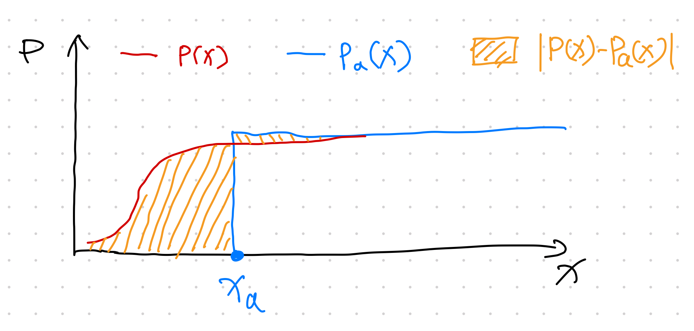
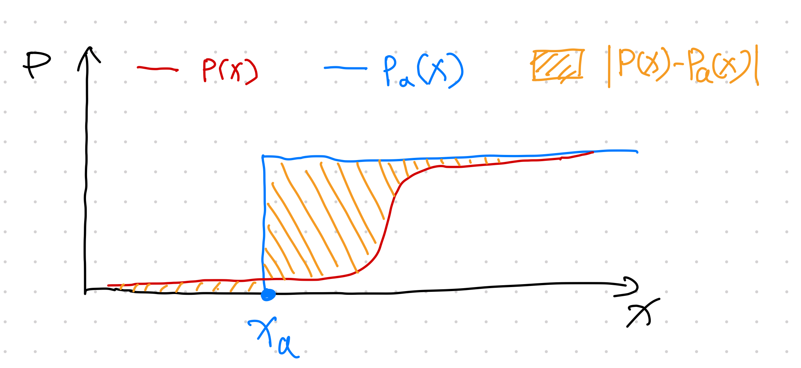
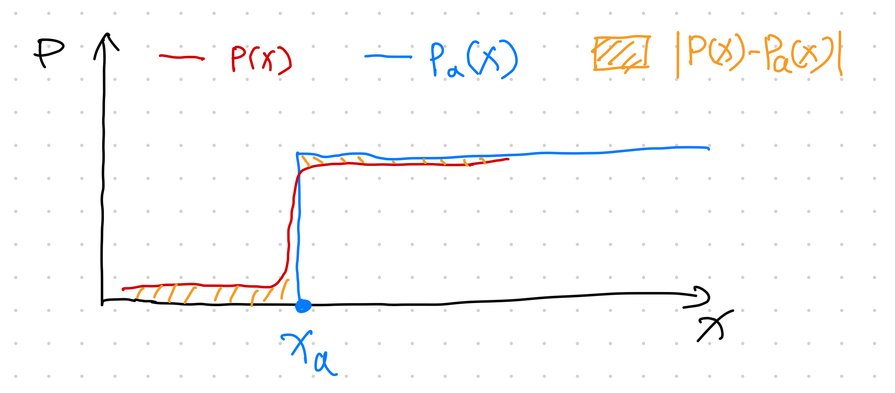
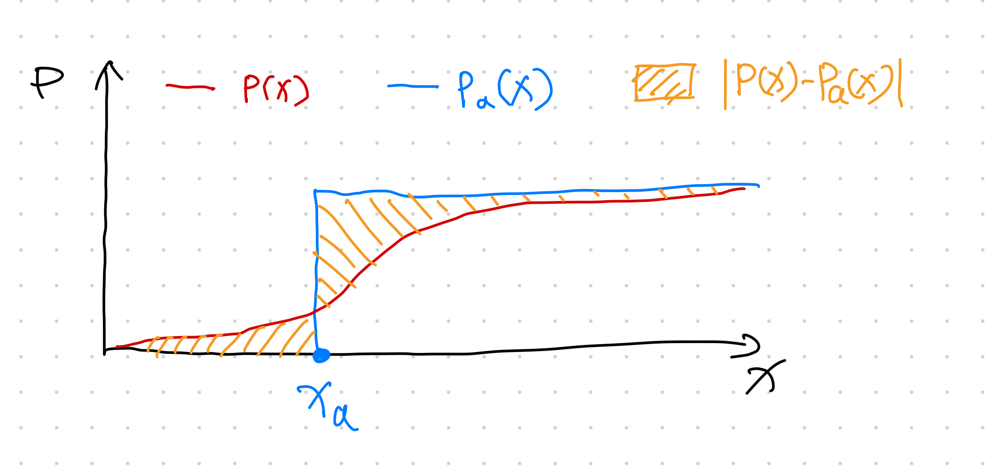
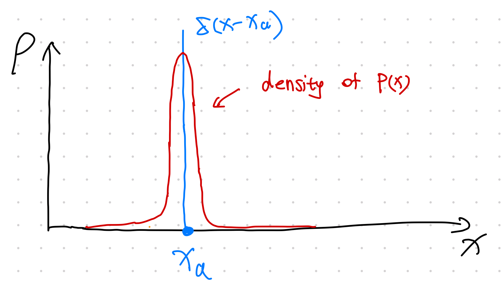

# Continuous Ranked Probability Score (CRPS)

The Continuous Ranked Probability Score, aka CRPS, is a score to measure how a proposed distribution approximates the data, without knowledge about the true distributions of the data.

## Definition

CRPS is defined as[^Hersbach2000]

$$
\operatorname{CRPS}(P, x_a) = \int_{-\infty}^\infty  \lVert P(x) - H(x - x_a) \rVert_2 dx,
$$

where

- $x_a$ is the true value of $x$,
- P(x) is our proposed cumulative distribution for $x$,
- $H(x)$ is the Heaviside step function,
- $\lVert \cdot \rVert_2$ is the L2 norm.

!!! note "Heaviside Step Function"

    $$
    H(x) = \begin{cases}
    1, &\qquad x=0\\
    0, &\qquad x\leq 0\\
    \end{cases}
    $$

## Explain it

The formula looks abstract on first sight, but it becomes crystal clear once we understand it.

Note that the distribution that corresponds to a Heaviside CDF is the delta function $\delta(x-x_a)$. What this score is calculating is the difference between our distribution and a delta function. If we have a model that minimizes CRPS, then we are looking for a distribution that is close to the delta function $\delta(x-x_a)$. In other words, we want our distribution to be large around $x_a$.

To illustrate what the integrand $\lVert P(x) - H(x - x_a) \rVert_2$ means, we apply some shades to the integrand of the integral in CRPS. We visualize four difference scenarios.

Scenario 1: The predicted CDF $P(x)$ is reaching 1 very fast.

Scenario 2: The predicted CDF $P(x)$ is reaching 1 quite late.

Scenario 3: The predicted CDF $P(x)$ is reaching 1 around the Heaviside function jump.

Scenario 4: The predicted CDF $P(x)$ is steadily increasing but very dispersed.

With the four different scenarios visualized, intuitively, the only way to get a small CRPS score is to choose a distribution that is focused around $x_a$. Echoing a previous note on the delta function being the density function of the Heaviside function, we expect a small CRPS reflects a scenario of the following: the predicted distribution $\rho(x)$ is very focused around the observation $x_a$.

## Discussions

Gebetsberger et al found that CRPS is more robust compared to Likelihood while producing similar results if we use a good assumption for the data distribution[^Gebetsberger2018].

CRPS is also very useful in time series forecasting. For example, the integrand of CRPS can be used as the loss function in model training [^Gouttes2021].

[^Hersbach2000]: [Hersbach H. Decomposition of the Continuous Ranked Probability Score for Ensemble Prediction Systems. Weather Forecast. 2000;15: 559–570. doi:10.1175/1520-0434(2000)015<0559:DOTCRP>2.0.CO;2](http://dx.doi.org/10.1175/1520-0434(2000)015%3C0559:DOTCRP%3E2.0.CO;2)
[^Gouttes2021]: [Gouttes A, Rasul K, Koren M, Stephan J, Naghibi T. Probabilistic Time Series Forecasting with Implicit Quantile Networks. arXiv [cs.LG]. 2021. doi:10.1109/icdmw.2017.19](https://arxiv.org/abs/2107.03743)
[^Gebetsberger2018]: [Gebetsberger M, Messner JW, Mayr GJ, Zeileis A. Estimation Methods for Nonhomogeneous Regression Models: Minimum Continuous Ranked Probability Score versus Maximum Likelihood. Mon Weather Rev. 2018;146: 4323–4338. doi:10.1175/MWR-D-17-0364.1](https://journals.ametsoc.org/view/journals/mwre/146/12/mwr-d-17-0364.1.xml)
