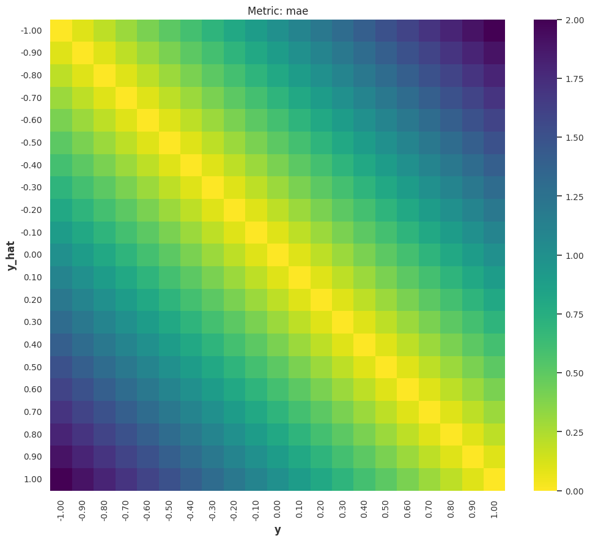
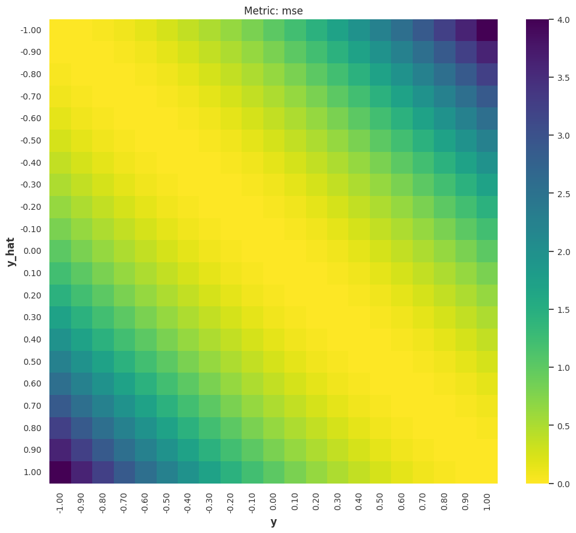
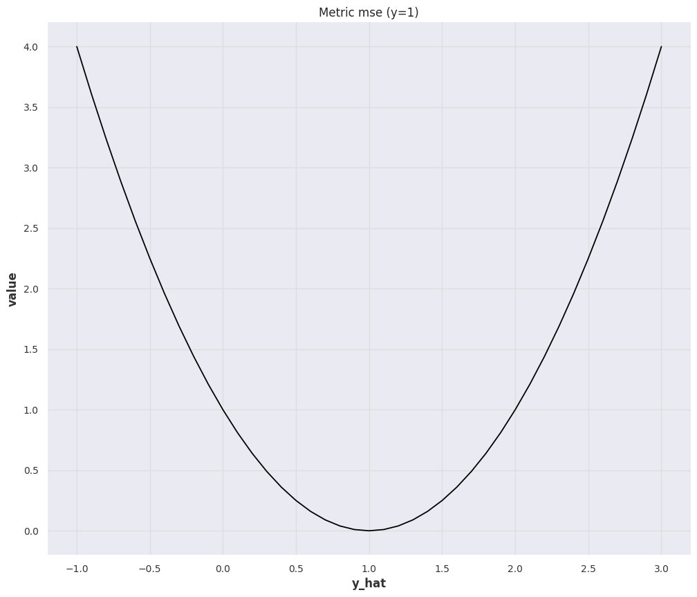
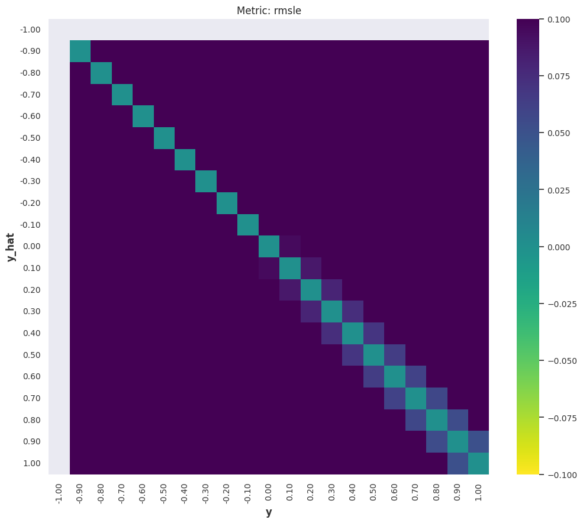
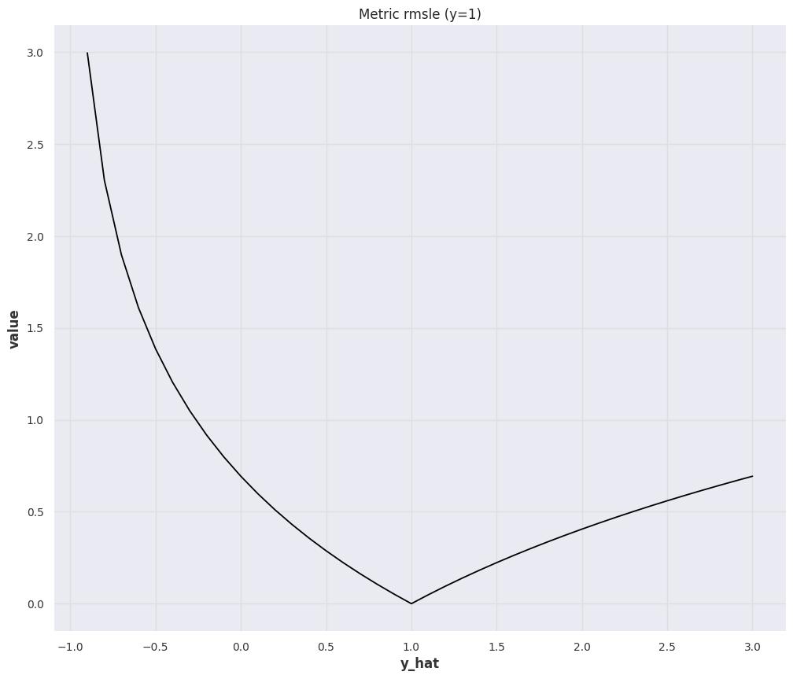
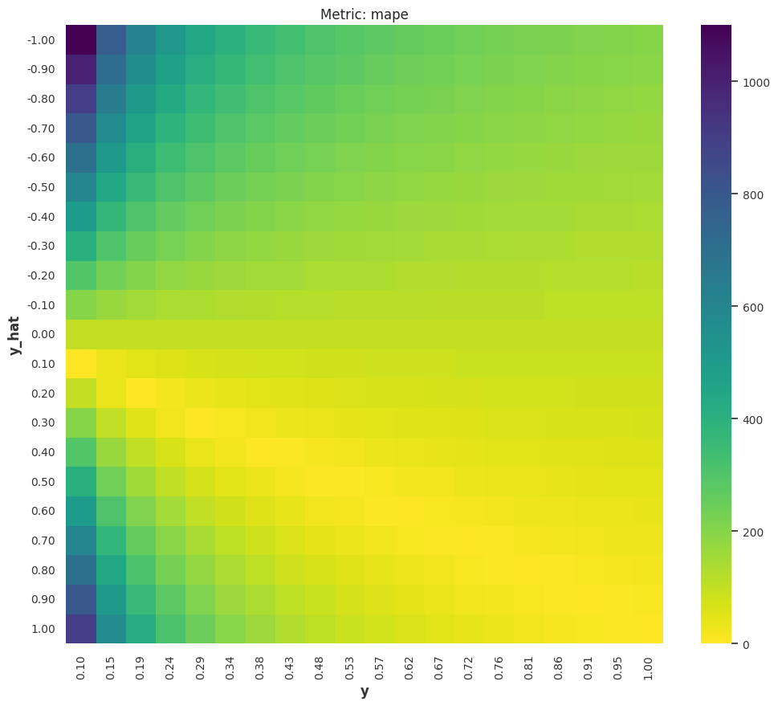
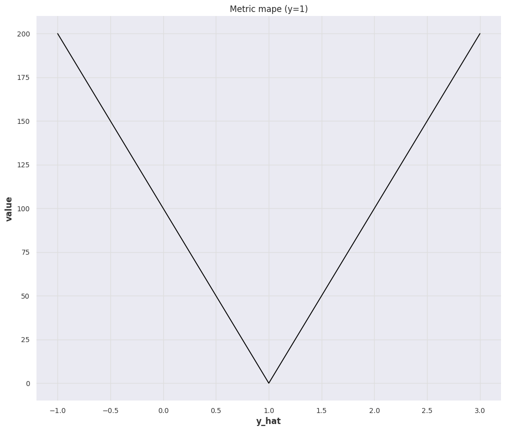
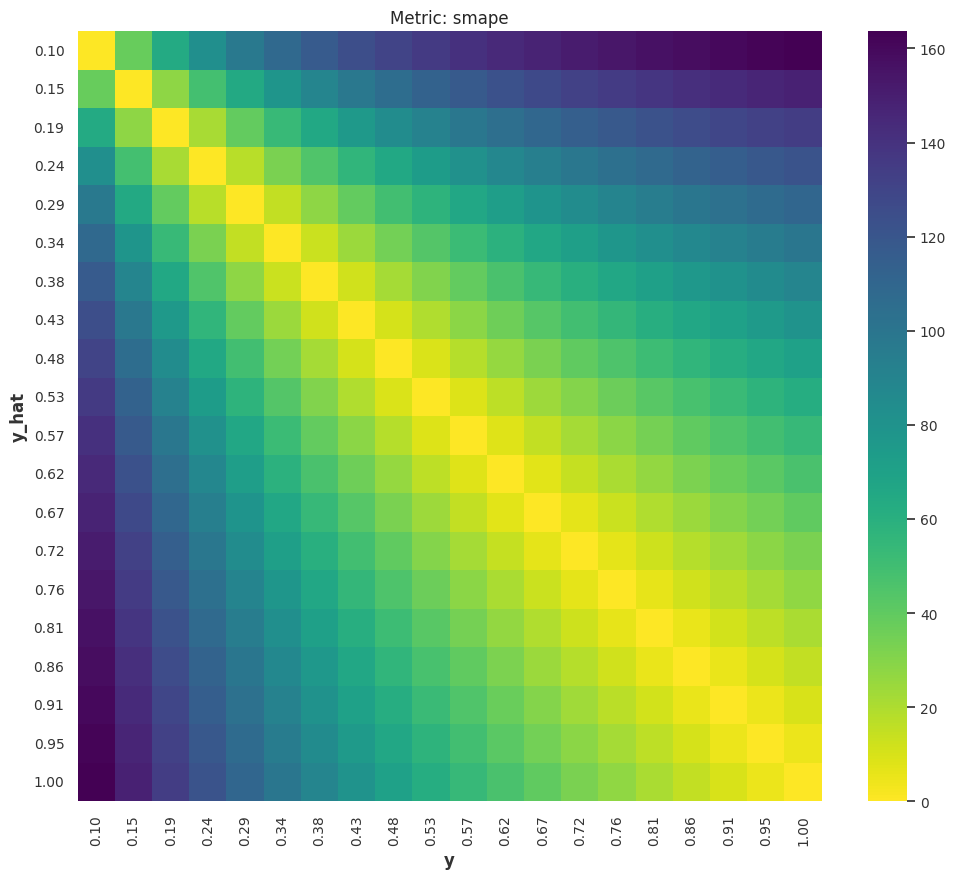
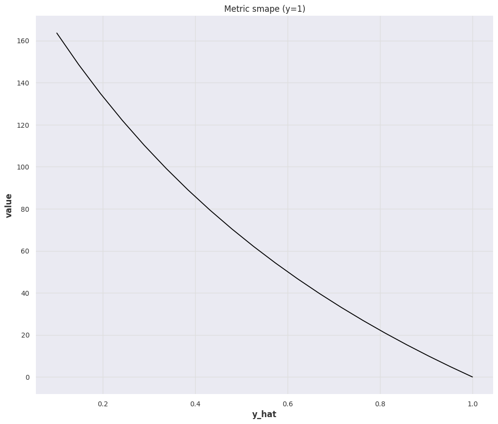

# Time Series Forecasting Metrics

Measuring the goodness of a forecaster is nontrivial. Tons of metrics are devised to measure forecasting results, applying the wrong metric may lead to "consequences" in decisions.

In this section, we explore some frequently used metrics. The metrics are grouped into categories using two dimensions: point forecast vs probabilistic forecast, and bounded vs unbounded.

!!! info "Recommended Reading"

    Hyndman & Athanasopoulos (2021) is a good reference for forecast errors [^Hyndman2021].

    To find implementations of metrics, [Darts](https://unit8co.github.io/darts/generated_api/darts.metrics.metrics.html#) and [GluonTS](https://ts.gluon.ai/stable/api/gluonts/gluonts.evaluation.metrics.html) both have a handful of metrics implemented.

In the following discussion, we assume the forecast at time $t$ to be $\hat y(t)$ and the actual value is $y(t)$. The forecast horizon is defined as $H$. In general, we look for a function

$$
L\left(\{y(t_1), \cdots, y(t_H)\}, \{\hat y(t_1), \cdots, \hat y(t_H)\}; \{C(t)\}, \{y(t)\} \right),
$$

where $\{C(t)\}$ are the covariates and $\{y(t)\}$ represents the past target variables.

!!! note "Distance between Truth and Forecasts"

    Naive choices of such metrics are distances between the truth vector $\{y(t_1), \cdots, y(t_H)\}$ and the forecast vector $\{\hat y(t_1), \cdots, \hat y(t_H)\}$.

    For example, we can use norms of the deviation vector $\{y(t_1) - \hat y(t_1), \cdots, y(t_H) - \hat y(t_H)\}$.

## List of Metrics

|  Metric | Definition |  Range | Notes |
|---|---|-----|----|
| MAE  |   |  $[0,\infty)$ | |
| MSE  |   |  $[0,\infty)$ | |
|  RMSE |   | $[0,\infty)$ | |
| MASE |  | $[0,\infty)$ | But scaled in practice |
| RMSLE | | $[0,\infty)$ | |
| MAPE | | $[0,\infty]$ | |
| sMAPE | | $[0, 2]$ | |
| wMAPE | | - | Depends on what weights are used |

Probabilistic forecast metrics

|  Metric | Definition |  Range | Notes |
|---|---|-----|----|
| Quantile Loss  |   |  $[0,\infty)$ | |
| CRPS  |   |   | |

### 1-Norm: MAE

The Mean Absolute Error (MAE) is

$$
\operatorname{MAE}(y, \hat y) = \frac{1}{H}\sum_{t=1}^{t=H}\lvert y(t) - \hat y(t)\rvert.
$$

=== ":material-test-tube: Forecasts and Actuals"

    

=== ":material-test-tube: Forecasts and Fixed Actuals"

    

### 2-Norm: MSE

The Mean Square Error (MSE) is

$$
\operatorname{MSE}(y, \hat y) = \frac{1}{H}\sum_{t=1}^{t=H}(y(t) - \hat y(t))^2.
$$

=== ":material-test-tube: Forecasts and Actuals"

    

=== ":material-test-tube: Forecasts and Fixed Actuals"

    

??? note "Other Norms"

    There are other norms that are not usually seen in liturature but might provide insights of forecasts.

    === "Maximum norm"

        The Max Norm error of a forecast can be defined as[^max-norm-wiki]

        $$
        \operatorname{MAE}(y, \hat y) = \operatorname{max}\left( {y(t) - \hat y(t)\right).
        $$

### RMSE

The Root Mean Square Error (RMSE) is

$$
\operatorname{RMSE}(y, \hat y) = \sqrt{\operatorname{MSE}(y, \hat y)} = \sqrt{\frac{1}{H}\sum_{t=1}^{t=H}(y(t) - \hat y(t))^2}.
$$

### MASE

The Mean Absolute Scaled Error (MASE) is the MAE scaled by the one-step ahead naive forecast error on the training data ($\{y(t_i)\}$, with $i\in {1, \cdots, T}$)[^mase-wiki]

$$
\operatorname{MASE}(y(t), \hat y(t)) = \frac{\operatorname{MAE}(y(t), \hat y(t))}{ \frac{1}{H-1} \sum_{i=1}^H \lvert y(t_i) - y(t_{i-1})\rvert }.
$$

### RMSLE

The Root Mean Squared Log Error (RMSLE) is

$$
\begin{align}
&\operatorname{RMSLE(y(t), \hat y(t))} \\
= &\operatorname{MSE\left( \ln(y(t) + 1), \ln(\hat y(t) + 1) \right)} \\
= &\sqrt{ \frac{1}{H} \sum_{i=1}^T \left( \ln (y(t) + 1) - \ln (\hat y(t) +1 ) \right)^2 }.
\end{align}
$$

=== ":material-test-tube: Forecasts and Actuals"

    

=== ":material-test-tube: Forecasts and Fixed Actuals"

    

### MAPE

The Mean Absolute Percent Error (MAPE) is a bounded metric defined as

$$
\operatorname{MAPE(y(t), \hat y(t))} = \frac{1}{H} \sum_{i=1}^H \left\lvert \frac{y(t_i) - \hat y(t_i)}{y(t_i)} \right\rvert.
$$

=== ":material-test-tube: Forecasts and Actuals"

    

=== ":material-test-tube: Forecasts and Fixed Actuals"

    

### sMAPE

The [symmetric Mean Absolute Percent Error (sMAPE)](https://en.wikipedia.org/wiki/Symmetric_mean_absolute_percentage_error) is a symmetrized version of MAPE

$$
\operatorname{sMAPE}(y(t), \hat y(t)) = \frac{1}{H} \sum_{i=1}^H \frac{\lvert y(t_i) - \hat y(t_i) \rvert}{ \lvert y(t_i) + \hat y(t_i) \rvert/2 }.
$$

=== ":material-test-tube: Forecasts and Actuals"

    

=== ":material-test-tube: Forecasts and Fixed Actuals"

    

### wMAPE

The [weighted Mean Absolute Percent Error (wMAPE)](https://en.wikipedia.org/wiki/Mean_absolute_percentage_error) is

$$
\operatorname{wMAPE}(y(t), \hat y(t)) = \frac{\sum_{i=1}^H w_i \lvert y(t_i) - \hat y(t_i) \rvert }{\sum_{i=1}^H w_i}.
$$

### Quantile Loss

The Quantile loss is defined as [@Gneiting2011-rr][@Koenker1978-lf][@De_Vargas_Staudacher2022-en]

$$
\operatorname{QL}(y(t), \hat y(t)) = \sum_{t=1}^H \sum_{q}\left(
    q (y(t) - \hat y(t))_+ + (1-q) (\hat y(t) - y(t))_+
\right),
$$

where ${}_{+}$ indicates that we only take positive values.

!!! note "Quantile Loss has many names"

    The quantile loss is also called quantile score, pinball loss, quantile risk or $\rho$-risk.

[^Hyndman2021]: Hyndman, R.J., & Athanasopoulos, G. (2021) Forecasting: principles and practice, 3rd edition, OTexts: Melbourne, Australia. OTexts.com/fpp3. Accessed on 2022-11-27.
[^max-norm-wiki]: Contributors to Wikimedia projects. Uniform norm. In: Wikipedia [Internet]. 23 Oct 2022 [cited 5 Mar 2023]. Available: https://en.wikipedia.org/wiki/Uniform_norm
[^mase-wiki]: Contributors to Wikimedia projects. Mean absolute scaled error. In: Wikipedia [Internet]. 11 Jan 2023 [cited 5 Mar 2023]. Available: https://en.wikipedia.org/wiki/Mean_absolute_scaled_error
