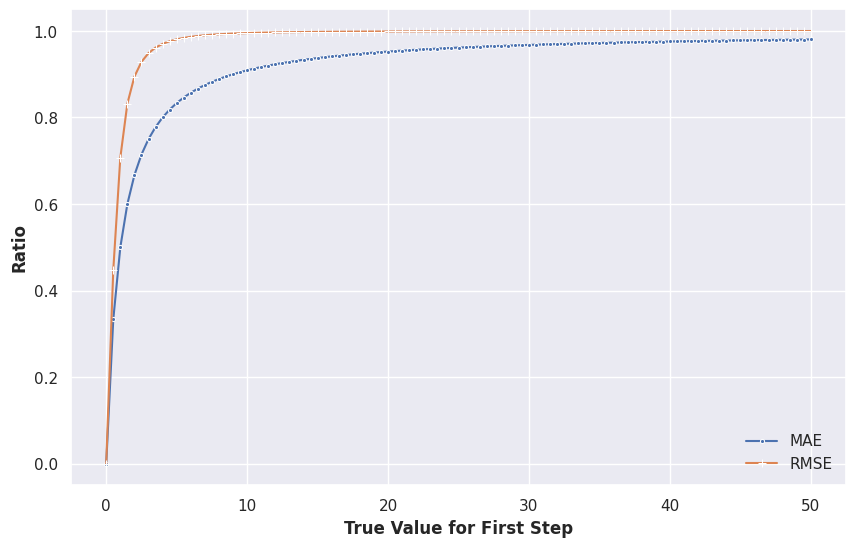
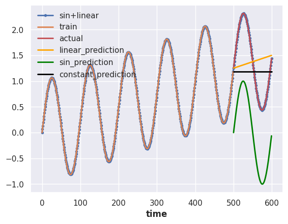
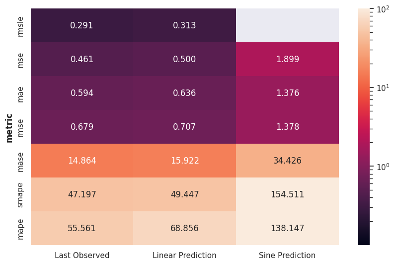

# Time Series Forecasting Metrics

Measuring the goodness of a forecaster is nontrivial. Tons of metrics are devised to measure forecasting results, applying the wrong metric may lead to "consequences" in decisions.

In the following discussion, we assume the forecast at time $t$ to be $\hat y(t)$ and the actual value is $y(t)$. The forecast horizon is defined as $H$. In general, we look for a function

$$
L\left(\{y(t_1), \cdots, y(t_H)\}, \{\hat y(t_1), \cdots, \hat y(t_H)\}; \{C(t)\}, \{y(t)\} \right),
$$

where $\{C(t)\}$ are the covariates and $\{y(t)\}$ represents the past target variables.


!!! info "Distance between Truths and Forecasts"

    Naive choices of such metrics are distances between the truth vector $\{y(t_1), \cdots, y(t_H)\}$ and the forecast vector $\{\hat y(t_1), \cdots, \hat y(t_H)\}$.

    For example, we can use norms of the deviation vector $\{y(t_1) - \hat y(t_1), \cdots, y(t_H) - \hat y(t_H)\}$.

    In Hyndman & Koehler (2006), $y(t_i) - \hat y(t_i)$ is defined as the **forecast error** $e_i\equiv y(t_i) - \hat y(t_i)$[@Hyndman2006-ld]. While it is a bit confusing, the term **forecast error** is used in many kinds of literature.

    The authors also defined the **relative error** $r_i = e_i/e^*_i$ with $e^*_i$ being the reference forecast error from the baseline.


In this section, we explore some frequently used metrics. Hyndman & Koehler (2006) discussed four different types of metrics[@Hyndman2006-ld]

1. scaled-dependent measures, e.g., errors based on $\{y(t_1) - \hat y(t_1), \cdots, y(t_H) - \hat y(t_H)\}$,
2. percentage errors, e.g., errors based on $\{\frac{y(t_1) - \hat y(t_1)}{y(t_1)}, \cdots, \frac{y(t_H) - \hat y(t_H)}{y(t_H)}\}$,
3. relative errors, e.g., errors based on $\{\frac{y(t_1) - \hat y(t_1)}{y(t_1) - \hat y^*(t_1)}, \cdots, \frac{y(t_H) - \hat y(t_H)}{y(t_H) - \hat y^*(t_H)}\}$, where $\hat y^*(t_i)$ is a baseline forecast at time $t_i$,
4. relative metrics, e.g., the ratio of the MAE for the experiment and the baseline, $\operatorname{MAE}/\operatorname{MAE}_{\text{baseline}}$,
5. in-sample scaled errors, e.g., MASE.

Apart from the above categories, there are some other properties of metrics. Some metrics are bounded while others are not. Also, some metrics specifically require probabilistic forecasts. In the following table, we list some of the useful metrics.

| Metric         | Probabilistic      | Theoretical Range | Notes                                      |
| -------------- | ------------------ | ----------------- | ------------------------------------------ |
| MAE            |                    | $[0,\infty)$      |                                            |
| MSE            |                    | $[0,\infty)$      |                                            |
| RMSE           |                    | $[0,\infty)$      |                                            |
| MASE           |                    | $[0,\infty)$      | Scaled in practice; requires insample data |
| RMSLE          |                    | $[0,\infty)$      |                                            |
| MAPE           |                    | $[0,\infty]$      |                                            |
| sMAPE          |                    | $[0, 2]$          | For values of the same sign                |
| wMAPE          |                    | -                 | Depends on what weights are used           |
| Quantile Score | :white_check_mark: | $[0,\infty)$      |                                            |
| [CRPS](timeseries-metrics.forecasting.crps.md)           | :white_check_mark: | $[0,\infty)$      |                                            |


!!! info "Recommended Reading"

    [Hyndman & Athanasopoulos (2021)](https://otexts.com/fpp3/accuracy.html) is a good reference for forecast errors [^Hyndman2021].

    To find implementations of metrics, [Darts](https://unit8co.github.io/darts/generated_api/darts.metrics.metrics.html#) and [GluonTS](https://ts.gluon.ai/stable/api/gluonts/gluonts.evaluation.metrics.html) both have a handful of metrics implemented.


## List of Metrics


??? note "Code to Reproduce the Results"

    ```python
    # %%
    from loguru import logger
    import datetime
    import numpy as np
    from itertools import product

    from matplotlib.ticker import FormatStrFormatter
    import pandas as pd

    import matplotlib.pyplot as plt
    import seaborn as sns

    sns.set()

    from darts.utils.timeseries_generation import (
        sine_timeseries,
        linear_timeseries,
        constant_timeseries,
    )

    from darts.metrics.metrics import (
        mae,
        mape,
        marre,
        mse,
        ope,
        rho_risk,
        rmse,
        rmsle,
        smape,
        mase
    )

    # %%
    length = 600
    start = 0
    ts_sin = sine_timeseries(length=length, value_frequency=0.01, start=0)
    ts_lin = linear_timeseries(
        length=length, start_value=0, end_value=1.5, start=0
    )

    ts = (ts_sin + ts_lin).with_columns_renamed("sine", "sin+linear")

    split_at = 500
    ts_train, ts_test = ts.split_before(split_at)
    ts_train = ts_train.with_columns_renamed("sin+linear", "train")
    ts_test = ts_test.with_columns_renamed("sin+linear", "actual")


    _, ts_pred_lin = ts_lin.split_before(split_at)
    ts_pred_lin = ts_pred_lin.with_columns_renamed("linear", "linear_prediction")


    _, ts_pred_sin = ts_sin.split_before(split_at)
    ts_pred_sin = ts_pred_sin.with_columns_renamed("sine", "sin_prediction")

    ts_pred_const = constant_timeseries(
        value=ts_train.last_value(),
        start=ts_test.start_time(),
        end=ts_test.end_time()
    )
    ts_pred_const = ts_pred_const.with_columns_renamed("constant", "constant_prediction")


    # %%
    ts.plot(marker=".")
    # ts_lin.plot(linestyle="dashed")
    # ts_sin.plot(linestyle="dashed")

    ts_train.plot()
    ts_test.plot(color="r")

    ts_pred_lin.plot(color="orange")
    ts_pred_sin.plot(color="green")
    ts_pred_const.plot(color="black")

    # %%
    class MetricBench:
        def __init__(self, metric_fn, metric_name=None):
            self.metric_fn = metric_fn
            if metric_name is None:
                metric_name = self.metric_fn.__name__
            self.metric_name = metric_name

        def _heatmap_data(self, actual_range=None, pred_range=None):
            if actual_range is None:
                actual_range = np.linspace(-1,1, 21)
            if pred_range is None:
                pred_range = np.linspace(-1,1, 21)
            hm_data = []
            for y, y_hat in product(actual_range, pred_range):
                ts_y = constant_timeseries(value=y, length=1)
                ts_y_hat = constant_timeseries(value=y_hat, length=1)
                try:
                    hm_data.append(
                        {
                            "y": y,
                            "y_hat": y_hat,
                            "metric": f"{self.metric_name}",
                            "value": self.metric_fn(ts_y, ts_y_hat)
                        }
                    )
                except Exception as e:
                    logger.warning(f"Skipping due to {e}")

            df_hm_data = pd.DataFrame(hm_data)

            return df_hm_data

        def heatmap(self, ax=None, cmap="viridis_r", actual_range=None, pred_range=None):
            if ax is None:
                fig, ax = plt.subplots(figsize=(12, 10))

            df_hm_data = self._heatmap_data(actual_range=actual_range, pred_range=pred_range)

            sns.heatmap(
                df_hm_data.pivot("y_hat", "y", "value"),
                fmt=".2g",
                cmap=cmap,
                ax=ax,
            )

            ax.set_xticklabels(
                [self._heatmap_fmt(label.get_text())
                for label in ax.get_xticklabels()]
            )
            ax.set_yticklabels(
                [self._heatmap_fmt(label.get_text())
                for label in ax.get_yticklabels()]
            )
            ax.set_title(f"Metric: {self.metric_name}")

            return ax

        @staticmethod
        def _heatmap_fmt(s):
            try:
                n = "{:.2f}".format(float(s))
            except:
                n = ""
            return n

        def _ratio_data(self, pred_range=None):
            if pred_range is None:
                pred_range = np.linspace(-1, 3, 41)
            ratio_data = []
            y = 1
            for y_hat in pred_range:
                ts_y = constant_timeseries(value=y, length=1)
                ts_y_hat = constant_timeseries(value=y_hat, length=1)
                try:
                    ratio_data.append(
                        {
                            "y": y,
                            "y_hat": y_hat,
                            "metric": f"{self.metric_name}",
                            "value": self.metric_fn(ts_y, ts_y_hat)
                        }
                    )
                except Exception as e:
                    logger.warning(f"Skipping due to {e}")

            df_ratio_data = pd.DataFrame(ratio_data)

            return df_ratio_data

        def ratio_plot(self, ax=None, color="k", pred_range=None):

            if ax is None:
                fig, ax = plt.subplots(figsize=(12, 10))

            df_ratio_data = self._ratio_data(pred_range=pred_range)

            sns.lineplot(df_ratio_data, x="y_hat", y="value", ax=ax)

            ax.set_title(f"Metric {self.metric_name} (y=1)")

            return ax


    # %% [markdown]
    # ## Norms (MAE, MSE)

    # %%
    mse_bench = MetricBench(metric_fn=mse)
    mse_bench.heatmap()

    # %%
    mse_bench.ratio_plot()

    # %%
    mae_bench = MetricBench(metric_fn=mae)
    mae_bench.heatmap()


    # %%
    mae_bench.ratio_plot()

    # %%
    rmsle_bench = MetricBench(metric_fn=rmsle)
    rmsle_bench.heatmap()

    # %%
    rmsle_bench.ratio_plot()

    # %%
    rmse_bench = MetricBench(metric_fn=rmse)
    rmse_bench.heatmap()

    # %%
    rmse_bench.ratio_plot()

    # %%
    y_pos = np.linspace(0.1, 1, 20)

    mape_bench = MetricBench(metric_fn=mape)
    mape_bench.heatmap(actual_range=y_pos)

    # %%
    mape_bench.ratio_plot()

    # %%
    smape_bench = MetricBench(metric_fn=smape)
    smape_bench.heatmap(actual_range=y_pos, pred_range=y_pos)

    # %%
    smape_bench.ratio_plot(pred_range=y_pos)

    # %% [markdown]
    # ## Naive MultiHorizon Forecasts

    # %%
    two_args_metrics = [
        mse, mae, rmse, rmsle, mape, smape
    ]

    insample_metrics = [mase]


    metrics_tests = []

    for m in two_args_metrics:
        metrics_tests.append(
            {
                "metric": m.__name__,
                "value_lin_pred": m(ts_test, ts_pred_lin),
                "value_sin_pred": m(ts_test, ts_pred_sin),
                "value_const_pred": m(ts_test, ts_pred_const)
            }
        )

    for m in insample_metrics:
        metrics_tests.append(
            {
                "metric": m.__name__,
                "value_lin_pred": m(ts_test, ts_pred_lin, insample=ts_train),
                "value_sin_pred": m(ts_test, ts_pred_sin, insample=ts_train),
                "value_const_pred": m(ts_test, ts_pred_const, insample=ts_train)
            }
        )

    df_metrics_tests = (
        pd.DataFrame(metrics_tests)
        .round(3)
        .set_index("metric")
        .sort_values(by="value_const_pred")
        .sort_values(by="mape", axis=1)
    )

    df_metrics_tests.rename(
        columns={
            "value_lin_pred": "Linear Prediction",
            "value_sin_pred": "Sine Prediction",
            "value_const_pred": "Last Observed"
        },
        inplace=True
    )

    df_metrics_tests

    # %%
    from matplotlib.colors import LogNorm

    # %%
    metrics_tests_min_value = df_metrics_tests.min().values.min()
    metrics_tests_max_value = np.ma.masked_invalid(df_metrics_tests.max()).max()
    metrics_tests_min_value, metrics_tests_max_value

    # %%
    fig, ax = plt.subplots(figsize=(10, 6.18))

    sns.heatmap(
        df_metrics_tests,
        norm=LogNorm(
            vmin=0.1,
            vmax=100
        ),
        cbar_kws={"ticks":[0,1,10,1e2]},
        vmin = 0.1, vmax=100,
        annot=True,
        fmt="0.3f",
        ax=ax,
    )
    ```

### 1-Norm: MAE

The Mean Absolute Error (MAE) is

$$
\operatorname{MAE}(y, \hat y) = \frac{1}{H}\sum_{t=1}^{t=H}\lvert y(t) - \hat y(t)\rvert.
$$

We can check some special and extreme cases:

- All forecasts are zeros: $\hat y(t)=0$, the value of $\operatorname{MAE}(y, \hat y)$ is determined by the true value $y$.

    !!! note "The Interpretation of MAE is Scale Dependent"

        This also tells us that MAE depends on the scale of the true values: MAE value of $100$ for larger true values such as true value $y=1000$ with forecast $\hat y=900$ doesn't seem to be bad, but MAE value for smaller true values such as true value $y=100$ with forecast $\hat y=0$ seems to be quite off. Of course, the actual perception depends on the problem we are solving.

        This brings in a lot of trouble when we are dealing with forecasts on different scales, such as sales forecasts for all kinds of items on an e-commerce platform. Different types of items, e.g., expensive watches vs cheat T-shirts, have very different sales. In fact, in a paper from Amazon, the sales on Amazon are even scale-free[@Salinas2017-hg].

- All forecasts are infinite: $\hat y=\infty$, the MAE value will also be $\infty$. This means MAE is not bounded.

=== ":material-test-tube: Forecasts and Actuals"

    

=== ":material-test-tube: Forecasts and Fixed Actuals"

    


### 2-Norm: MSE

The Mean Square Error (MSE) is

$$
\operatorname{MSE}(y, \hat y) = \frac{1}{H}\sum_{t=1}^{t=H}(y(t) - \hat y(t))^2.
$$

Similar to MAE, the interpretation of MSE is also scale dependent and the value is unbounded. However, due to the ${}^2$, MSE can be really large or small. Obtaining insights from MSE is even harder than MAE in most situations unless MSE matches a meaningful quantity in the dynamical system we are forecasting. Nevertheless, we can know that large deviations ($\lvert y(t) - \hat y(t)\rvert \gg 1$) dominates the metric even more than MAE.

=== ":material-test-tube: Forecasts and Actuals"

    

=== ":material-test-tube: Forecasts and Fixed Actuals"

    


??? note "Other Norms"

    Other norms are not usually seen in literature but might provide insights into forecasts.

    === "Maximum norm"

        The Max Norm error of a forecast can be defined as[^max-norm-wiki]

        $$\operatorname{MAE}(y, \hat y) = \operatorname{max}\left( \{y(t) - \hat y(t)\}\right).$$


### RMSE

The Root Mean Square Error (RMSE) is

$$
\operatorname{RMSE}(y, \hat y) = \sqrt{\operatorname{MSE}(y, \hat y)} = \sqrt{\frac{1}{H}\sum_{t=1}^{t=H}(y(t) - \hat y(t))^2}.
$$

RMSE essentially brings the scale of the metric from the MSE scale back to something similar to MAE. However, we have to be mindful that large deviations dominate the metric more than that in MAE.

!!! example "Domination by Large Deviations"

    For example, in a horizon 2 forecasting problem, suppose we have the true values $[100, 1]$ and we forecast $[0, 0]$

    $$
    \operatorname{RMSE} = \sqrt{ \frac{1}{2}\left((100-0)^2 + (1-0)^2 \right)} \sim 70.71
    $$

    If we assume the second step is forecasted perfectly, i.e., forecasts $[0, 1]$, we have almost the same RMSE

    $$
    \sqrt{ \frac{1}{2}(100-0)^2 + (1-1)^2} \sim 70.71
    $$

    For MAE, assuming forecasts $[0,0]$, we get

    $$
    \operatorname{MAE} = \frac{1}{2} \left( \lvert 1 - 0 \rvert + \lvert 100 - 0 \rvert \right) = 50.5.
    $$

    If we assume the forecast $[0,1]$, we get something slightly different

    $$
    \frac{1}{2} \lvert 100 - 0 \rvert  = 50.
    $$

    To see the difference between RMSE and MAE visually,
    we compute the following quantities

    $$
    MAE(y=[x, 1], \hat y=[0, 1]) / MAE(y=[x, 1], \hat y=[0, 0])
    $$

    as well as

    $$
    RMSE(y=[x, 1], \hat y=[0, 1]) / RMSE(y=[x, 1], \hat y=[0, 0]).
    $$

    Using these ratios, we investigate the contributions from the large deviations for MAE and RMSE.

    === ":material-chart-line: MAE vs RMSE"

        

    === ":material-code-json: Code for Chart"

        ```python
        import numpy as np
        from darts.metrics.metrics import mae, rmse
        from darts import TimeSeries

        metric_contrib_x = np.linspace(0, 50, 101)

        mae_contrib_ratio = []
        for i in metric_contrib_x:
            mae_contrib_ratio.append(
                mae(
                    TimeSeries.from_values(np.array([i,1,])),
                    TimeSeries.from_values(np.array([0,1,])),
                )/mae(
                    TimeSeries.from_values(np.array([i,1,])),
                    TimeSeries.from_values(np.array([0,0,])),
                )
            )

        rmse_contrib_ratio = []
        for i in metric_contrib_x:
            rmse_contrib_ratio.append(
                rmse(
                    TimeSeries.from_values(np.array([ i, 1,])),
                    TimeSeries.from_values(np.array([0, 1,])),
                )/rmse(
                    TimeSeries.from_values(np.array([i, 1,])),
                    TimeSeries.from_values(np.array([0,0])),
                )
            )
        ```

    The above chart shows that RMSE is more dominated by large deviations.

### MASE

The Mean Absolute Scaled Error (MASE) is the MAE scaled by the one-step ahead naive forecast error on the training data ($\{y(t_i)\}$, with $i\in {1, \cdots, T}$)[^mase-wiki]

$$
\operatorname{MASE}(y(t), \hat y(t)) = \frac{\operatorname{MAE}(y(t), \hat y(t))}{ \frac{1}{H-1} \sum_{i=1}^H \lvert y(t_i) - y(t_{i-1})\rvert }.
$$

Due to the scaling by the one-step ahead naive forecast, MASE is easier to interpret. If MASE is large, the deviation in our forecasts is comparable to the rough scale of the time series. Naively, we expect a good MASE to be smaller than 1.


### RMSLE

The Root Mean Squared Log Error (RMSLE) is

$$
\begin{align}
&\operatorname{RMSLE(y(t), \hat y(t))} \\
= &\operatorname{MSE\left( \ln(y(t) + 1), \ln(\hat y(t) + 1) \right)} \\
= &\sqrt{ \frac{1}{H} \sum_{i=1}^T \left( \ln (y(t) + 1) - \ln (\hat y(t) +1 ) \right)^2 }.
\end{align}
$$

=== ":material-test-tube: Forecasts and Actuals"

    

=== ":material-test-tube: Forecasts and Fixed Actuals"

    


### MAPE

The Mean Absolute Percent Error (MAPE) is a bounded metric defined as

$$
\operatorname{MAPE(y(t), \hat y(t))} = \frac{1}{H} \sum_{i=1}^H \left\lvert \frac{y(t_i) - \hat y(t_i)}{y(t_i)} \right\rvert.
$$

=== ":material-test-tube: Forecasts and Actuals"

    

=== ":material-test-tube: Forecasts and Fixed Actuals"

    


### sMAPE

The [symmetric Mean Absolute Percent Error (sMAPE)](https://en.wikipedia.org/wiki/Symmetric_mean_absolute_percentage_error) is a symmetrized version of MAPE

$$
\operatorname{sMAPE}(y(t), \hat y(t)) = \frac{1}{H} \sum_{i=1}^H \frac{\lvert y(t_i) - \hat y(t_i) \rvert}{ \lvert y(t_i) + \hat y(t_i) \rvert/2 }.
$$

=== ":material-test-tube: Forecasts and Actuals"

    

=== ":material-test-tube: Forecasts and Fixed Actuals"

    

!!! info "sMAPE is Bounded but Hard to Get a Feeling"

    Even though sMAPE is bounded and it solves the blow-up problem in MAPE, it is dangerous to use sMAPE alone. For example, given true values $[1]$, forecasting $[10]$ gives us sMAPE value $1.636$; Forecasting $[100]$ gives us sMAPE value $1.960$; Forecasting $[1000]$ gives us sMAPE value $1.996$. The later are not too different judging by the sMAPE values.

    That being said, as the sMAPE value gets a bit larger, it is hard to get stable intuitions on how bad the forecast is.

### wMAPE

The [weighted Mean Absolute Percent Error (wMAPE)](https://en.wikipedia.org/wiki/Mean_absolute_percentage_error) is

$$
\operatorname{wMAPE}(y(t), \hat y(t)) = \frac{\sum_{i=1}^H w_i \lvert y(t_i) - \hat y(t_i) \rvert }{\sum_{i=1}^H w_i}.
$$


### Quantile Loss

The Quantile loss is defined as [@Gneiting2011-rr][@Koenker1978-lf][@De_Vargas_Staudacher2022-en]

$$
\operatorname{QL}(y(t), \hat y(t)) = \sum_{t=1}^H \sum_{q}\left(
    q (y(t) - \hat y(t))_+ + (1-q) (\hat y(t) - y(t))_+
\right),
$$

where ${}_{+}$ indicates that we only take positive values.


!!! note "Quantile Loss has many names"

    The quantile loss is also called quantile score, pinball loss, quantile risk or $\rho$-risk.

### Other Metrics

We do not have a full collection of all metrics available. But we also explain some more complicated metrics, e.g., [CRPS](timeseries-metrics.forecasting.crps.md), as individual sections.

## Metrics Applied on a Toy Problem

To feel the difference between each metric, we assume a simple forecasting problem with some artificial time series data.

We construct the artificial data by summing a sine series and a linear series.



We have prepared three naive forecasts,

1. forecasting constant values using the last observation,
2. forecasting the sin component of the actual data,
3. forecasting the linear component of the actual data.

We calculated the metrics for the three different scenarios.




[^Hyndman2021]: Hyndman, R.J., & Athanasopoulos, G. (2021) Forecasting: principles and practice, 3rd edition, OTexts: Melbourne, Australia. OTexts.com/fpp3. Accessed on 2022-11-27.
[^max-norm-wiki]: Contributors to Wikimedia projects. Uniform norm. In: Wikipedia [Internet]. 23 Oct 2022 [cited 5 Mar 2023]. Available: https://en.wikipedia.org/wiki/Uniform_norm
[^mase-wiki]: Contributors to Wikimedia projects. Mean absolute scaled error. In: Wikipedia [Internet]. 11 Jan 2023 [cited 5 Mar 2023]. Available: https://en.wikipedia.org/wiki/Mean_absolute_scaled_error
