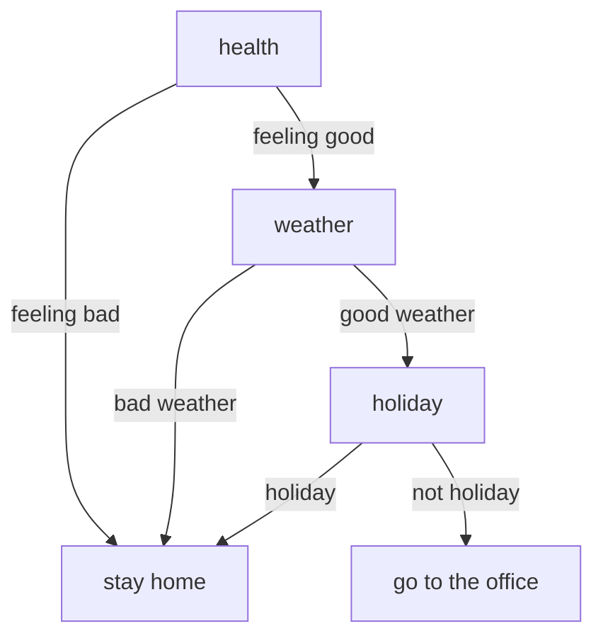
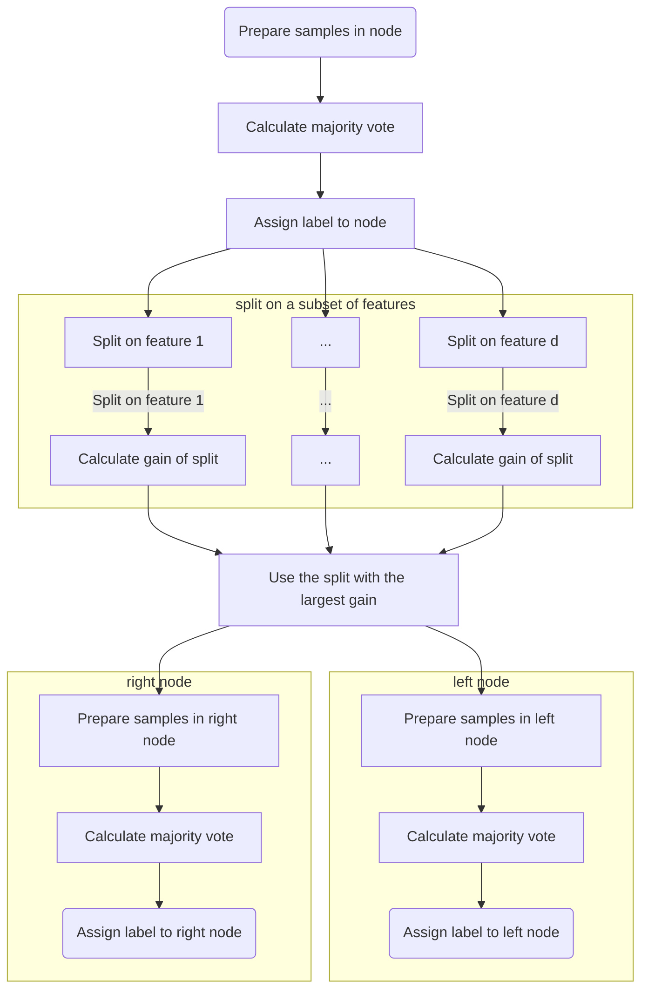

# Tree-Based Models

Trees are still powerful machine-learning models for time series forecasting. We explain the basic ideas of trees in the following sections.

## Should I Work from Home?

!!! info ""
    We prepared a notebook for this section [here :material-language-python:](../../notebooks/tree_basics).

To illustrate the idea of trees, we use a simple classification task: Deciding whether a person will go to the office or work from home based on an artificial dataset.

### Definition of the problem

We will decide whether one should go to work today. In this demo project, we consider the following features.

| feature | possible values |
|:----:|:---:|
| health | 0: feeling bad, 1: feeling good |
| weather | 0: bad weather, 1: good weather |
| holiday | 1: holiday, 0: not holiday |

Our prediction will be a binary result, 0 or 1, with 0 indicates staying at home and 1 indicates going to work.

!!! info "Notations"

    For more compactness, we can use the abstract notation $\{0,1\}^3$ to describe a set of three features each with 0 and 1 as possible values. In general, the notation $\{0,1\}^d$ indicates $d$ binary features.

    Meanwhile, the prediction can be denoted as $\{0,1\}^1$.

### How to Describe a Decision Tree

In theory, we would expect a decision tree of the following.

!!! note ""
    It is straightforward to prove that the max required depths and max required leaves of a model that maps $\{0,1\}^d$ to $\{0,1\}^1$ are $d+1$ and $2^d$. In our simple example, some of the branches are truncated based on our understanding of the problem. In principle, the branch "feeling bad" could also go on to the next level.

### Data

However, we are not always lucky enough to be able to forge trees using experience and common sense. It is more common to build the tree using data.

??? note "Artificial Dataset"

    To fit a model, we generated some artificial data using
    [this notebook](../../notebooks/tree_basics/#decision-tree-on-perfect-data).

    When generating the data, we follow the rule that one only goes to the office, if and only if

    - the person is healthy,
    - the weather is good, and
    - today is not a holiday.

The following table shows a small sample of the dataset.

|    |   health |   weather |   holiday |   go_to_office |
|---:|---------:|----------:|----------:|---------------:|
|  0 |        0 |         0 |         1 |              0 |
|  1 |        1 |         1 |         1 |              0 |
|  2 |        1 |         0 |         1 |              0 |
|  3 |        0 |         0 |         0 |              0 |
|  4 |        1 |         0 |         1 |              0 |

### Build a Tree

We use sklearn to build a decision tree, see [:material-language-python: code here](../../notebooks/tree_basics/#decision-tree-on-perfect-data). We observed that the decision tree we get from the data is exactly what we expected.

??? note "Reading the Decision Tree Chart"

    On each node of the tree, we read useful information.

    In the **root**, aka the first node on the top, the feature name and value range are denoted on the first row, i.e., **weather<= 0.5**, which means that we are making decisions based on whether the value of the weather feature is less or equal to 0.5. If the value is less or equal to 0.5, we go to the left branch, otherwise, we go to the right branch. The following rows in the node are assuming the condition is satisfied.

    On the second row, we read the [**Gini** impurity value](../../concepts/gini-impurity). Gini impurity is a measure of the impurity of the data under the condition.

    On the third row, the number of samples of the given condition (weather <= 0.5) is also given.

    Finally, we read the values of the samples. In this example, value = [93, 7], i.e., 93 of the samples have a target value 0, and 7 of the samples have a target value 1.

This is a perfect result as it is the same as our theoretical expectations. This is because we have built our dataset using the rules. Surely we will get a perfect tree.

In reality, our dataset is probabilistic or comes with noise. To see how the noise affects our decision tree, we can build a tree using a perturbed dataset. Here is an example.

A decision tree trained with a fake "impure dataset" with noise that doesn't always fit into our theoretical model. For example, on the **leaves**, aka, **the bottom level**, we see some with both going to the office and not going to the office, which corresponds to nonzero [Gini impurity value](../../concepts/gini-impurity). Though we take the majority target value when doing the predictions, we can already imagine that some of the data points will be misclassified.

### How was the Model Built?

Many different algorithms can build a decision tree from a given dataset. The Iterative Dichotomizer 3 algorithm, aka ID3 algorithm, is one of the famous implementations of the decision tree[@shalev-shwartz_ben-david_2014]. The following is the "flowchart" of the algorithm[@shalev-shwartz_ben-david_2014].

To "calculate the gain of the split", here we use [Gini impurity](../../concepts/gini-impurity). There are other "gains" such as [information gain](../../concepts/information-gain). For regression tasks, we can also have gains such as a MSE loss.

## Overfitting

Fully grown trees will most likely to overfit the data since they always try to grow pure leaves. Besides, fully grown trees grow exponentially as the number of features grows which requires a lot of computation resources.

!!! warning ""
    Applying Occam's razor, we prefer smaller trees as long as the trees can explain the data well.

To achieve this, we will either have to limit how the trees grow during training or prune the trees after the trees are built. Pruning of a tree is achieved by replacing subtrees at a node with a leaf if certain conditions are based on cost estimations.
