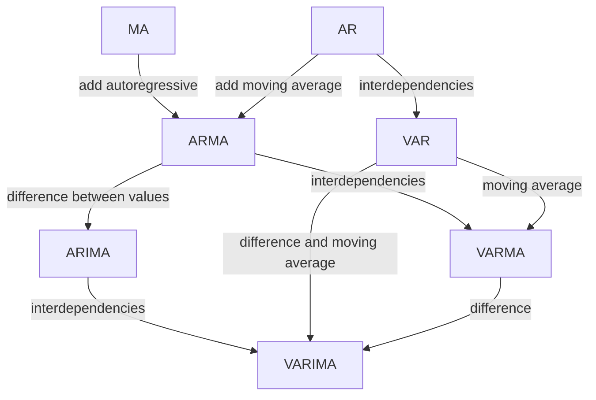

# Statistical Models of Time Series

Though statistical models are not our focus, it is always beneficial to understand how those famous statistical models work. To best understand how the models work, we will build some data generating process using these models and explore their behavior.

In the following paragraphs, we list some of the most applied statistical models. For a comprehensive review of statistical models, please refer to Petropoulos et al., 2022 and Hyndman et al., 2021[^Petropoulos2022][^Hyndman2021].

## ARIMA

ARIMA is one of the most famous forecasting models[^Cerqueira2019]. We will not discuss the details of the model. However, for reference, we sketch the relations between the different components of the ARIMA model in the following chart.

## Exponential Smoothing

!!! note "A Naive Forecast"

    In time series forecasting, one of the naive forecasts we can use it the previous observation, i.e.,

    $$
    \hat s(t+1) = s(t),
    $$

    where we use $\hat s$ to denote the forecasts and $s$ for the observations.

 A naive version of the exponential smoothing model is the Simple Exponential Smoothing (SES)[^Petropoulos2022][^Hyndman2021]. The SES is an average of the most recent observation and the previous forecasts.

$$
\hat s(t+1) = \alpha s(t) + (1-\alpha) \hat s(t),
$$

where $\hat s$ is the forecast and $s$ is the observation. Expanding this form, we observe the exponential decaying effect of history in the long past[^Hyndman2021].

## State Space Models

State space models (SSM) are amazing models due to their simplicity. SSM applies Markov chains but is not limited to the Markovian assumptions[^Bishop2006].

[^Cerqueira2019]: Cerqueira V, Torgo L, Soares C. Machine Learning vs Statistical Methods for Time Series Forecasting: Size Matters. arXiv [stat.ML]. 2019. Available: http://arxiv.org/abs/1909.13316
[^wu2020]: Wu Z, Pan S, Long G, Jiang J, Chang X, Zhang C. Connecting the Dots: Multivariate Time Series Forecasting with Graph Neural Networks. arXiv [cs.LG]. 2020. Available: http://arxiv.org/abs/2005.11650
[^Petropoulos2022]: Petropoulos F, Apiletti D, Assimakopoulos V, Babai MZ, Barrow DK, Ben Taieb S, et al. Forecasting: theory and practice. Int J Forecast. 2022;38: 705–871. doi:10.1016/j.ijforecast.2021.11.001
[^Hyndman2021]: Hyndman, R.J., & Athanasopoulos, G. (2021) Forecasting: principles and practice, 3rd edition, OTexts: Melbourne, Australia. OTexts.com/fpp3. Accessed on 2022-11-27.
[^Bishop2006]: Bishop CM. Pattern Recognition and Machine Learning. Springer; 2006. Available: https://play.google.com/store/books/details?id=qWPwnQEACAAJ
