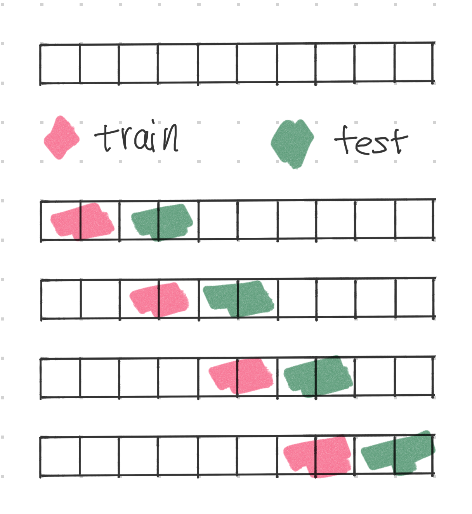
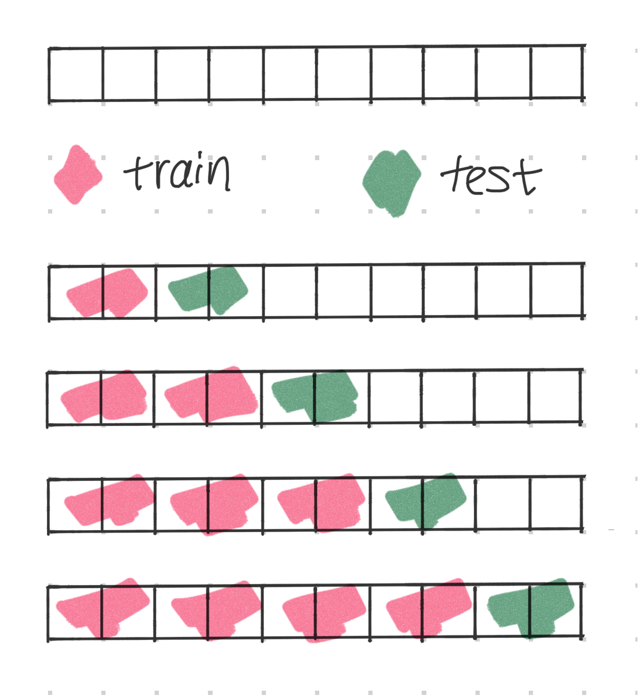
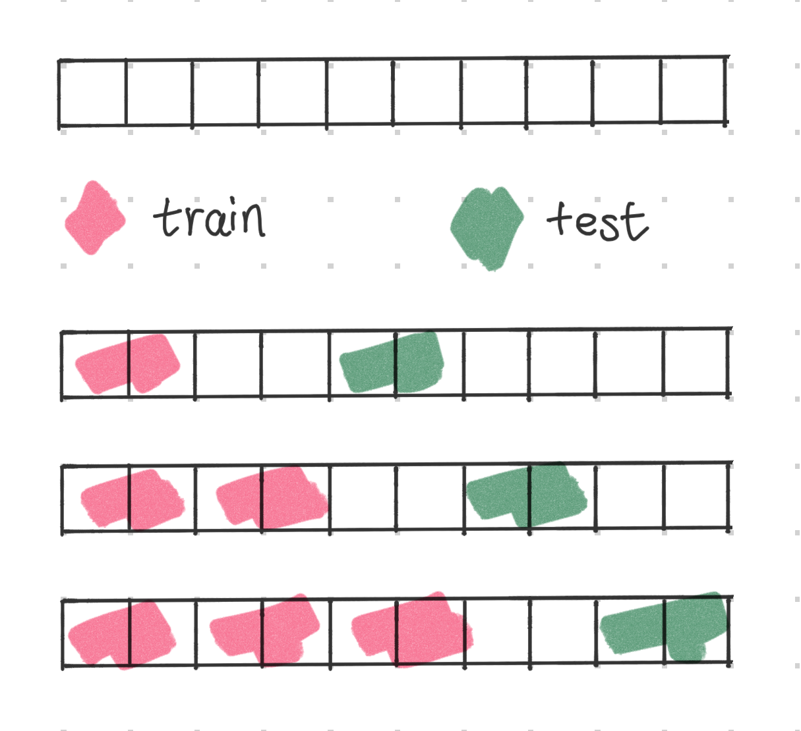
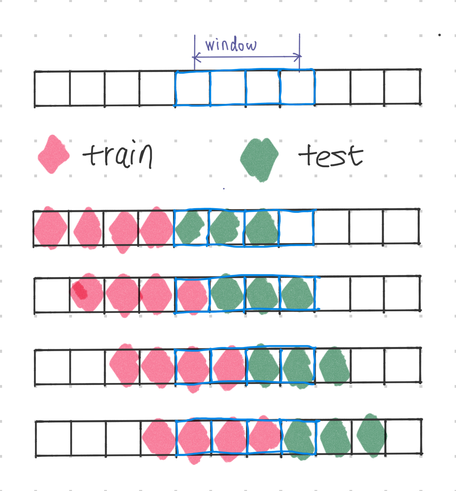
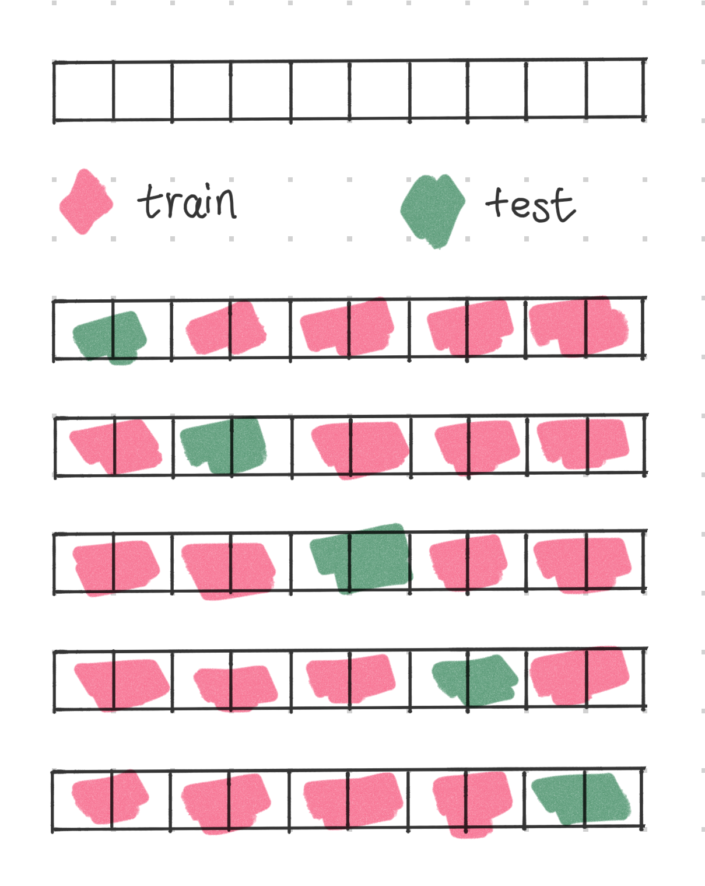
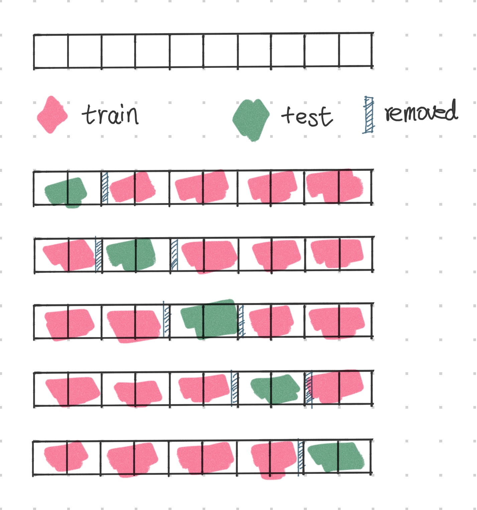

# Time Series Forecasting Evaluation

Evaluating time series forecasting models is very important yet sometimes difficult. For example, it is very easy to bring in information leakage when evaluating time series forecasting models. In this section, we will discuss some of the common pitfalls and best practices when evaluating time series forecasting models.

## Train Test Split for Time Series Data

Evaluating time series models is usually different from most other machine learning tasks as we usually don't have strictly i.i.d. data. On the other hand, the time dimension in our time series data is a natural dimension to split the data into train and test sets. In this section, we will discuss the different ways to split the data into train and test sets.

### Backtesting

We choose the specific time step to split the data, assuming the series used to train the model is $Y_t$ with length $T_t$, and the series used to evaluate the model is $Y_e$ with length $T_e$.

!!! info "Slicing the Training Data $Y_t$ for Training"

    In many deep learning models, the input length and output length are fixed. To train the model using time series data, we usually apply the [time delayed embedding](../time-delayed-embedding) method to prepare the train data $Y_t$. Refer to [our deep learning forecasting examples](../../supplementary) for more details.

Keeping the length of the train and test unchanged, we can move forward in time, where we require the split time point to fall inside the window[@Cerqueira2019-vt]. In this way, we create multiple train test splits and perform multiple evaluations, or backtesting, on the model. The following illustration shows an example of this technique. The uppermost panel shows the original series, with each block indicating a time step.

??? note "Expanding the Length of the Training Set"

    Keeping the train set length equal when sliding through time is to simulate the use case where we always take a fixed length of historical data to train the model. For example, some dataset has gradual data shift, and using fixed length historical data can help relieviate data shift problems.

    In some other use cases, we would take in as much data as possible. In this case, we could also expand the train set when silidng the window.

    

In some use cases, we do not get to know the most recent data when we are performing inference. For example, if we are forecasting the demand for the next week, we might not know the demand for the last week as the data might be ready. In this case, we can also use a gap between the train and test sets to simulate this situation.

#### Using Multiple Time Windows

When we move the split time point forward in time, we could constrain the split to fall inside a specific time window. In the following, we have assumed the sliding window size to be 4, where we move forward one time step for each test set.

For some large time series forecasting datasets, we might be interested in the performance of some specific types of periods. For example, if Amazon is evaluating its demand forecasting model, it may be more interested in the performance of the model during some normal days as well as the holiday seasons. In this case, we can use multiple sliding windows to evaluate the model.

### Cross-validation

!!! warning "Not a Common Practice"

    This is not a common practice in time series forecasting problems but it is still worth mentioning here.

If our dataset is i.i.d. through time and we do not have information leakage if we randomly take a subsequence of the data, we could also use the cross-validation technique to evaluate the model. The following illustration shows an example of this technique. The uppermost panel shows the original series, with each block indicating a time step.

Similar to the gap technique in backtesting, we can also use a gap between the train and test sets.

