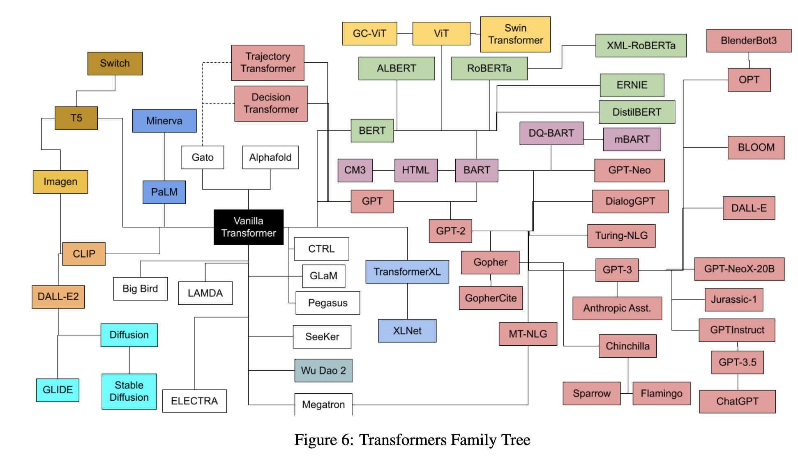
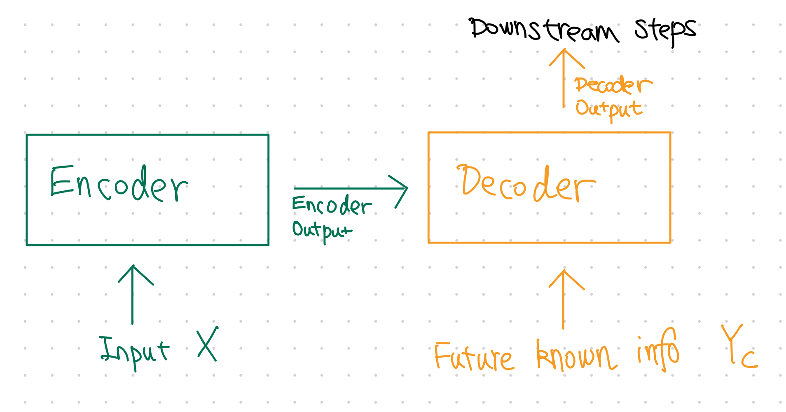

# Vanilla Transformers

In the seminal paper *Attention is All You Need*, the legendary transformer architecture was born[@Vaswani2017-yg].

!!! quote "Quote from *Attention Is All You Need*"
    "... the Transformer, a model architecture eschewing recurrence and instead relying entirely on an attention mechanism to draw global dependencies between input and output."

Transformer has evolved a lot in the past few years and there are a galaxy of variants[@Amatriain2023-of].

In this section, we will focus on the vanilla transformer. Jay Alammar wrote an excellent post, named [The Illustrated Transformer](http://jalammar.github.io/illustrated-transformer/)[^illustrated_transformer]. We recommend the reader read the post. We won't cover everything in this section. However, for completeness, we will summarize some of the key ideas of transformers.

!!! info "Formal Algorithms"

    For a formal description of the transformer-relevant algorithms, please refer to Phuong & Hutter (2022)[@Phuong2022-im].

## The Vanilla Transformer

In the **vanilla transformer**, we can find three key components: Encoder-Decoder, the attention mechanism, and the positional encoding.

### Encoder-Decoder

It has an encoder-decoder architecture.

We assume that the input $\mathbf X$ is already embedded and converted to tensors.

The encoder-decoder is simulating the induction-deduction framework of learning. Input $\mathbf X$ is first encoded into a representation $\hat{\mathbf X}$ that should be able to capture the minimal sufficient statistics of the input. Then, the decoder takes this representation of minimal sufficient statistics $\hat{\mathbf X}$ and perform deduction to create the output $\hat{\mathbf Y}$.

### Attention

The key to a transformer is its attention mechanism. It utilizes the attention mechanism to look into the relations of the embeddings[@Vaswani2017-yg][@zhang2021dive]. To understand the attention mechanism, we need to understand the **query**, **key**, and **value**. In essence, the attention mechanism is a classifier that outputs the usefulness of the elements in the **value**, and the usefulness is represented using a matrix formed by the **query** and the **key**.

$$
\operatorname{Attention}(\mathbf Q, \mathbf K, \mathbf V) = \operatorname{softmax} \left( \frac{\mathbf Q \mathbf K^T}{\sqrt{d_k}} \right)\mathbf V,
$$

where $d_k$ is the dimension of the key $\mathbf K$. For example, we can construct the **query**, **key**, and **value** by applying a linear layer to the input $\mathbf X$.

!!! info "Conventions"
    We follow the convention that the first index of $\mathbf X$ is the index for the input element. For example, if we have two words as our input, the $X_{0j}$ is the representation of the first word and $X_{1j}$ is that for the second.

    We also use Einstein notation in this section.

| Name | Definition |  Component Form  | Comment |
|-----|--------|-------|-------|
| Query $\mathbf Q$ | $\mathbf Q=\mathbf X \mathbf W^Q$  | $Q_{ij} = X_{ik} W^{Q}_{kj}$ | Note that the weights $\mathbf W^Q$ can be used to adjust the size of the query. |
| Key $\mathbf K$ | $\mathbf K=\mathbf X \mathbf W^K$  | $K_{ij} = X_{ik} W^{K}_{kj}$ | In the vanilla scaled-dot attention, the dimension of key is the same as the query. This is why $\mathbf Q \mathbf K^T$ works. |
| Value $\mathbf V$ | $\mathbf V = \mathbf X \mathbf W^V$ | $V_{ij} = X_{ik} W^{V}_{kj}$ |  |

The dot product $\mathbf Q \mathbf K^T$ is

$$
\begin{align}
\mathbf A \equiv \mathbf Q \mathbf K^T =& \mathbf X \mathbf W^{Q} {\mathbf W^{K}}^T \mathbf X^T \\
=& X_{im} X_{jn} W^{Q}_{mk} W^{K}_{nk}.
\end{align}
$$

which determines how the elements in the value tensor are mixed, $A_{ij}V_{jk}$. For identity $\mathbf A$, we do not mix the rows of $\mathbf V$.

!!! note "Classifier"
    The dot-product attention is like a classifier that outputs the usefulness of the elements in $\mathbf V$. After training, $\mathbf A$ should be able to make connections between the different input elements.

We will provide a detailed example when discussing [the applications to time series](../time-series-deep-learning/timeseries.transformer.md).

### Knowledge of Positions

Positional information, or time order information for time series input, is encoded by a positional encoder that shifts the embeddings. The simplest positional encoder uses the cyclic nature of trig functions[@Vaswani2017-yg]. By adding such positional information directly to the values before the data flows into the attention mechanism, we can encode the positional information into the attention mechanism[^Kazemnejad2019].

[^illustrated_transformer]: Alammar J. The Illustrated Transformer. In: Jay Alammar [Internet]. 27 Jun 2018 [cited 14 Jun 2023]. Available: http://jalammar.github.io/illustrated-transformer/
[^Kazemnejad2019]: Kazemnejad A. Transformer Architecture: The Positional Encoding. In: Amirhossein Kazemnejad’s Blog [Internet]. 20 Sep 2019 [cited 7 Nov 2023]. Available: https://kazemnejad.com/blog/transformer_architecture_positional_encoding/
